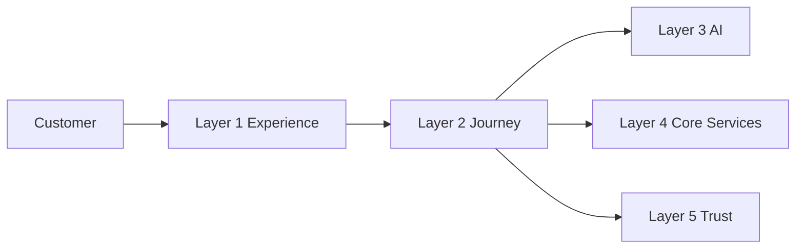
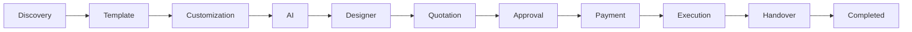
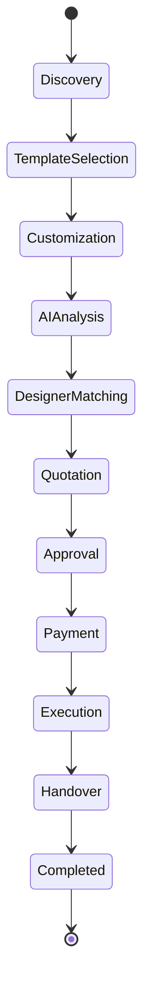
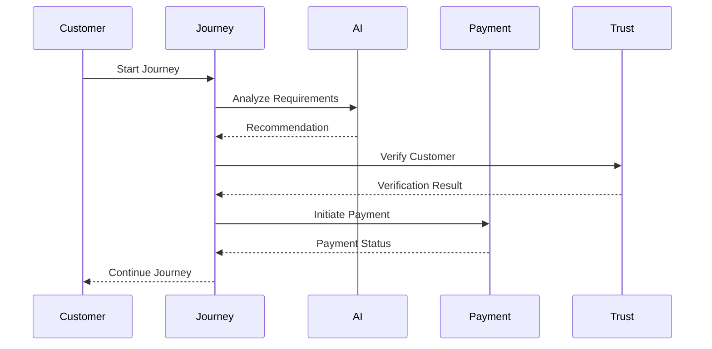
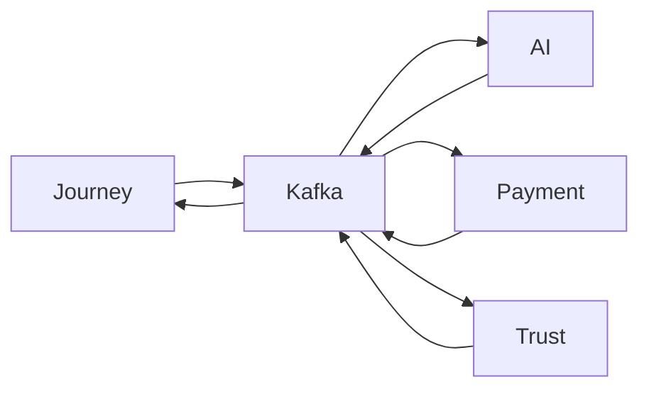

# Journey Architecture

## Document Information

| Property | Value |
|----------|-------|
| Layer | Layer 2 – Guided Journey |
| Document | Journey Architecture |
| Status | Production |
| Version | 1.0 |

---

# Overview

The Journey Architecture defines how Layer 2 orchestrates the complete customer lifecycle from project discovery to successful project delivery.

The Journey Orchestrator coordinates every stage of the workflow while interacting with AI services, payment services, trust verification, and execution services.

Business workflows remain deterministic, event-driven, and resilient to failures.

---

# Objectives

- Orchestrate end-to-end customer journeys
- Coordinate multiple business services
- Maintain workflow state
- Support long-running processes
- Recover from failures
- Provide scalable workflow execution

---

# High-Level Journey Architecture

---

# Journey Lifecycle

---

# Journey State Machine

---

# Service Interaction

---

# Event Flow

---

# Core Components

- Journey Orchestrator
- Discovery
- Template Selection
- Customization
- AI Integration
- Designer Matching
- Quotation
- Approval
- Payment
- Execution
- Project Handover

---

# Architectural Principles

- Event-driven communication
- Deterministic workflows
- Saga orchestration
- State machine execution
- Loose coupling
- High cohesion
- Idempotent operations
- Fault tolerance

---

# Failure Recovery

- Retry transient failures
- Pause long-running workflows
- Resume from checkpoints
- Publish recovery events
- Prevent duplicate execution

---

# Observability

Monitor:

- Journey completion rate
- Workflow latency
- API latency
- Event processing
- Retry count
- Failure rate

---

# Security

- JWT Authentication
- RBAC Authorization
- TLS Encryption
- Input Validation
- Audit Logging

---

# Related Documents

- README.md
- architecture.md
- ADR.md
- dependency_graph.md
- interaction_architecture.md
- AI_CONTEXT.md
- payment/overview.md
