# Journey Stages

The Guided Journey Layer models the customer experience as a sequence of orchestrated workflow stages. Each stage represents a well-defined orchestration checkpoint responsible for coordinating downstream services, validating workflow progression, persisting journey state, and publishing domain events.

Business logic is **not implemented** within these stages. Instead, each stage invokes the appropriate service, waits for completion through synchronous APIs or asynchronous events, and advances the workflow only after the required completion criteria have been satisfied.

---
# Workflow Checkpoints

The Guided Journey Layer persists a workflow checkpoint after every successful stage transition. This enables durable execution, workflow recovery, retries, and resumable customer journeys.

Each checkpoint stores:

| Field | Description |
|--------|-------------|
| Journey ID | Unique workflow identifier |
| Current Stage | Active workflow state |
| Previous Stage | Last completed stage |
| Correlation ID | Distributed tracing identifier |
| Execution ID | Workflow execution identifier |
| Retry Count | Current retry attempts |
| Timestamp | Last successful checkpoint |
| Metadata | Stage-specific orchestration context |
| Event ID | Last processed domain event |

---


# 1. Discover Ideas

| Property | Value |
|----------|-------|
| Stage ID | L2-STG-01 |
| Stage Owner | Journey Orchestrator |
| Execution Type | Hybrid (Synchronous + Asynchronous) |
| Criticality | Medium |
| Timeout | 5 Minutes |
| Retry Policy | Exponential Backoff (3 Attempts) |
| Workflow Type | Long Running |
| State Persistence | Required |


## Purpose

The **Discover Ideas** stage initializes the customer's design journey by helping them explore inspirations, interior styles, room layouts, furniture collections, and design themes.

This stage establishes the initial design context that will be used throughout the remainder of the journey. Rather than generating recommendations itself, the Guided Journey Layer orchestrates interactions with downstream recommendation and content services while maintaining the current workflow state.

---

## Preconditions

Before entering this stage, the following conditions must be satisfied:

- A valid journey has been created.
- Customer session is authenticated.
- Workflow instance has been initialized.
- Journey is not cancelled or archived.
- Correlation ID has been generated.

## Entry Trigger

The workflow enters this stage when:

- Customer creates a new project.
- Customer resumes a previously saved draft.
- Customer starts a redesign journey.

Previous State

```text
JourneyCreated
```

Current State

```text
DiscoverIdeas
```

---

## Inputs

### Customer Inputs

- Property Type
- Room Type
- Preferred Style
- Budget Range
- Design Preferences
- Saved Inspirations

### System Inputs

- Customer Profile
- Journey Context
- Recommendation Metadata
- Previously Saved Draft

---

## Orchestration

The Journey Layer coordinates the following activities:

1. Validate customer session.
2. Create workflow checkpoint.
3. Load customer preferences.
4. Request inspiration catalog.
5. Request personalized recommendations.
6. Wait for recommendation response.
7. Persist selected inspiration.
8. Publish workflow event.
9. Advance workflow.

No recommendation logic executes inside this layer.

---

## Outputs

Produces:

- Selected Inspiration
- Journey Metadata
- Updated Workflow Context
- Design Preference Context
- Customer Selection

---

## Exit Criteria

This stage is considered complete when:

- Customer selects an inspiration.
- Selection is successfully persisted.
- Journey context is updated.
- Workflow checkpoint is created.
- `IdeaSelected` event is published.
- Next workflow stage is scheduled.

### Events Published

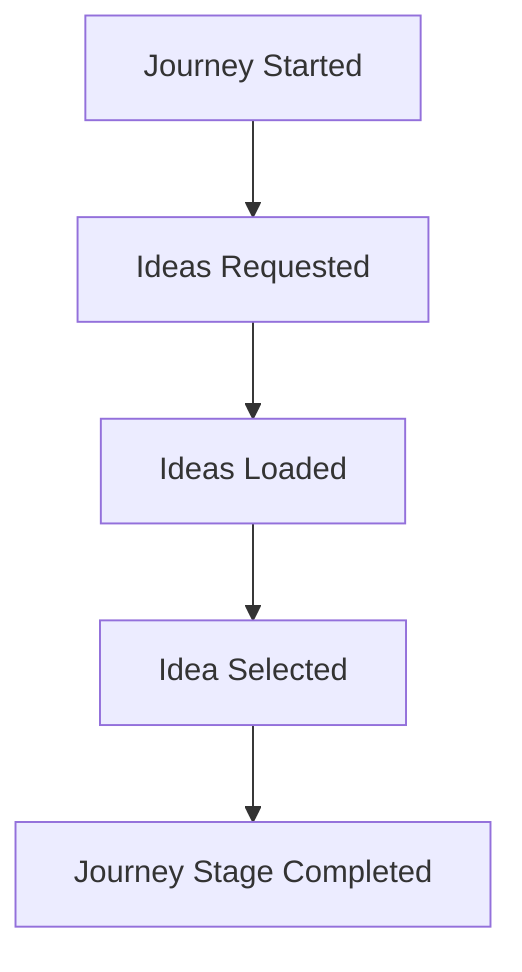

---

## APIs

### Retrieve Inspirations

```http
GET /api/v1/inspirations
```

### Retrieve Personalized Recommendations

```http
GET /api/v1/recommendations/designs
```

### Save Selection

```http
POST /api/v1/journeys/{journeyId}/ideas
```

---

## State Transition

## State Transition

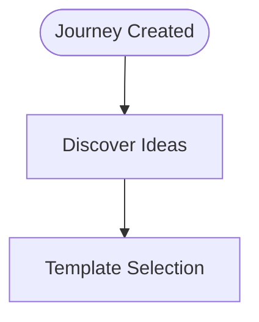

---

## Failure Handling

Possible failures include:

| Failure | Recovery Strategy |
|----------|------------------|
| Recommendation timeout | Retry asynchronously |
| Catalog unavailable | Return cached inspirations |
| Customer disconnect | Persist workflow checkpoint |
| Duplicate submission | Ignore using idempotency key |

If recommendation services remain unavailable beyond retry limits, manual browsing remains available without blocking workflow progression.

---

## Downstream Layers

Consumes:

- Layer 3 — AI Operating System
- Layer 4 — Content & Template Services

Publishes events consumed by:

- Analytics
- Recommendation Engine
- Journey State Manager

---

# 2. Template Selection

| Property | Value |
|----------|-------|
| Stage ID | L2-STG-02 |
| Stage Owner | Journey Orchestrator |
| Execution Type | Synchronous |
| Criticality | Medium |
| Timeout | 2 Minutes |
| Retry Policy | Exponential Backoff (3 Attempts) |
| Workflow Type | Interactive |
| State Persistence | Required |


## Purpose

The Template Selection stage allows customers to select a predefined interior design template that serves as the foundation for subsequent customization.

The Guided Journey Layer coordinates template retrieval, validates compatibility with project constraints, records customer selection, and prepares the workflow for customization.

---

## Preconditions

Before entering this stage, the following conditions must be satisfied:

- Discover Ideas stage has completed successfully.
- An inspiration has been selected.
- Template catalog service is available.
- Journey state is active.
- Workflow checkpoint exists.

## Entry Trigger

Triggered after successful completion of:

```text
DiscoverIdeas
```

Required Event

```text
IdeaSelected
```

---

## Inputs

### Customer Inputs

- Selected Inspiration
- Preferred Template
- Project Type

### System Inputs

- Template Catalog
- Property Metadata
- Room Dimensions
- Journey Context

---

## Orchestration

The Journey Layer performs:

1. Validate workflow state.
2. Request template catalog.
3. Retrieve selected template.
4. Validate compatibility.
5. Persist template selection.
6. Publish TemplateSelected event.
7. Advance workflow.

No template rendering occurs inside this layer.

---

## Outputs

- Selected Template
- Template Metadata
- Workflow Context
- Template Identifier

---

## Exit Criteria

This stage is considered complete when:

- Template selection is validated.
- Selected template is persisted.
- Workflow state is updated.
- Workflow checkpoint is stored.
- `TemplateSelected` event is published.
- Template Customization stage is scheduled.

## Events Published

### Events Published

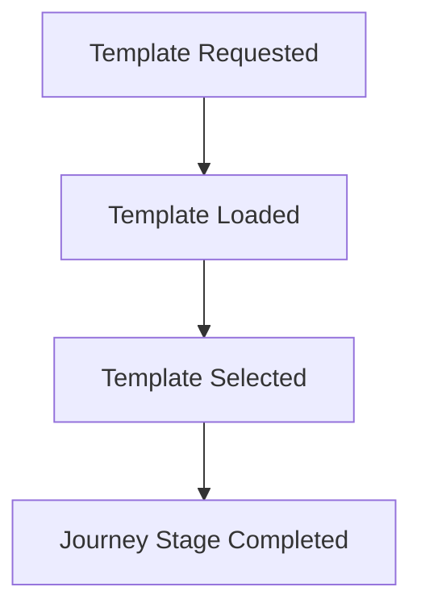

---

## APIs

### Retrieve Templates

```http
GET /api/v1/templates
```

### Retrieve Template

```http
GET /api/v1/templates/{templateId}
```

### Save Selection

```http
POST /api/v1/journeys/{journeyId}/template
```

---

## State Transition

## State Transition

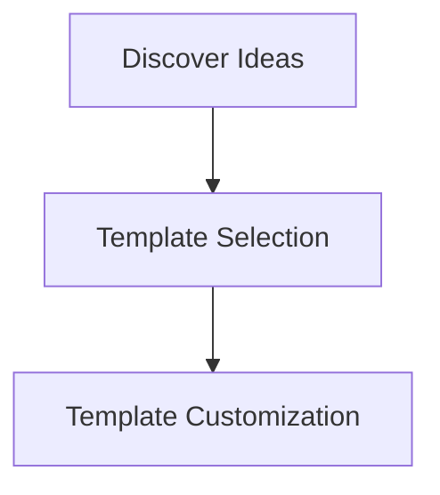

---

## Failure Handling

| Failure | Recovery |
|----------|----------|
| Template unavailable | Suggest alternatives |
| Validation failure | Return validation errors |
| Service timeout | Retry with exponential backoff |
| Duplicate request | Ignore using idempotency |

---

## Downstream Layers

Consumes

- Layer 4 — Template Service

Publishes events for

- Analytics
- Journey State Manager
- Customization Service

---

# 3. Template Customization

| Property | Value |
|----------|-------|
| Stage ID | L2-STG-03 |
| Stage Owner | Journey Orchestrator |
| Execution Type | Interactive |
| Criticality | High |
| Timeout | 15 Minutes |
| Retry Policy | Automatic Retry (3 Attempts) |
| Workflow Type | Long Running |
| State Persistence | Required |

## Purpose

The **Template Customization** stage enables customers to personalize the selected design template according to their functional requirements, aesthetic preferences, and project constraints.

This stage acts as the bridge between template selection and visualization by transforming a generic design template into a customer-specific design configuration.

The Guided Journey Layer orchestrates customization requests, validates workflow progression, persists configuration changes, and coordinates downstream services responsible for design configuration and material management. It does **not** perform design generation or rendering itself.

---

## Preconditions

Before entering this stage, the following conditions must be satisfied:

- Template has been selected.
- Journey remains active.
- Editable configuration exists.
- Customer has modification permissions.
- Workflow checkpoint is available.

## Entry Trigger

The workflow enters this stage after a template has been successfully selected.

Previous State

```text
TemplateSelection
```

Required Event

```text
TemplateSelected
```

Current State

```text
TemplateCustomization
```

---

## Inputs

### Customer Inputs

- Furniture preferences
- Material selections
- Color palette
- Lighting preferences
- Storage preferences
- Lifestyle requirements
- Accessibility requirements
- Budget adjustments

### System Inputs

- Selected Template
- Room Dimensions
- Property Metadata
- Customer Profile
- Journey Context
- Available Material Catalog
- Design Constraints

---

## Orchestration

The Guided Journey Layer coordinates the following workflow:

1. Validate current workflow state.
2. Load selected template configuration.
3. Retrieve editable template components.
4. Validate customer modifications.
5. Check design constraint compatibility.
6. Save customization draft.
7. Update workflow checkpoint.
8. Publish customization event.
9. Trigger preview generation request.

All customization logic is delegated to downstream design services.

---

## Validation Rules

The Journey Layer validates only workflow-level constraints.

Examples include:

- Journey must be active.
- Template must exist.
- Customer owns the workflow.
- Configuration request must be complete.
- Required selections must be present.

Business validation such as furniture compatibility or material availability is delegated to downstream services.

---

## Outputs

Produces:

- Customized Template
- Customer Design Configuration
- Updated Journey Context
- Customization Metadata
- Workflow Checkpoint

---

## Exit Criteria

This stage is considered complete when:

- Customer customization is saved.
- Configuration passes workflow validation.
- Workflow context is updated.
- Workflow checkpoint is persisted.
- `TemplateCustomized` event is published.
- Spatial Preview stage is initiated.

### Events Published

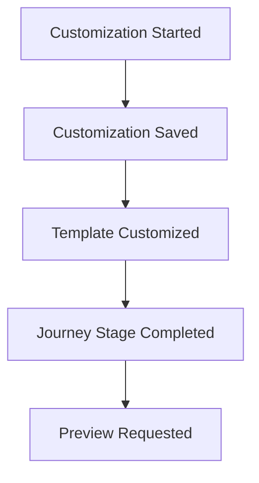

---

## APIs

### Load Editable Template

```http
GET /api/v1/templates/{templateId}/configuration
```

---

### Save Customization

```http
PUT /api/v1/journeys/{journeyId}/customization
```

---

### Retrieve Materials

```http
GET /api/v1/materials
```

---

### Retrieve Furniture Catalog

```http
GET /api/v1/furniture
```

---

## State Transition

## State Transition

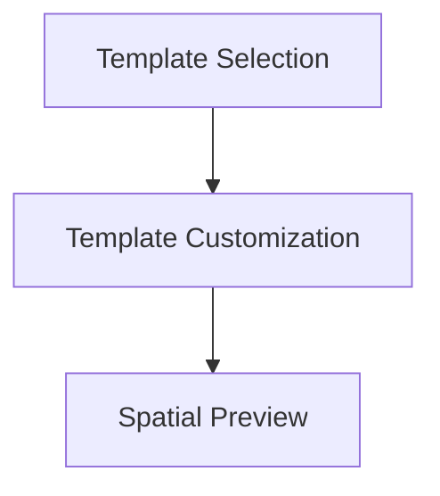

---

## Failure Handling

| Failure | Recovery Strategy |
|----------|------------------|
| Invalid configuration | Return validation errors |
| Material unavailable | Suggest alternatives |
| Service timeout | Retry asynchronously |
| Draft save failure | Retry persistence |
| Customer disconnect | Resume from checkpoint |
| Duplicate request | Ignore using idempotency key |

---

## Downstream Layers

Consumes

- Layer 4 — Design Configuration Service
- Layer 4 — Material Catalog
- Layer 4 — Furniture Catalog

Publishes events consumed by

- Spatial Intelligence
- Analytics
- Journey State Manager

---

# 4. Spatial Preview

| Property | Value |
|----------|-------|
| Stage ID | L2-STG-04 |
| Stage Owner | Journey Orchestrator |
| Execution Type | Asynchronous |
| Criticality | High |
| Timeout | 10 Minutes |
| Retry Policy | Exponential Backoff (3 Attempts) |
| Workflow Type | Long Running |
| State Persistence | Required |

## Purpose

The **Spatial Preview** stage provides customers with an interactive visualization of their customized interior design before further evaluation.

Rather than rendering the visualization itself, the Guided Journey Layer coordinates preview generation by invoking the Spatial Intelligence service, monitoring rendering progress, persisting workflow state, and advancing the workflow after successful completion.

This stage provides the visual confirmation required before AI-driven design analysis.

---

## Preconditions

Before entering this stage, the following conditions must be satisfied:

- Customized design configuration exists.
- Rendering request is valid.
- Journey is active.
- Asset references are available.
- Workflow checkpoint has been created.

## Entry Trigger

Triggered after successful customization.

Previous State

```text
TemplateCustomization
```

Required Event

```text
TemplateCustomized
```

Current State

```text
SpatialPreview
```

---

## Inputs

### Customer Inputs

- Customized Design Configuration
- Preview Preferences
- Selected View Mode

### System Inputs

- Design Configuration
- Room Geometry
- Asset Library
- Texture Library
- Lighting Configuration
- Journey Context

---

## Orchestration

The Guided Journey Layer performs the following sequence:

1. Validate workflow progression.
2. Persist workflow checkpoint.
3. Submit rendering request.
4. Wait for rendering completion.
5. Monitor rendering status.
6. Receive preview completion event.
7. Store preview metadata.
8. Publish preview event.
9. Continue workflow.

Rendering execution remains entirely within the Spatial Intelligence service.

---

## Outputs

Produces

- Preview Session
- Preview Metadata
- Rendering Identifier
- Preview URL
- Journey Context Update

---

## Exit Criteria

This stage is considered complete when:

- Preview generation completes successfully.
- Preview metadata is stored.
- Workflow state is updated.
- Workflow checkpoint is persisted.
- `PreviewGenerated` event is published.
- AI Analysis stage is triggered.

### Events Published

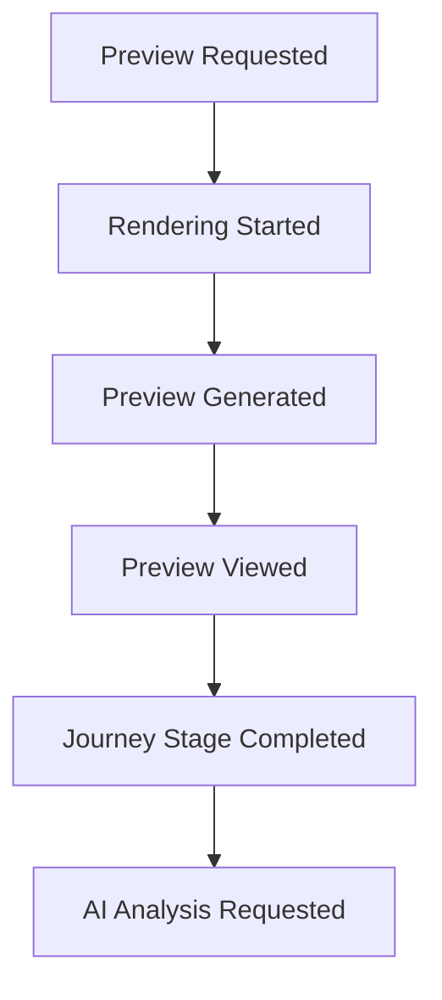

---

## APIs

### Request Preview

```http
POST /api/v1/previews
```

---

### Retrieve Preview Status

```http
GET /api/v1/previews/{previewId}
```

---

### Retrieve Preview Session

```http
GET /api/v1/previews/{previewId}/viewer
```

---

## State Transition

## State Transition

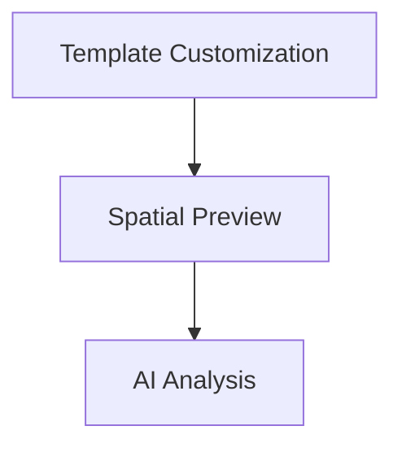

---

## Failure Handling

| Failure | Recovery Strategy |
|----------|------------------|
| Rendering timeout | Retry rendering job |
| Rendering failure | Queue asynchronous retry |
| Asset unavailable | Render using fallback assets |
| Preview service unavailable | Retry after backoff |
| Customer disconnect | Resume existing preview session |
| Duplicate rendering request | Ignore using idempotency key |

If rendering repeatedly fails, the workflow remains in **SpatialPreview** until successful completion or manual intervention.

---

## Downstream Layers

Consumes

- Layer 3 — Spatial Intelligence
- Layer 4 — Asset Management
- Layer 6 — Object Storage

Publishes events consumed by

- AI Operating System
- Analytics
- Journey State Manager

---

## Workflow Summary

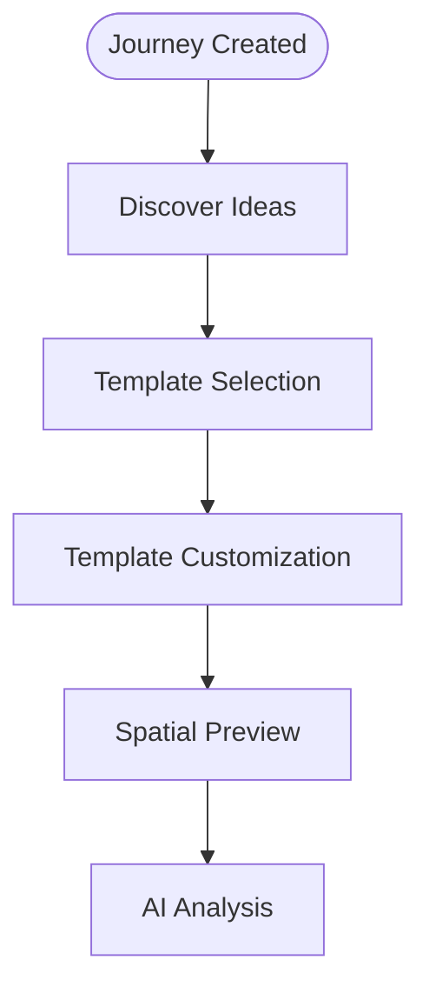

---

# 5. AI Analysis

| Property | Value |
|----------|-------|
| Stage ID | L2-STG-05 |
| Stage Owner | Journey Orchestrator |
| Execution Type | Asynchronous |
| Criticality | High |
| Timeout | 15 Minutes |
| Retry Policy | Exponential Backoff (3 Attempts) |
| Workflow Type | Long Running |
| State Persistence | Required |

## Purpose

The **AI Analysis** stage coordinates AI-powered evaluation of the customer's customized design. The Guided Journey Layer does not perform AI inference; instead, it orchestrates requests to the AI Operating System and waits for analysis results before progressing the workflow.

The AI Operating System evaluates aspects such as:

- Space utilization
- Design consistency
- Functional layout
- Material compatibility
- Budget estimation
- Style consistency
- Interior optimization recommendations

This stage enriches the journey with intelligent insights that assist both customers and designers in making informed decisions.

---

## Preconditions

Before entering this stage, the following conditions must be satisfied:

- Spatial preview has been generated.
- Analysis request is valid.
- AI service is available.
- Journey state is active.
- Workflow checkpoint exists.

## Entry Trigger

Triggered after successful preview generation.

Previous State

```text
SpatialPreview
```

Required Event

```text
PreviewGenerated
```

Current State

```text
AIAnalysis
```

---

## Inputs

### Customer Inputs

- Customized Design
- Preferred Design Goals
- Budget Constraints

### System Inputs

- Preview Metadata
- Design Configuration
- Spatial Model
- Customer Preferences
- Journey Context

---

## Orchestration

The Guided Journey Layer performs the following orchestration:

1. Validate workflow progression.
2. Persist workflow checkpoint.
3. Submit analysis request.
4. Wait for asynchronous completion.
5. Monitor execution timeout.
6. Receive AI analysis results.
7. Store analysis metadata.
8. Publish completion event.
9. Advance workflow.

The Journey Layer never performs inference or recommendation generation.

---

## Outputs

Produces

- AI Analysis Report
- Design Quality Score
- Budget Estimation
- Optimization Suggestions
- Updated Journey Context

---

## Exit Criteria

This stage is considered complete when:

- AI analysis results are received.
- Analysis metadata is stored.
- Workflow context is updated.
- Workflow checkpoint is persisted.
- `AIAnalysisCompleted` event is published.
- Designer Matching stage is scheduled.

### Events Published

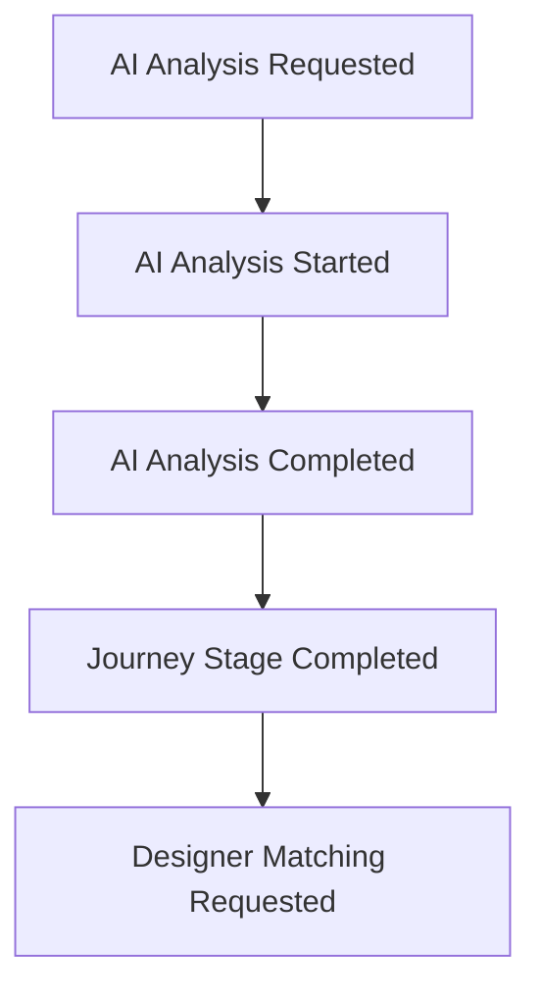

---

## APIs

### Submit Analysis

```http
POST /api/v1/analysis
```

---

### Retrieve Analysis

```http
GET /api/v1/analysis/{analysisId}
```

---


## State Transition

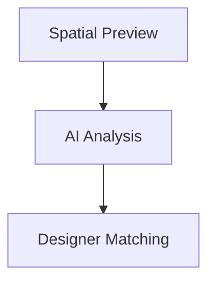

---

## Failure Handling

| Failure | Recovery Strategy |
|----------|------------------|
| AI timeout | Retry asynchronously |
| AI unavailable | Queue request |
| Invalid response | Re-submit analysis |
| Service outage | Circuit breaker |
| Duplicate request | Idempotent processing |

---

## Downstream Layers

Consumes

- Layer 3 — AI Operating System

Publishes events consumed by

- Designer Matching
- Analytics
- Journey State Manager

---

# 6. Designer Matching

| Property | Value |
|----------|-------|
| Stage ID | L2-STG-06 |
| Stage Owner | Journey Orchestrator |
| Execution Type | Asynchronous |
| Criticality | High |
| Timeout | 5 Minutes |
| Retry Policy | Automatic Retry (3 Attempts) |
| Workflow Type | Long Running |
| State Persistence | Required |

## Purpose

The **Designer Matching** stage coordinates the selection of suitable interior designers based on project requirements.

The Journey Layer delegates matching logic to the Marketplace and Recommendation services while ensuring workflow consistency.

Matching may consider:

- Project type
- Designer specialization
- Location
- Availability
- Budget
- Portfolio relevance
- Trust score
- Customer preferences

---

## Preconditions

Before entering this stage, the following conditions must be satisfied:

- AI Analysis has completed successfully.
- Journey remains active.
- Project requirements are finalized.
- Matching service is available.
- Workflow checkpoint exists.

## Entry Trigger

Previous State

```text
AIAnalysis
```

Required Event

```text
AIAnalysisCompleted
```

Current State

```text
DesignerMatching
```

---

## Inputs

### Customer Inputs

- Preferred Designer
- Budget
- Timeline
- Project Location

### System Inputs

- AI Analysis
- Designer Database
- Availability Calendar
- Trust Scores
- Journey Context

---

## Orchestration

Workflow sequence:

1. Validate workflow state.
2. Submit designer matching request.
3. Retrieve candidate designers.
4. Rank matching results.
5. Persist shortlisted designers.
6. Publish matching event.
7. Advance workflow.

---

## Outputs

Produces

- Ranked Designer List
- Matching Score
- Availability Status
- Journey Metadata

---

## Exit Criteria

This stage is considered complete when:

- Designer shortlist is generated.
- Matching results are persisted.
- Workflow context is updated.
- Workflow checkpoint is stored.
- `DesignerMatched` event is published.
- Quotation Hub stage is initiated.

### Events Published

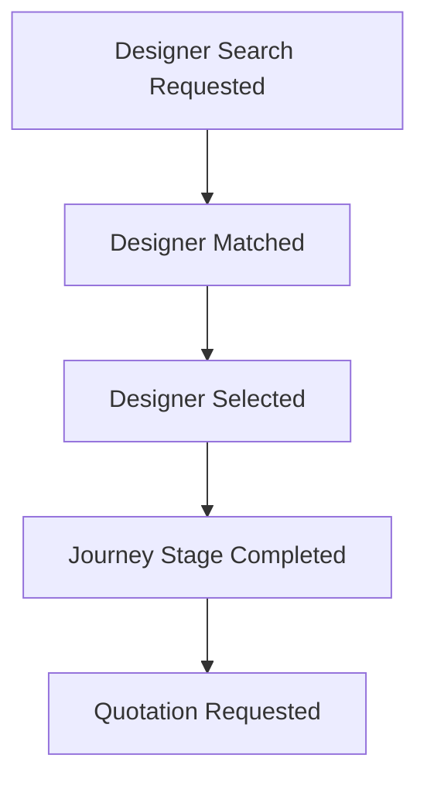

---

## APIs

### Match Designers

```http
POST /api/v1/designers/match
```

---

### Retrieve Designer

```http
GET /api/v1/designers/{designerId}
```

---

## State Transition

## State Transition

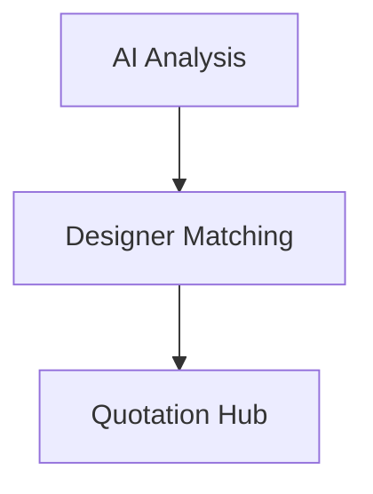

---

## Failure Handling

| Failure | Recovery |
|----------|----------|
| No designers available | Expand search |
| Recommendation timeout | Retry |
| Trust service unavailable | Queue request |
| Duplicate request | Ignore |
| Customer disconnect | Resume workflow |

---

## Downstream Layers

Consumes

- Layer 4 — Marketplace Service
- Layer 5 — Trust Ecosystem

Publishes events consumed by

- Quotation Service
- Analytics

---

# 7. Quotation Hub

### Stage Metadata

### Stage Metadata

| Property | Value |
|----------|-------|
| **Stage ID** | L2-STG-07 |
| **Stage Owner** | Journey Orchestrator |
| **Execution Type** | Asynchronous |
| **Criticality** | High |
| **Timeout** | 24 Hours |
| **Retry Policy** | Scheduled Retry |
| **Workflow Type** | Long Running |
| **State Persistence** | Required |

## Purpose

The **Quotation Hub** coordinates quotation generation between customers and shortlisted designers.

Rather than generating quotations itself, the Journey Layer requests quotations from the Marketplace and monitors their completion.

This stage manages multiple concurrent quotation requests while maintaining workflow state.

---

## Preconditions

Before entering this stage, the following conditions must be satisfied:

- Designer Matching has completed successfully.
- At least one designer has been selected.
- Project scope has been finalized.
- Journey remains active.
- Workflow checkpoint exists.


## Entry Trigger

Previous State

```text
DesignerMatching
```

Required Event

```text
DesignerMatched
```

Current State

```text
QuotationHub
```

---

## Inputs

### Customer Inputs

- Selected Designers

### System Inputs

- Project Specification
- Material Estimates
- AI Analysis
- Design Configuration

---

## Orchestration

Workflow execution:

1. Validate workflow.
2. Send quotation requests.
3. Monitor quotation progress.
4. Receive completed quotations.
5. Persist quotation metadata.
6. Notify customer.
7. Advance workflow.

---

## Outputs

Produces

- Designer Quotations
- Estimated Cost
- Estimated Timeline
- Proposal Metadata

---

## Exit Criteria

This stage is considered complete when:

- Quotations are successfully received.
- Quotation metadata is persisted.
- Workflow checkpoint is updated.
- `QuotationGenerated` event is published.
- Proposal Comparison stage is scheduled.

### Events Published

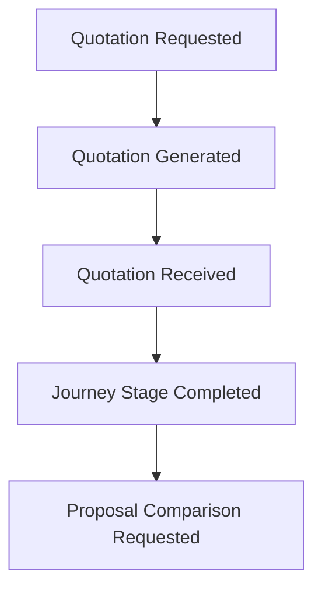

---

## APIs

### Request Quotation

```http
POST /api/v1/quotations
```

---

### Retrieve Quotations

```http
GET /api/v1/quotations/{journeyId}
```

---


## State Transition

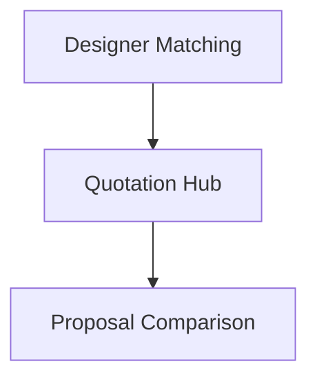

---

## Failure Handling

| Failure | Recovery |
|----------|----------|
| Designer timeout | Retry request |
| Partial quotations | Continue until timeout |
| Marketplace unavailable | Queue request |
| Duplicate quotation | Ignore |
| Customer disconnect | Resume workflow |

---

## Downstream Layers

Consumes

- Layer 4 — Marketplace Service

Publishes events consumed by

- Proposal Comparison
- Analytics

---

# 8. Proposal Comparison

## Stage Metadata

| Property | Value |
|----------|-------|
| **Stage ID** | L2-STG-08 |
| **Stage Owner** | Journey Orchestrator |
| **Execution Type** | Interactive |
| **Criticality** | Medium |
| **Timeout** | 7 Days |
| **Retry Policy** | Resume Supported |
| **Workflow Type** | Human Approval |
| **State Persistence** | Required |


## Purpose

The **Proposal Comparison** stage enables customers to evaluate multiple proposals before selecting the preferred implementation partner.

The Guided Journey Layer coordinates proposal retrieval, comparison workflows, and customer selection while maintaining workflow state.

Proposal evaluation logic remains within downstream comparison services.

---

## Preconditions

Before entering this stage, the following conditions must be satisfied:

- Quotations are available.
- Comparison dataset has been prepared.
- Journey remains active.
- Workflow checkpoint exists.


## Entry Trigger

Previous State

```text
QuotationHub
```

Required Event

```text
QuotationGenerated
```

Current State

```text
ProposalComparison
```

---

## Inputs

### Customer Inputs

- Selected Proposal
- Comparison Preferences

### System Inputs

- Designer Quotations
- AI Recommendations
- Trust Scores
- Budget Analysis

---

## Orchestration

The Journey Layer performs:

1. Retrieve proposals.
2. Validate proposal completeness.
3. Prepare comparison dataset.
4. Present proposals.
5. Record customer selection.
6. Persist workflow checkpoint.
7. Publish selection event.
8. Advance workflow.

---

## Outputs

Produces

- Selected Proposal
- Comparison Summary
- Selected Designer
- Updated Journey Context

---

## Exit Criteria

This stage is considered complete when:

- Customer selects a proposal.
- Selected proposal is persisted.
- Workflow state is updated.
- `ProposalSelected` event is published.
- Revision stage is scheduled.


### Events Published

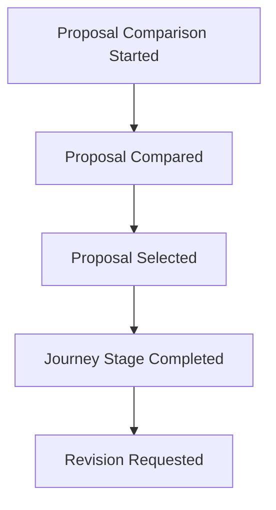

---

## APIs

### Retrieve Comparison

```http
GET /api/v1/proposals/compare
```

---

### Select Proposal

```http
POST /api/v1/proposals/select
```

---

## State Transition

## State Transition

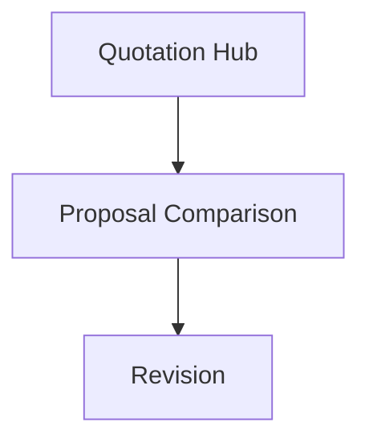

---

## Failure Handling

| Failure | Recovery |
|----------|----------|
| Missing proposal | Request regeneration |
| Comparison unavailable | Retry |
| Customer timeout | Save draft |
| Duplicate submission | Ignore |
| Service unavailable | Queue retry |

---

## Downstream Layers

Consumes

- Layer 4 — Proposal Service
- Layer 5 — Trust Ecosystem

Publishes events consumed by

- Revision Service
- Analytics

---

## Workflow Summary

## Workflow Summary

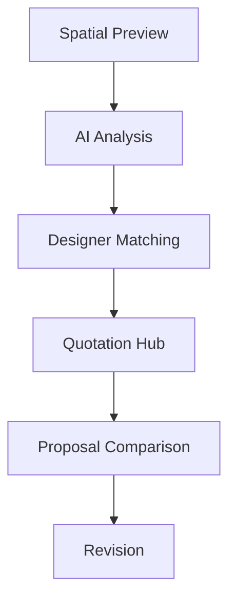

---

# 9. Revision

## Stage Metadata

| Property | Value |
|----------|-------|
| **Stage ID** | L2-STG-09 |
| **Stage Owner** | Journey Orchestrator |
| **Execution Type** | Long Running |
| **Criticality** | High |
| **Timeout** | 14 Days |
| **Retry Policy** | Resume Supported |
| **Workflow Type** | Collaborative |
| **State Persistence** | Required |


## Purpose

The **Revision** stage manages customer-requested modifications after proposal evaluation. It provides a controlled feedback loop between the customer and the assigned designer while maintaining workflow consistency and version history.

Rather than modifying the design itself, the Guided Journey Layer coordinates revision requests, tracks their lifecycle, persists workflow state, and resumes the customer journey after the updated proposal is received.

The stage may execute multiple iterations until the customer is satisfied or the revision policy is exhausted.

---

## Preconditions

Before entering this stage, the following conditions must be satisfied:

- Proposal has been selected.
- Revision is permitted.
- Designer has been assigned.
- Workflow checkpoint exists.


## Entry Trigger

Triggered after proposal selection.

Previous State

```text
ProposalComparison
```

Required Event

```text
ProposalSelected
```

Current State

```text
Revision
```

---

## Inputs

### Customer Inputs

- Revision comments
- Design feedback
- Updated requirements
- Budget modifications
- Timeline adjustments

### System Inputs

- Selected Proposal
- Designer Assignment
- Previous Design Versions
- Revision History
- Journey Context

---

## Orchestration

The Journey Layer coordinates:

1. Validate workflow state.
2. Verify revision eligibility.
3. Create revision request.
4. Notify assigned designer.
5. Persist revision metadata.
6. Wait for updated proposal.
7. Receive revision completion event.
8. Update workflow checkpoint.
9. Advance workflow.

The Journey Layer does not participate in design modification.

---

## Outputs

Produces

- Revision Request
- Updated Proposal
- Revision History
- Proposal Version
- Updated Journey Context

---

## Exit Criteria

This stage is considered complete when:

- Revision has been completed.
- Updated proposal is received.
- Workflow checkpoint is updated.
- `RevisionCompleted` event is published.
- Final Walkthrough stage is scheduled.

### Events Published

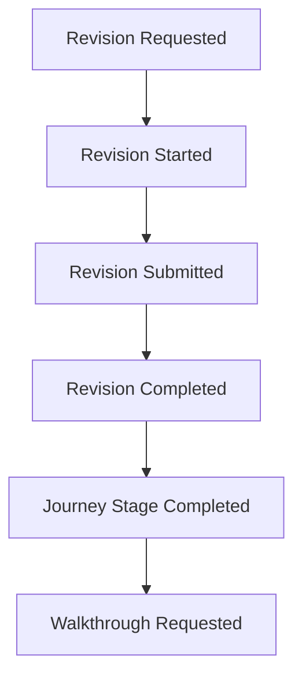

---

## APIs

### Create Revision

```http
POST /api/v1/revisions
```

---

### Retrieve Revision

```http
GET /api/v1/revisions/{revisionId}
```

---

### Update Revision

```http
PUT /api/v1/revisions/{revisionId}
```

---


## State Transition

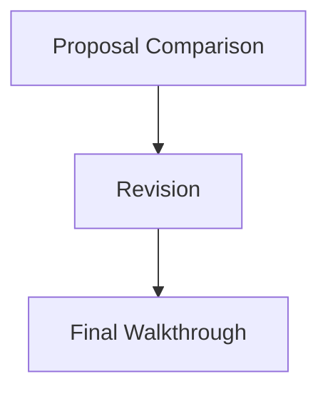

---

## Failure Handling

| Failure | Recovery Strategy |
|----------|------------------|
| Designer unavailable | Reassign designer |
| Revision timeout | Notify customer |
| Maximum revisions exceeded | Escalate for approval |
| Duplicate request | Ignore using idempotency |
| Customer disconnect | Resume workflow |

---

## Downstream Layers

Consumes

- Layer 4 — Proposal Service
- Layer 4 — Collaboration Service

Publishes events consumed by

- Walkthrough Service
- Analytics
- Journey State Manager

---

# 10. Final Walkthrough

## Stage Metadata

| Property | Value |
|----------|-------|
| **Stage ID** | L2-STG-10 |
| **Stage Owner** | Journey Orchestrator |
| **Execution Type** | Interactive |
| **Criticality** | Medium |
| **Timeout** | 7 Days |
| **Retry Policy** | Resume Supported |
| **Workflow Type** | Human Review |
| **State Persistence** | Required |

## Purpose

The **Final Walkthrough** stage presents the finalized design to the customer before formal approval.

This stage ensures that all requested revisions have been completed and the customer has reviewed the complete project scope, design assets, material selections, estimated timeline, and implementation plan.

The Guided Journey Layer coordinates walkthrough scheduling, captures customer decisions, and determines whether the workflow proceeds to approval or returns to revision.

---

## Preconditions

Before entering this stage, the following conditions must be satisfied:

- Revision has completed successfully.
- Final proposal is available.
- Walkthrough session has been prepared.

## Entry Trigger

Previous State

```text
Revision
```

Required Event

```text
RevisionCompleted
```

Current State

```text
FinalWalkthrough
```

---

## Inputs

### Customer Inputs

- Walkthrough Feedback
- Approval Comments
- Final Questions

### System Inputs

- Final Proposal
- Design Assets
- Material Specifications
- Project Timeline
- Journey Context

---

## Orchestration

The Journey Layer performs:

1. Validate workflow state.
2. Retrieve finalized proposal.
3. Generate walkthrough session.
4. Present project summary.
5. Capture customer feedback.
6. Record walkthrough completion.
7. Publish workflow event.
8. Route workflow based on customer decision.

---

## Outputs

Produces

- Walkthrough Session
- Customer Feedback
- Final Review
- Walkthrough Completion Status

---

## Exit Criteria

This stage is considered complete when:

- Customer review is completed.
- Feedback is recorded.
- Workflow state is updated.
- `WalkthroughCompleted` event is published.
- Approval stage is initiated.

### Events Published

```mermaid
flowchart TD

    A[Walkthrough Requested]

    B[Walkthrough Started]

    C[Walkthrough Completed]

    D[Customer Review Completed]

    E[Journey Stage Completed]

    F[Approval Requested]

    A --> B
    B --> C
    C --> D
    D --> E
    E --> F
```

---

## APIs

### Create Walkthrough

```http
POST /api/v1/walkthroughs
```

---

### Retrieve Walkthrough

```http
GET /api/v1/walkthroughs/{walkthroughId}
```

---

### Submit Feedback

```http
POST /api/v1/walkthroughs/{walkthroughId}/feedback
```

---


## State Transition

```mermaid
flowchart TD

    Revision[Revision]

    FinalWalkthrough[Final Walkthrough]

    Approval[Approval]

    Revision --> FinalWalkthrough
    FinalWalkthrough -->|Approved for Review| Approval
    FinalWalkthrough -->|Additional Modifications Requested| Revision
```

---

## Failure Handling

| Failure | Recovery Strategy |
|----------|------------------|
| Session interrupted | Resume walkthrough |
| Asset unavailable | Retry asset loading |
| Customer timeout | Save progress |
| Duplicate feedback | Ignore duplicate submission |
| Service unavailable | Retry asynchronously |

---

## Downstream Layers

Consumes

- Layer 4 — Design Repository
- Layer 4 — Asset Service

Publishes events consumed by

- Approval Service
- Analytics
- Journey State Manager

---

# 11. Approval

## Stage Metadata

| Property | Value |
|----------|-------|
| **Stage ID** | L2-STG-11 |
| **Stage Owner** | Journey Orchestrator |
| **Execution Type** | Interactive |
| **Criticality** | Critical |
| **Timeout** | 30 Days |
| **Retry Policy** | Resume Supported |
| **Workflow Type** | Human Approval |
| **State Persistence** | Required |

## Purpose

The **Approval** stage captures the customer's formal acceptance of the finalized proposal before financial commitment and project execution begin.

This stage acts as the final business checkpoint of the design phase.

The Guided Journey Layer coordinates approval requests, records customer decisions, validates workflow completeness, and prepares the workflow for payment processing.

---

## Preconditions

Before entering this stage, the following conditions must be satisfied:

- Final Walkthrough has completed successfully.
- Final proposal is available.
- Journey remains active.

## Entry Trigger

Previous State

```text
FinalWalkthrough
```

Required Event

```text
WalkthroughCompleted
```

Current State

```text
Approval
```

---

## Inputs

### Customer Inputs

- Approval Decision
- Acceptance Confirmation
- Digital Consent

### System Inputs

- Final Proposal
- Walkthrough Status
- Project Metadata
- Journey Context

---

## Orchestration

Workflow execution:

1. Validate workflow completion.
2. Verify walkthrough completion.
3. Present approval summary.
4. Capture customer approval.
5. Persist approval record.
6. Publish approval event.
7. Transition workflow to payment.

---

## Outputs

Produces

- Approved Proposal
- Customer Consent
- Approval Metadata
- Workflow Checkpoint

---

## Exit Criteria

This stage is considered complete when:

- Approval decision is recorded.
- Workflow state is persisted.
- `ProposalApproved` event is published.
- Payment stage is scheduled.

### Events Published

```mermaid
flowchart TD

    A[Approval Requested]

    B[Proposal Approved]

    C[Customer Approved]

    D[Journey Stage Completed]

    E[Payment Requested]

    A --> B
    B --> C
    C --> D
    D --> E
```

---

## APIs

### Submit Approval

```http
POST /api/v1/approvals
```

---

### Retrieve Approval

```http
GET /api/v1/approvals/{approvalId}
```

---

## ## State Transition

```mermaid
flowchart TD

    FinalWalkthrough[Final Walkthrough]

    Approval[Approval]

    Payment[Payment]

    Revision[Revision]

    FinalWalkthrough --> Approval
    Approval -->|Approved| Payment
    Approval -->|Rejected| Revision
```

---

## Failure Handling

| Failure | Recovery Strategy |
|----------|------------------|
| Customer rejects proposal | Return to Revision |
| Approval timeout | Notify customer |
| Duplicate approval | Ignore using idempotency |
| Persistence failure | Retry transaction |
| Service unavailable | Queue approval request |

---

## Downstream Layers

Consumes

- Layer 4 — Approval Service

Publishes events consumed by

- Payment Service
- Analytics
- Journey State Manager

---


## Workflow Summary

```mermaid
flowchart TD

    ProposalComparison[Proposal Comparison]

    Revision[Revision]

    FinalWalkthrough[Final Walkthrough]

    Approval[Approval]

    Payment[Payment]

    ProposalComparison --> Revision
    Revision --> FinalWalkthrough
    FinalWalkthrough --> Approval
    Approval --> Payment
```

---

# 12. Payment

## Stage Metadata

| Property | Value |
|----------|-------|
| **Stage ID** | L2-STG-12 |
| **Stage Owner** | Journey Orchestrator |
| **Execution Type** | Asynchronous |
| **Criticality** | Critical |
| **Timeout** | 15 Minutes |
| **Retry Policy** | Exponential Backoff |
| **Workflow Type** | Distributed Transaction |
| **State Persistence** | Required |

## Purpose

The **Payment** stage coordinates the financial commitment required to initiate project execution. Rather than processing payments directly, the Guided Journey Layer orchestrates interactions with the Core Platform's Payment Service, ensuring that payment authorization, confirmation, and workflow progression remain reliable and consistent.

The Journey Layer treats payment as a long-running distributed workflow and relies on asynchronous events to determine the final transaction outcome.

---

## Preconditions

Before entering this stage, the following conditions must be satisfied:

- Proposal has been approved.
- Payment request has been created.
- Journey remains active.

## Entry Trigger

Triggered after customer approval.

Previous State

```text
Approval
```

Required Event

```text
ProposalApproved
```

Current State

```text
Payment
```

---

## Inputs

### Customer Inputs

- Payment Method
- Billing Details
- Coupon / Discount Codes
- Installment Preference

### System Inputs

- Approved Proposal
- Final Quotation
- Project Cost
- Tax Information
- Journey Context

---

## Orchestration

The Guided Journey Layer coordinates the following workflow:

1. Validate workflow state.
2. Generate payment request.
3. Invoke Payment Service.
4. Persist workflow checkpoint.
5. Wait for payment confirmation.
6. Receive asynchronous payment event.
7. Update workflow state.
8. Publish completion event.
9. Advance workflow.

The Journey Layer never stores payment credentials or performs payment authorization.

---

## Outputs

Produces

- Payment Reference
- Transaction Metadata
- Payment Status
- Updated Journey Context

---

## Exit Criteria

This stage is considered complete when:

- Payment is successfully confirmed.
- Workflow checkpoint is updated.
- `PaymentCompleted` event is published.
- Execution stage is scheduled.

### Events Published

```mermaid
flowchart TD

    A[Payment Requested]

    B[Payment Initiated]

    C[Payment Authorized]

    D[Payment Completed]

    E[Journey Stage Completed]

    F[Execution Requested]

    A --> B
    B --> C
    C --> D
    D --> E
    E --> F
```

---

## APIs

### Create Payment

```http
POST /api/v1/payments
```

---

### Retrieve Payment Status

```http
GET /api/v1/payments/{paymentId}
```

---

### Cancel Payment

```http
POST /api/v1/payments/{paymentId}/cancel
```

---

## ## State Transition

```mermaid
flowchart TD

    Approval[Approval]

    Payment[Payment]

    Execution[Execution]

    Approval --> Payment
    Payment --> Execution
```

### Failed Payment

```mermaid
flowchart TD

    Payment[Payment]

    Approval[Approval]

    Payment -->|Payment Failed| Approval
```

---

## Failure Handling

| Failure | Recovery Strategy |
|----------|------------------|
| Payment timeout | Await asynchronous confirmation |
| Gateway unavailable | Retry with exponential backoff |
| Duplicate payment | Ignore using idempotency key |
| Payment declined | Return customer to payment |
| Unknown payment outcome | Mark Pending Confirmation |
| Service unavailable | Queue retry |

---

## Downstream Layers

Consumes

- Layer 4 — Payment Service

Publishes events consumed by

- Execution Service
- Analytics
- Journey State Manager

---

# 13. Execution

## Stage Metadata

| Property | Value |
|----------|-------|
| **Stage ID** | L2-STG-13 |
| **Stage Owner** | Journey Orchestrator |
| **Execution Type** | Long Running |
| **Criticality** | Critical |
| **Timeout** | Project Duration |
| **Retry Policy** | Resume Supported |
| **Workflow Type** | Distributed Workflow |
| **State Persistence** | Required |

## Purpose

The **Execution** stage transfers the approved project into implementation after successful payment completion.

The Guided Journey Layer orchestrates project execution by coordinating project management services, monitoring milestone progression, recording workflow state, and updating customers throughout execution.

Business operations such as procurement, installation, logistics, and workforce scheduling remain outside this layer.

---

## Preconditions

Before entering this stage, the following conditions must be satisfied:

- Payment has completed successfully.
- Execution plan has been created.
- Required resources have been allocated.

## Entry Trigger

Previous State

```text
Payment
```

Required Event

```text
PaymentCompleted
```

Current State

```text
Execution
```

---

## Inputs

### Customer Inputs

- Preferred Start Date
- Site Access Details
- Contact Information

### System Inputs

- Approved Proposal
- Payment Confirmation
- Assigned Designer
- Project Schedule
- Journey Context

---

## Orchestration

Workflow sequence

1. Validate payment completion.
2. Create execution workflow.
3. Notify execution services.
4. Persist execution checkpoint.
5. Monitor milestone events.
6. Update customer progress.
7. Track completion status.
8. Publish execution completion.

---

## Outputs

Produces

- Execution Plan
- Project Schedule
- Milestone Status
- Progress Updates
- Updated Journey Context

---

## Exit Criteria

This stage is considered complete when:

- Project execution is completed.
- Final milestone is recorded.
- Workflow checkpoint is updated.
- `ExecutionCompleted` event is published.
- Handover stage is initiated.

## Events Published

```mermaid
flowchart TD

    A[Execution Started]

    B[Milestone Started]

    C[Milestone Completed]

    D[Execution Completed]

    E[Journey Stage Completed]

    F[Handover Requested]

    A --> B
    B --> C
    C --> D
    D --> E
    E --> F
```

---

## APIs

### Start Execution

```http
POST /api/v1/execution
```

---

### Retrieve Progress

```http
GET /api/v1/execution/{executionId}
```

---

### Update Progress

```http
PUT /api/v1/execution/{executionId}
```

---

## State Transition

```mermaid
flowchart TD

    Payment[Payment]

    Execution[Execution]

    Handover[Handover]

    Payment --> Execution
    Execution --> Handover
``` 

---

## Failure Handling

| Failure | Recovery Strategy |
|----------|------------------|
| Milestone delayed | Notify stakeholders |
| Resource unavailable | Reschedule activity |
| Service interruption | Resume workflow |
| Duplicate milestone event | Ignore event |
| Customer requests pause | Suspend workflow |

---

## Downstream Layers

Consumes

- Layer 4 — Project Management
- Layer 4 — Execution Services

Publishes events consumed by

- Handover Service
- Analytics
- Journey State Manager

---

# 14. Handover

## Stage Metadata

| Property | Value |
|----------|-------|
| **Stage ID** | L2-STG-14 |
| **Stage Owner** | Journey Orchestrator |
| **Execution Type** | Interactive |
| **Criticality** | High |
| **Timeout** | 7 Days |
| **Retry Policy** | Resume Supported |
| **Workflow Type** | Project Closure |
| **State Persistence** | Required |


## Purpose

The **Handover** stage completes the customer journey by transferring the finished interior project to the homeowner.

The Guided Journey Layer coordinates project closure, customer acceptance, warranty documentation, completion records, and workflow archival before marking the journey as complete.

This stage represents the terminal workflow state.

---

## Preconditions

Before entering this stage, the following conditions must be satisfied:

- Project execution has completed successfully.
- Completion documents are available.
- Customer is ready for project handover.

## Entry Trigger

Previous State

```text
Execution
```

Required Event

```text
ExecutionCompleted
```

Current State

```text
Handover
```

---

## Inputs

### Customer Inputs

- Project Acceptance
- Final Feedback
- Customer Rating
- Completion Confirmation

### System Inputs

- Completed Project
- Quality Inspection
- Completion Report
- Warranty Documents
- Journey Context

---

## Orchestration

The Journey Layer performs

1. Validate execution completion.
2. Retrieve completion documents.
3. Coordinate customer handover.
4. Capture acceptance.
5. Archive workflow.
6. Publish completion events.
7. Close workflow instance.

---

## Outputs

Produces

- Completion Certificate
- Warranty Package
- Customer Acceptance
- Journey Archive
- Project Closure Metadata

---

## Exit Criteria

This stage is considered complete when:

- Customer accepts project delivery.
- Journey is archived.
- Completion metadata is persisted.
- `JourneyCompleted` event is published.
- Workflow transitions to the **Completed** state.

## Events Published

```mermaid
flowchart TD

    A[Handover Started]

    B[Project Delivered]

    C[Journey Completed]

    D[Journey Archived]

    A --> B
    B --> C
    C --> D
```

---

## APIs

### Create Handover

```http
POST /api/v1/handover
```

---

### Retrieve Documents

```http
GET /api/v1/handover/{handoverId}
```

---

### Complete Journey

```http
POST /api/v1/journeys/{journeyId}/complete
```

---

## State Transition

```mermaid
flowchart TD

    Execution[Execution]
    Handover[Handover]
    Completed((Completed))

    Execution --> Handover
    Handover --> Completed
```

---

## Failure Handling

| Failure | Recovery Strategy |
|----------|------------------|
| Customer rejects delivery | Return to Execution |
| Documentation unavailable | Retry retrieval |
| Acceptance timeout | Notify project manager |
| Duplicate completion | Ignore duplicate request |
| Workflow archival failure | Retry persistence |

---

## Downstream Layers

Consumes

- Layer 4 — Document Service
- Layer 4 — Project Closure Service

Publishes events consumed by

- Analytics
- Notification Service
- Trust Ecosystem
- Journey Archive

---

# Journey Lifecycle Summary

```mermaid
flowchart TD

A[Journey Created]

B[Discover Ideas]

C[Template Selection]

D[Template Customization]

E[Spatial Preview]

F[AI Analysis]

G[Designer Matching]

H[Quotation Hub]

I[Proposal Comparison]

J[Revision]

K[Final Walkthrough]

L[Approval]

M[Payment]

N[Execution]

O[Handover]

P([Completed])

A --> B
B --> C
C --> D
D --> E
E --> F
F --> G
G --> H
H --> I
I --> J
J --> K
K --> L
L --> M
M --> N
N --> O
O --> P
```

---

# Journey Stage Responsibility Matrix

| Stage | Primary Responsibility | Next Stage |
|---------|-----------------------|------------|
| Discover Ideas | Collect design inspiration | Template Selection |
| Template Selection | Select design template | Template Customization |
| Template Customization | Personalize template | Spatial Preview |
| Spatial Preview | Coordinate 3D visualization | AI Analysis |
| AI Analysis | Coordinate AI evaluation | Designer Matching |
| Designer Matching | Select designers | Quotation Hub |
| Quotation Hub | Collect quotations | Proposal Comparison |
| Proposal Comparison | Compare proposals | Revision |
| Revision | Manage design changes | Final Walkthrough |
| Final Walkthrough | Present finalized project | Approval |
| Approval | Capture customer approval | Payment |
| Payment | Coordinate payment workflow | Execution |
| Execution | Monitor project implementation | Handover |
| Handover | Complete project closure | Completed |

---

# Conclusion

The **Journey Stages** document defines the operational contracts for every stage within the Guided Journey Layer. Each stage is responsible for orchestrating workflow progression, coordinating downstream services, persisting workflow state, publishing domain events, and handling failures without embedding business logic.

Combined with the architecture, workflow orchestration, API contracts, event-driven communication, persistence strategies, and operational concerns documented in the existing Guided Journey documents, these stage definitions complete the Layer 2 specification. Together they provide a production-ready reference for implementing a scalable, resilient, and event-driven customer journey orchestration engine while maintaining clear separation of concerns across the Allure Interiors platform.
