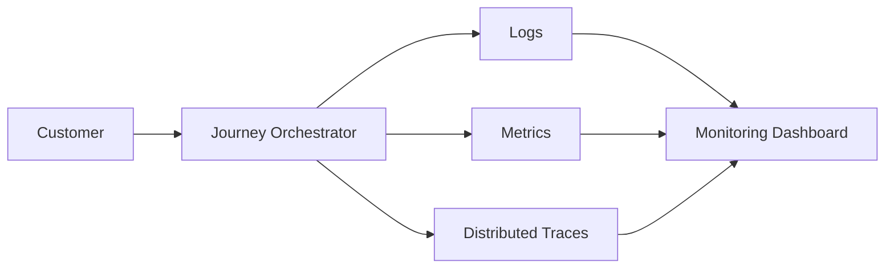
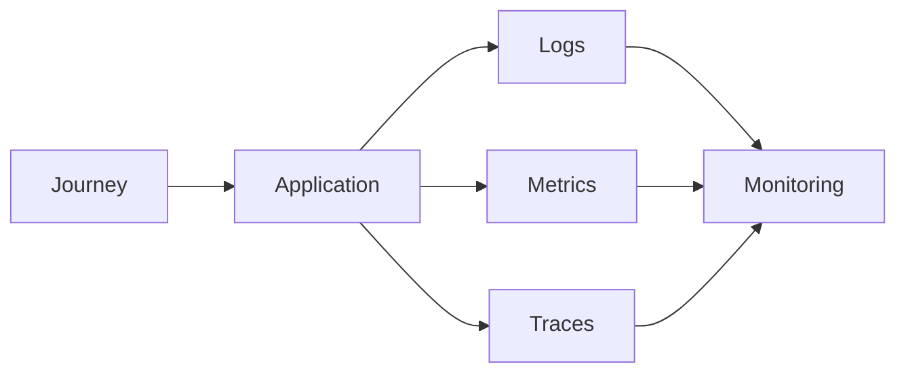
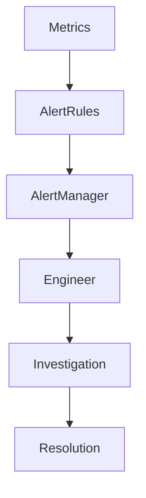
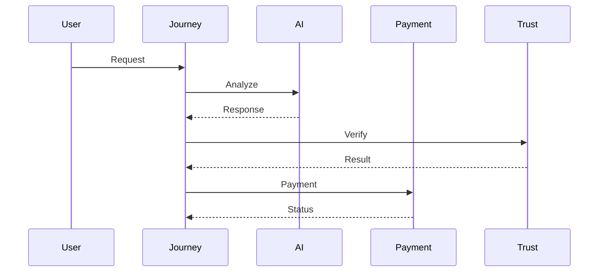

# Observability

## Document Information

| Property | Value |
|----------|-------|
| Layer | Layer 2 – Guided Journey |
| Document | Observability |
| Status | Production |
| Version | 1.0 |

---

# Overview

Observability enables engineers to monitor, troubleshoot, and optimize Layer 2 throughout the Guided Journey.

The observability architecture combines logs, metrics, traces, and events to provide complete visibility into workflow execution.

---

# Objectives

- Monitor workflow execution
- Detect failures quickly
- Trace customer journeys
- Measure system performance
- Improve operational reliability

---

# Observability Architecture

---

# Monitoring Pipeline

---

# Alert Flow

---

# Distributed Trace Flow

---

# Logging Standards

Every log should include:

- Timestamp
- Correlation ID
- Journey ID
- Service Name
- Log Level
- Error Details
- Execution Duration

Never log:

- Passwords
- Authentication tokens
- Payment credentials
- Sensitive personal information

---

# Metrics

Monitor:

- Journey completion rate
- API latency
- Workflow duration
- Error rate
- Retry count
- Event processing latency
- AI response time
- Payment success rate

---

# Tracing

Distributed tracing should capture:

- End-to-end request flow
- Service dependencies
- External API calls
- Database operations
- Event processing

---

# Alerting

Generate alerts for:

- High error rate
- Service unavailability
- Workflow failures
- Payment failures
- AI timeouts
- Event processing delays

---

# Best Practices

- Use correlation IDs across all services.
- Log structured events.
- Collect meaningful metrics.
- Trace all distributed requests.
- Monitor business KPIs in addition to system metrics.

---

# Related Documents

- architecture.md
- dependency_graph.md
- interaction_architecture.md
- security.md
- implementation_rules.md
- payment/observability.md
