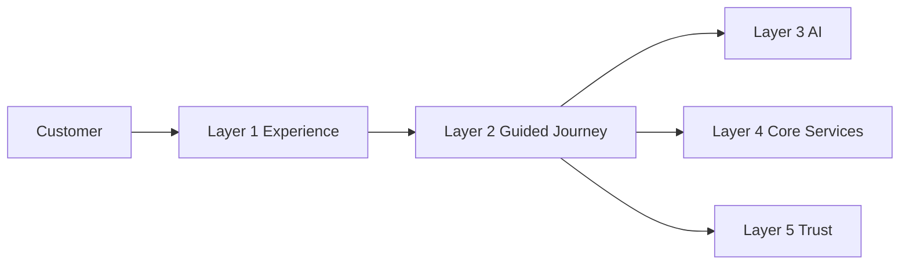
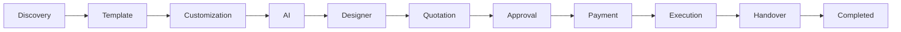
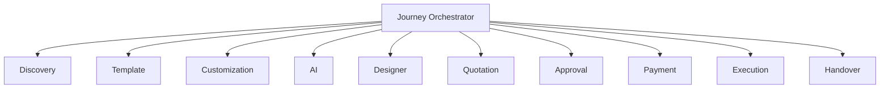

# Layer 2 Overview

## Document Information

| Property | Value |
|----------|-------|
| Layer | Layer 2 – Guided Journey |
| Document | Overview |
| Status | Production |
| Version | 1.0 |

---

# Purpose

Layer 2 is the Guided Journey layer of the platform.

It orchestrates the complete customer journey, coordinating interactions between users and downstream services while maintaining workflow state, enforcing business rules, and ensuring reliable execution from project discovery to completion.

---

# Responsibilities

Layer 2 is responsible for:

- Journey orchestration
- Workflow management
- Business rule enforcement
- AI integration
- Designer matching
- Quotation management
- Approval workflows
- Payment orchestration
- Execution coordination
- Project handover

---

# Platform Position

---

# Guided Journey

---

# Internal Architecture

---

# Core Principles

- Event-driven architecture
- Deterministic workflows
- State machine execution
- Saga orchestration
- AI-assisted recommendations
- Loose coupling
- High cohesion
- Fault tolerance

---

# External Dependencies

Layer 2 interacts with:

- Layer 1 Experience
- Layer 3 AI Operating System
- Layer 4 Core Services
- Layer 5 Trust Ecosystem
- Kafka Event Bus
- Redis Cache
- Journey Database

---

# Key Capabilities

- Customer journey management
- AI-assisted decision support
- Workflow orchestration
- Event processing
- Payment coordination
- Progress tracking
- Failure recovery
- Operational monitoring

---

# Design Goals

- Scalability
- Reliability
- Maintainability
- Security
- Extensibility
- Observability

---

# Related Documents

- README.md
- architecture.md
- journey_architecture.md
- interaction_architecture.md
- dependency_graph.md
- ADR.md
- AI_CONTEXT.md
- observability.md
