# Architecture Decision Record (ADR)
# ADR-000: Foundational Cloud Architecture & Distributed System Design

| Status | Accepted |
|---------|----------|
| Date | YYYY-MM-DD |
| Decision Makers | Architecture Team |
| Scope | Cloud Platform, Microservices, Distributed Systems |
| Related ADRs | TBD |

---

# 1. Context

Modern cloud-native applications are increasingly built as distributed microservice ecosystems. While microservices improve scalability, deployment flexibility, and organizational independence, they introduce significant architectural challenges including:

- Distributed data consistency
- Service orchestration
- Network failures
- Duplicate requests
- Long-running business transactions
- Operational complexity
- Vendor lock-in
- Knowledge preservation

To address these challenges, the platform adopts a collection of proven architectural patterns rather than relying on ad hoc implementations.

This ADR documents the foundational architectural decisions governing the platform.

---

# 2. Problem Statement

Distributed systems cannot rely on traditional monolithic design principles or database transactions across services.

The architecture must provide:

- High scalability
- Service autonomy
- Data consistency
- Failure isolation
- Long-running workflow support
- Reliable event delivery
- Maintainability
- Auditability
- Security
- Evolutionary architecture

---

# 3. Decision Summary

The platform adopts the following architectural principles:

| Area | Decision |
|--------|----------|
| Software Architecture | Clean Architecture |
| Data Consistency | Transactional Outbox Pattern |
| Event Publishing | CDC-based Outbox Processing |
| Distributed Transactions | Saga Pattern |
| Workflow Management | Orchestrated Workflows |
| Retry Safety | Idempotency Keys |
| Retry Strategy | Exponential Backoff + Jitter |
| Workflow Engine | Temporal (preferred), Camunda (business workflows) |
| Decision Documentation | Markdown ADR (MADR Format) |
| Failure Isolation | Bulkhead Pattern |
| External Authentication | Federated Identity |
| Service Protection | Circuit Breaker Pattern |

---

# 4. Architectural Principles

## 4.1 Clean Architecture

The system follows Robert C. Martin's Clean Architecture.

### Objectives

- Separation of concerns
- Framework independence
- Testability
- Maintainability
- Business rule protection

### Layer Structure

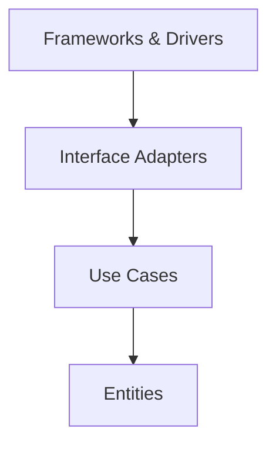

### Dependency Rule

All source code dependencies must point inward.

Outer layers may depend on inner layers.

Inner layers must never depend on external frameworks or infrastructure.

---

## Entities

Contain enterprise-wide business rules.

Examples

- Payment
- Customer
- Product
- Order

Characteristics

- Stable
- Framework independent
- Database independent

---

## Use Cases

Application-specific business logic.

Responsibilities

- Execute business workflows
- Coordinate entities
- Enforce business policies

---

## Interface Adapters

Translate data between:

- APIs
- Databases
- External systems
- Domain models

Examples

- Controllers
- Repositories
- Message Adapters
- API Gateways

---

## Frameworks & Drivers

Implementation details.

Examples

- PostgreSQL
- MongoDB
- Kafka
- React
- Spring Boot
- NestJS

---

# 5. Reliable Data Patterns

## 5.1 Transactional Outbox Pattern

### Context

A service often needs to:

1. Update its database
2. Publish an event

Traditional distributed transactions are not feasible.

---

### Decision

Store business events inside an Outbox table within the same database transaction.

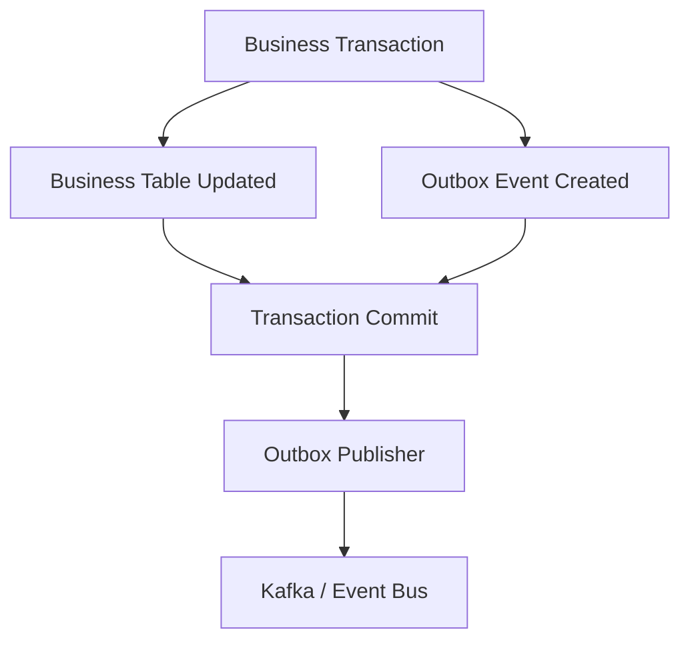
---

### Benefits

- Atomic persistence
- Reliable event delivery
- No dual-write problem
- Supports eventual consistency

---

## Outbox Processing Options

### Option A — Polling

Advantages

- Easy implementation
- Database independent

Disadvantages

- Higher latency
- Increased database load

---

### Option B — Change Data Capture (Preferred)

Uses database transaction logs.

Example

Debezium

Advantages

- Near real-time
- Minimal database impact
- Highly scalable

---

# 6. Distributed Transaction Management

## Saga Pattern

### Context

Business processes frequently span multiple services.

Example

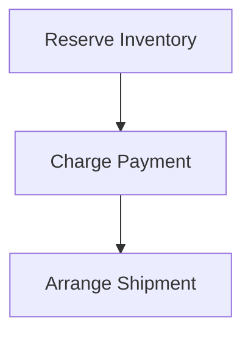

Traditional ACID transactions cannot span these services.

---

### Decision

Use Saga Pattern.

Each step becomes an independent local transaction.

Failures trigger compensating transactions.

Example

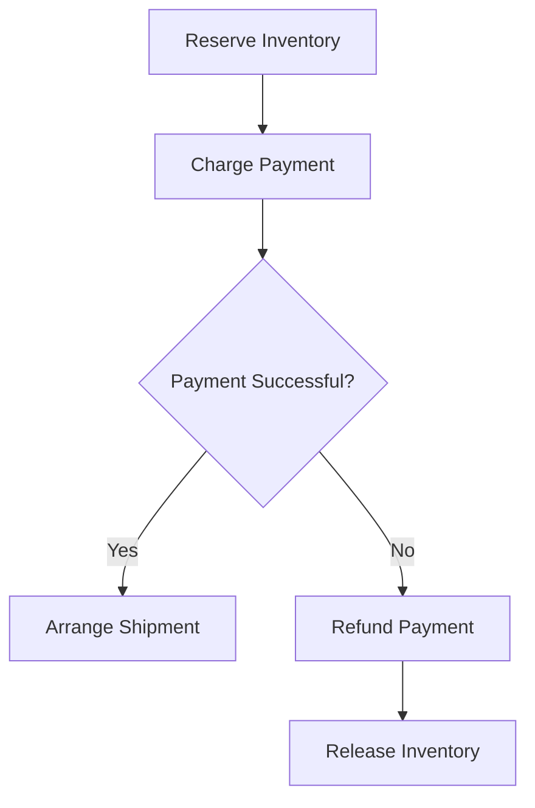
---

## Saga Styles

### Orchestration (Preferred)

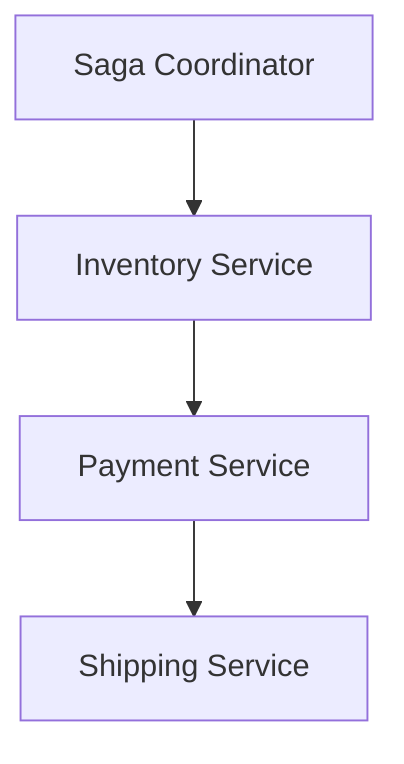

Advantages

- Easier debugging
- Better visibility
- Centralized workflow

---

### Choreography

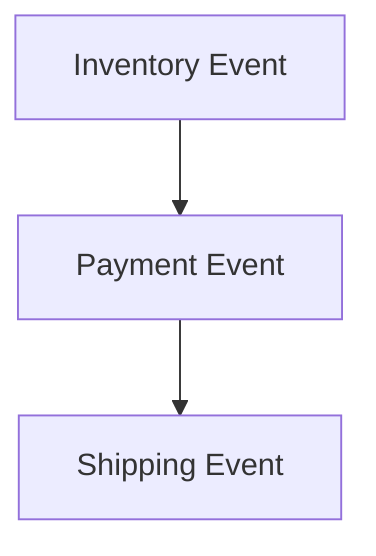

Advantages

- Loose coupling

Disadvantages

- Difficult tracing
- Complex debugging

---

# 7. API Reliability

## Idempotency

Every externally accessible write operation must be idempotent.

### Decision

Clients generate an Idempotency Key.

The server stores the operation result.

Repeated requests return the original response.

Example

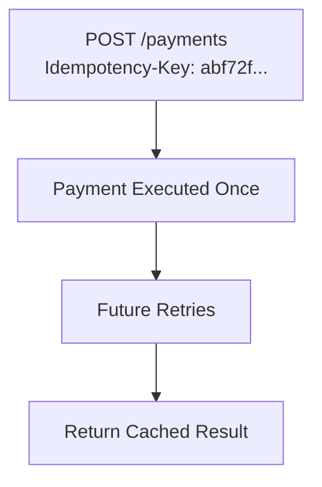
---

## Retry Strategy

Network failures are expected.

### Exponential Backoff

Retry delay increases exponentially.

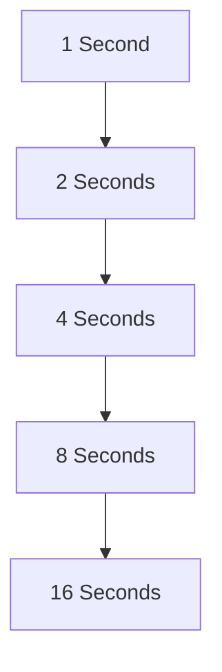

---

### Jitter

Random delay is added.

Benefits

- Prevents thundering herd
- Reduces synchronized retries
- Protects downstream systems

---

# 8. Workflow Orchestration

Workflow engines coordinate long-running business processes.

---

## Orchestration Models

### Directive

The engine commands each participant.

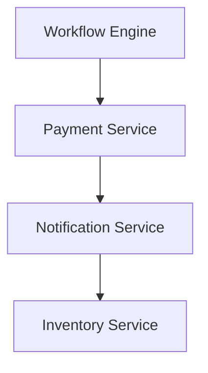

---

### Reactive

The engine listens to events and coordinates follow-up actions.

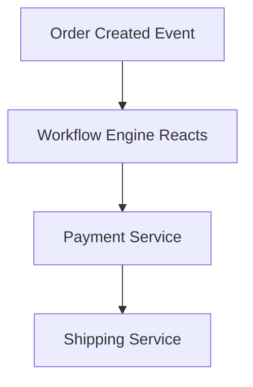

---

# Workflow Engine Selection

## Temporal (Preferred)

Characteristics

- Durable workflows
- Code-first
- Automatic retries
- State persistence

Best suited for

- Long-running workflows
- Distributed transactions
- Cloud-native systems

---

## Camunda

Characteristics

- BPMN diagrams
- Business visibility
- Compliance
- Auditability

Best suited for

- Enterprise workflow governance

---

## AWS Step Functions

Advantages

- Fully managed
- Cloud integration
- Rapid deployment

Trade-offs

- Vendor lock-in
- Cloud dependency

---

# 9. Architectural Decision Management

Architecturally significant decisions must be documented.

---

## ADR Purpose

An Architectural Decision Record captures:

- Context
- Decision
- Rationale
- Consequences

---

## Supported Formats

### Nygard ADR

Simple format

- Context
- Decision
- Status
- Consequences

---

### Y-Statement

Example

> In the context of distributed workflows, facing unreliable network communication, we decided to implement idempotency keys to prevent duplicate processing.

---

### MADR

Markdown-based ADRs integrated into Git repositories.

Preferred format.

---

# 10. Security & Reliability

## Bulkhead Pattern

Separate critical components.

Benefits

- Limits blast radius
- Prevents cascading failures

---

## Federated Identity

Authentication is delegated to external identity providers.

Examples

- OAuth 2.0
- OpenID Connect
- Azure AD
- Auth0

Benefits

- Reduced operational burden
- Improved security
- Centralized identity management

---

## Circuit Breaker

Protects services from repeatedly calling failing dependencies.

States

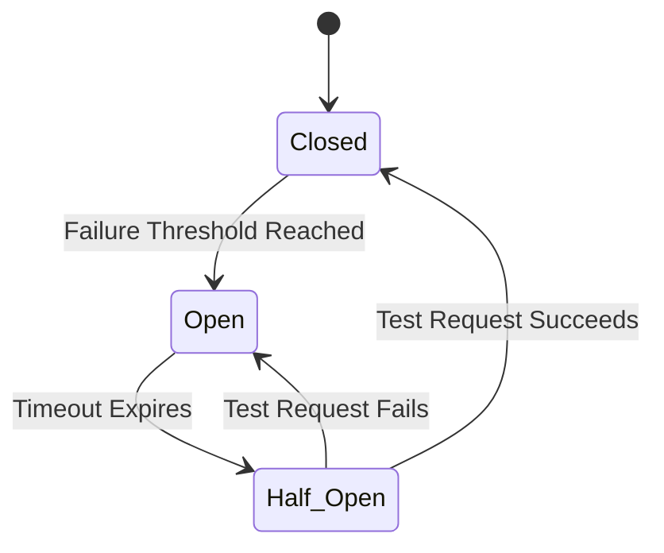

Benefits

- Faster recovery
- Reduced cascading failures
- Improved resilience

---

## Data Integrity

Every external operation must include:

- Idempotency Key
- Retry Policy
- Audit Logging

This guarantees safe retries and consistent outcomes.

---

## Sensitive Data Protection

Architecture documentation systems must ensure:

- Access control
- Encryption
- Integrity verification
- Audit history
- Secure storage

---

# 11. Consequences

## Positive

- Highly maintainable architecture
- Framework independence
- Reliable event delivery
- Scalable workflows
- Failure isolation
- Improved observability
- Simplified recovery
- Reduced operational risk
- Better documentation
- Easier onboarding

---

## Trade-offs

- Increased architectural complexity
- Eventual consistency instead of immediate consistency
- Additional infrastructure requirements
- Workflow engines require operational expertise
- More comprehensive monitoring is necessary

---

# 12. Alternatives Considered

| Alternative | Reason Rejected |
|-------------|-----------------|
| Two-Phase Commit (2PC) | Poor scalability, blocking behavior, reduced availability |
| Distributed ACID Transactions | Not suitable for autonomous microservices |
| Direct Database Integration | Tight coupling between services |
| Synchronous Service Chaining | Increased latency and failure propagation |
| Manual Decision Documentation | Knowledge loss and inconsistency |

---

# 13. References

- Robert C. Martin — Clean Architecture
- Chris Richardson — Microservices Patterns
- Martin Fowler — Architectural Decision Records
- Temporal Documentation
- Camunda Documentation
- Debezium Documentation
- AWS Architecture Center
- Microsoft Cloud Design Patterns
- Google Cloud Architecture Framework

---

# 14. Conclusion

This ADR establishes the foundational architectural standards for developing cloud-native distributed systems. By combining Clean Architecture, the Transactional Outbox Pattern, Saga orchestration, idempotent APIs, resilient retry mechanisms, durable workflow engines, and structured Architectural Decision Records, the platform achieves a scalable, maintainable, and resilient architecture capable of supporting complex long-running business processes while preserving system reliability and operational excellence.
