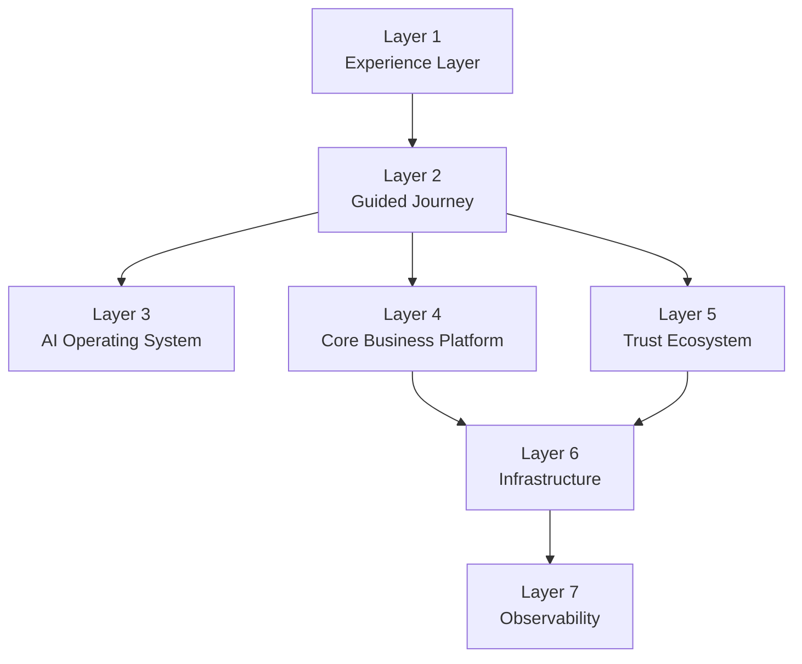
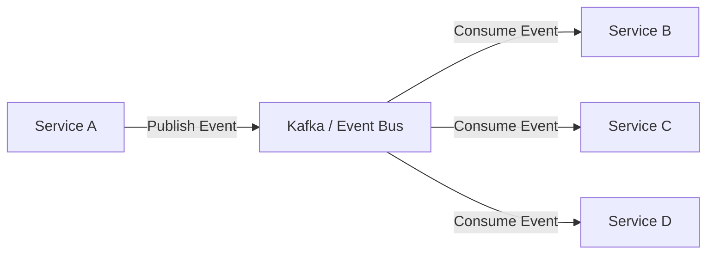
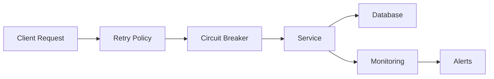
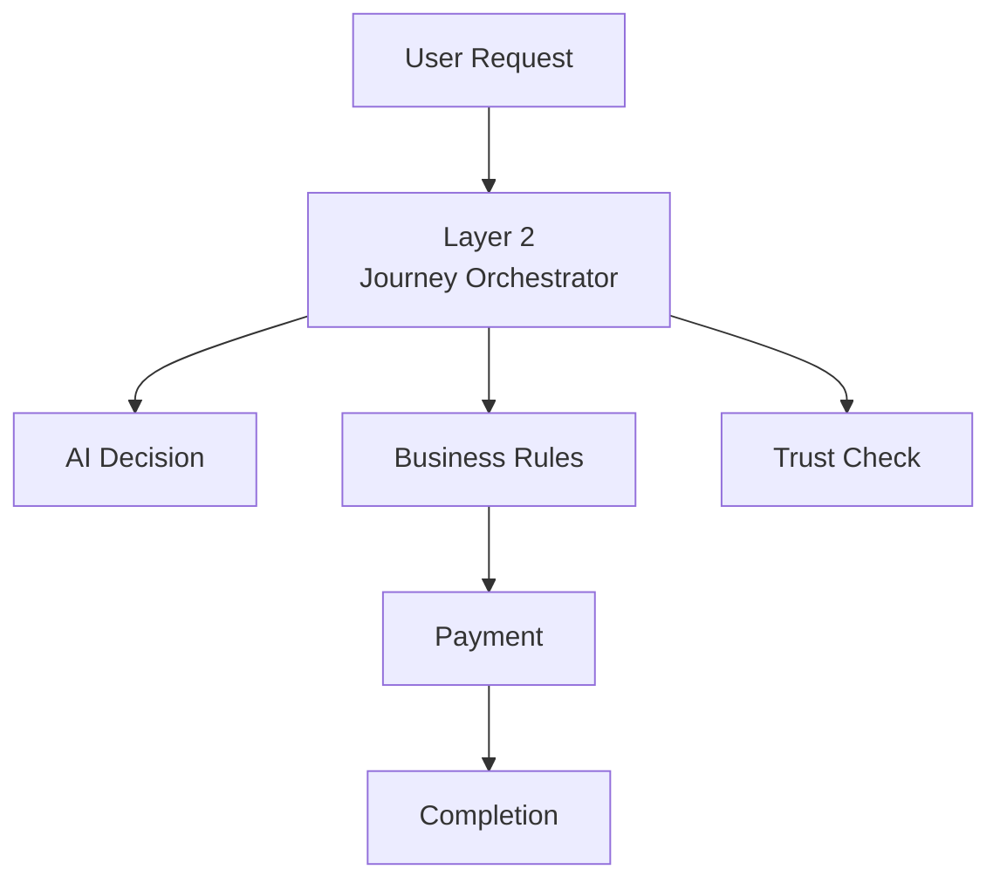

# AI Context

## Purpose

This repository contains the production architecture for the Allure Interiors platform.

The purpose of this document is to provide architectural context for AI assistants so that all generated documentation, diagrams, code, and design decisions remain consistent with the platform architecture.

---

# Project Overview

Allure Interiors is an AI-powered interior design ecosystem connecting homeowners, designers, builders, vendors, and project managers through an event-driven distributed platform.

The architecture emphasizes:

- Scalability
- High availability
- Loose coupling
- Event-driven communication
- Domain-driven design
- Long-running workflows
- Cloud-native deployment
- Production-grade reliability

---

# Architectural Principles

The platform follows:

- Clean Architecture
- Domain-Driven Design (DDD)
- Event-Driven Architecture (EDA)
- Microservices Architecture
- Saga Pattern
- Transactional Outbox Pattern
- Change Data Capture (CDC)
- CQRS where appropriate
- Eventual Consistency
- API-first development

---

# Layered Architecture

The system is organized into multiple architectural layers.

## Layer 1

Experience Layer

Responsible for

- Web UI
- Mobile UI
- Admin Portal
- Customer Portal
- APIs

---

## Layer 2

Guided Journey Layer

Responsible for

- Workflow orchestration
- Journey state management
- Long-running business processes
- Workflow checkpointing
- Saga coordination

Layer 2 never contains business logic.

It orchestrates business services.

---

## Layer 3

AI Operating System

Responsible for

- AI recommendations
- Personalization
- Designer matching
- AI analysis
- Planning
- Decision support

Layer 3 assists workflows.

It never owns business transactions.

---

## Layer 4

Core Business Platform

Contains business services.

Examples

- Payment Service
- Quotation Service
- Marketplace
- Booking
- Scheduling
- Notifications
- Billing

Business rules belong here.

---

## Layer 5

Trust Ecosystem

Responsible for

- Verification
- Trust Score
- Reputation
- Fraud Detection
- Risk Analysis

---

## Layer 6

Infrastructure Layer

Contains

- Kafka
- Databases
- Redis
- Object Storage
- API Gateway
- Authentication
- Service Mesh
- Kubernetes

No business logic exists here.

---

## Layer 7

Observability Layer

Responsible for

- Logging
- Metrics
- Tracing
- Monitoring
- Alerting
- Analytics

---

# Workflow Philosophy

Long-running workflows must be implemented as durable workflows.

Never use distributed ACID transactions.

Preferred patterns

- Saga Pattern
- Workflow Engine
- Event Choreography
- Event Orchestration

---

# Event Communication

Services communicate using asynchronous events.

Preferred technologies

- Kafka
- RabbitMQ
- Cloud Event Bus

Commands are synchronous only when immediate responses are required.

---

# Data Consistency

The platform uses eventual consistency.

Never use Two-Phase Commit (2PC).

Preferred approaches

- Transactional Outbox
- CDC
- Idempotency
- Retry Policies
- Compensating Transactions

---

# Reliability

Every service should support

- Retry
- Idempotency
- Dead Letter Queue
- Circuit Breaker
- Timeout
- Bulkhead Isolation

---

# Security

Security requirements include

- OAuth2
- OpenID Connect
- JWT
- RBAC
- Audit Logging
- Encryption
- Secret Management

---

# Documentation Standards

All generated documentation should use

- GitHub Markdown
- Mermaid diagrams
- ADR format
- Consistent terminology

Avoid unnecessary implementation details unless requested.

---

# Diagram Standards

Prefer Mermaid.

Supported diagrams include

- Flowcharts
- Sequence diagrams
- State diagrams
- Class diagrams
- Entity Relationship diagrams
- Journey diagrams

---
# Decision Flow

# Coding Philosophy

Prefer

- SOLID Principles
- Clean Code
- High cohesion
- Low coupling
- Dependency Injection
- Interface-based design

Avoid

- Tight coupling
- Shared databases
- Circular dependencies
- Monolithic workflows

---

# AI Instructions

When generating content:

- Preserve architectural consistency.
- Respect the dependency direction defined by Clean Architecture.
- Keep orchestration separate from business logic.
- Never place infrastructure concerns inside business layers.
- Prefer asynchronous communication unless synchronous interaction is explicitly required.
- Explain architectural decisions with rationale and trade-offs.
- Use production-grade terminology suitable for software architects and senior engineers.
- Generate GitHub-ready Markdown with Mermaid diagrams where appropriate.

---

# Goal

Every generated artifact should be consistent with a scalable, cloud-native, event-driven, production-grade architecture that can evolve independently while remaining maintainable, observable, and resilient.
