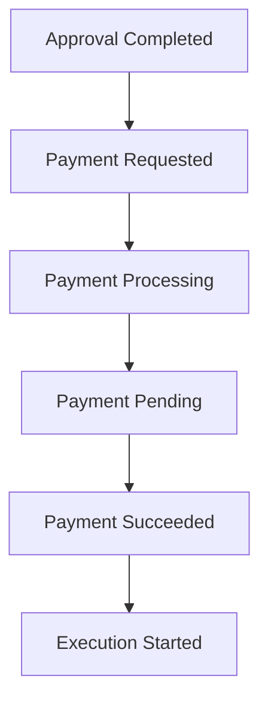

# Payment Stage Implementation Manifest

## Document Information

| Property | Value |
|----------|-------|
| Layer | Layer 2 – Guided Journey |
| Module | Payment |
| Type | Implementation Manifest |
| Status | Production |
| Owner | Journey Orchestrator |
| Execution Model | Event-Driven |
| Workflow Type | Long-Running Saga |

---

# Purpose

This manifest defines the implementation contract for the Payment stage within the Guided Journey Layer.

It specifies responsibilities, interactions, architectural boundaries, mandatory patterns, lifecycle events, implementation requirements, and operational expectations.

This document serves as the implementation reference for engineers and AI assistants.

---

# Architectural Responsibility

Layer 2 **does not process payments**.

Layer 2 only orchestrates payment workflows.

Responsibilities include

- Validate workflow state
- Create payment request
- Persist workflow checkpoint
- Invoke Payment Service
- Await asynchronous payment events
- Resume journey
- Handle retries
- Handle timeouts
- Trigger compensating workflows

Payment execution belongs to Layer 4.

---

# Scope

Included

- Journey orchestration
- State transitions
- Workflow persistence
- Saga coordination
- Retry logic
- Timeout handling
- Event publication
- Event consumption

Excluded

- Payment gateway integration
- Card processing
- UPI processing
- Invoice generation
- Refund execution

---

# Preconditions

The following conditions must be satisfied before payment begins.

- Approval completed
- Quote accepted
- Journey active
- Designer assigned
- Workflow checkpoint persisted
- User authenticated
- Trust verification completed

---

# Entry Event

```text
PaymentRequested
```

---

# Exit Events

Successful

```text
PaymentSucceeded
ExecutionStarted
```

Failure

```text
PaymentFailed
JourneyPaused
```

Cancellation

```text
PaymentCancelled
JourneyCancelled
```

Timeout

```text
PaymentExpired
PaymentRetryScheduled
```

---

# Layer Interactions

## Layer 1

Receives

- Proceed to Payment

Returns

- Payment Status

---

## Layer 3

Requests

- Fraud Analysis
- Payment Recommendation
- Policy Validation

---

## Layer 4

Invokes

- Payment Service

Receives

- Payment Completed
- Payment Failed
- Payment Pending

---

## Layer 5

Validates

- Trust Score
- Identity Verification
- Risk Score

---

## Layer 6

Uses

- Kafka
- Database
- Workflow Storage
- API Gateway

---

## Layer 7

Publishes

- Metrics
- Logs
- Traces
- Alerts

---

# Workflow State Machine



Alternative states

- PaymentFailed
- PaymentCancelled
- PaymentExpired
- PaymentRetrying

---

# Commands

- InitiatePayment
- RetryPayment
- CancelPayment

---

# Events

Published

- PaymentInitiated
- PaymentSucceeded
- PaymentFailed
- PaymentPending
- PaymentCancelled

Consumed

- ApprovalCompleted
- PaymentGatewayCallback
- RetryRequested
- TimeoutOccurred

---

# Saga Participation

Payment is one Saga step.

Previous

Quotation Approval

Current

Payment

Next

Execution

Compensations

- Cancel Payment
- Pause Journey
- Resume Approval

---

# Required Patterns

Mandatory

- Saga Pattern
- Transactional Outbox
- CDC
- Idempotency Keys
- Retry Policy
- Circuit Breaker
- Workflow Checkpointing

Avoid

- Distributed Transactions
- Two Phase Commit
- Shared Database

---

# Reliability Requirements

Every payment operation must support

- Retry
- Timeout
- Idempotency
- Event Replay
- Recovery

---

# Security Requirements

Must support

- JWT Authentication
- Authorization
- Audit Logging
- Encrypted Payloads
- Webhook Validation

---

# Observability

Every payment execution must emit

Metrics

- Payment Duration
- Retry Count
- Success Rate
- Failure Rate

Logs

- Payment Started
- Payment Completed
- Retry Scheduled

Tracing

- Journey
- Payment Service
- Gateway

Alerts

- High Failure Rate
- Timeout Threshold
- Retry Storm

---

# Performance Targets

Journey Validation

<100 ms

Payment Request

<200 ms

Checkpoint Persistence

<100 ms

Workflow Resume

<500 ms

---

# Failure Handling

Recoverable

- Network Failure
- Gateway Timeout
- Temporary Service Failure

Non-Recoverable

- Invalid Payment
- Fraud Detection
- Authorization Failure

---


# Acceptance Criteria

The implementation is considered complete when

- Workflow state machine implemented
- Saga orchestration completed
- Events published correctly
- Events consumed correctly
- Retry policy implemented
- Idempotency verified
- Observability integrated
- Security validated
- Documentation completed

---

# Implementation Principles

- Orchestration over business logic
- Event-driven communication
- Loose coupling
- Stateless services
- Durable workflows
- Eventual consistency
- High observability
- Production-grade reliability
