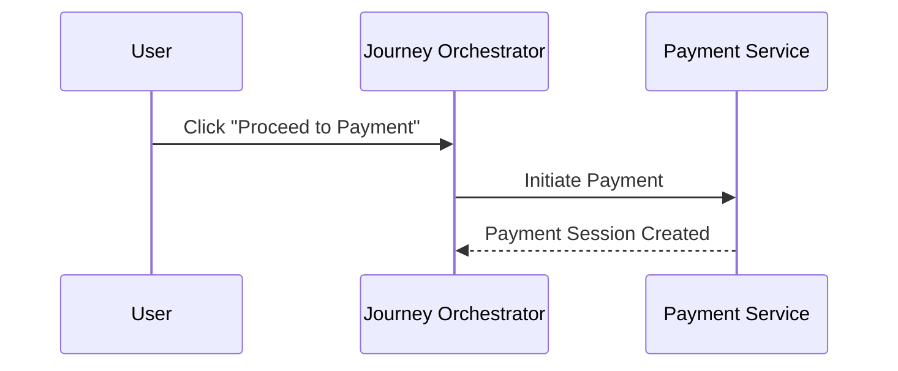
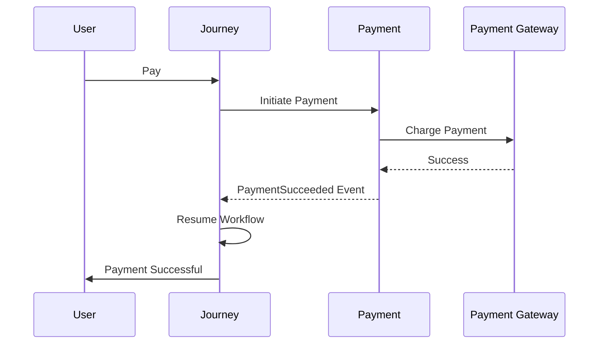
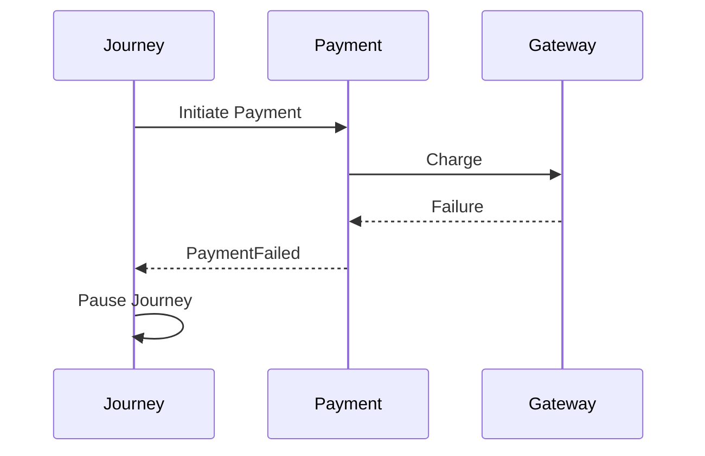
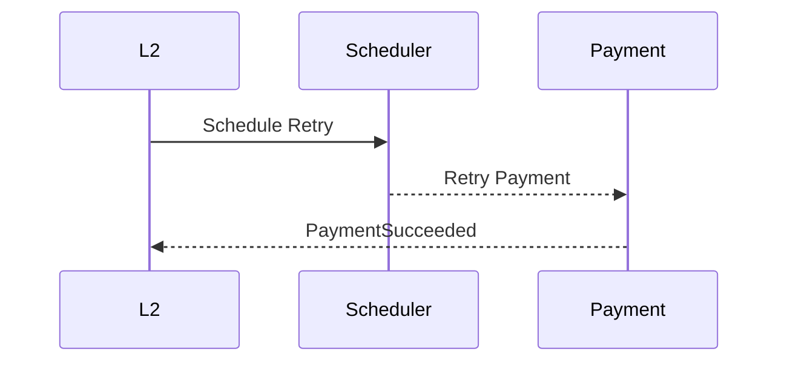
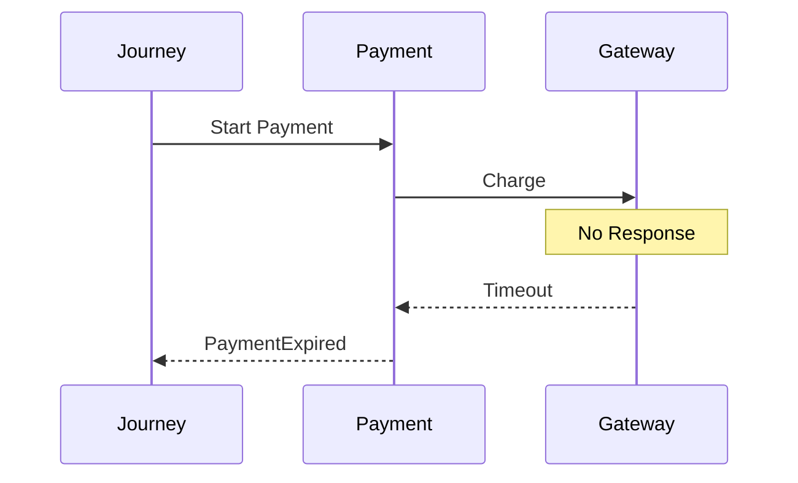
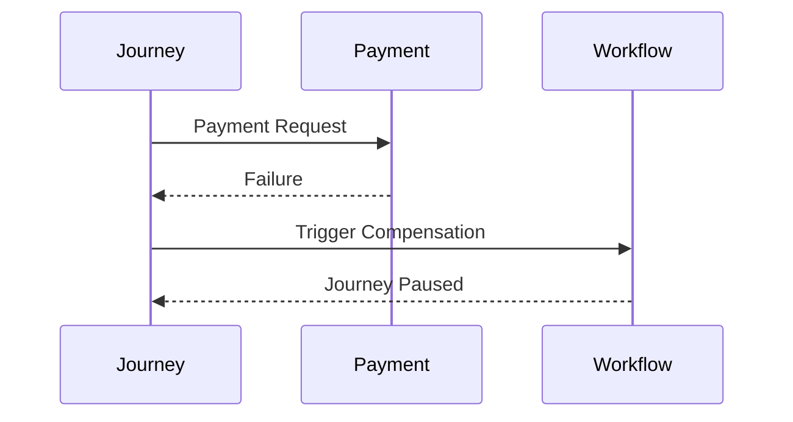
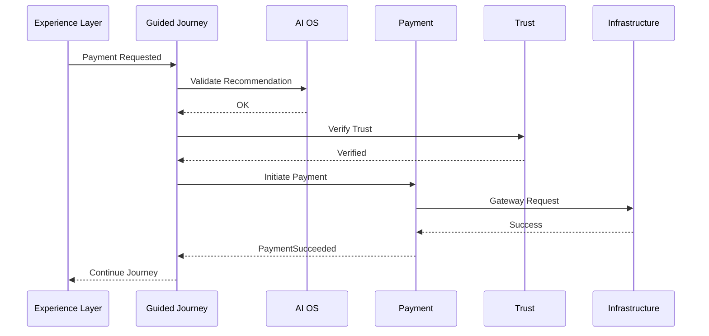
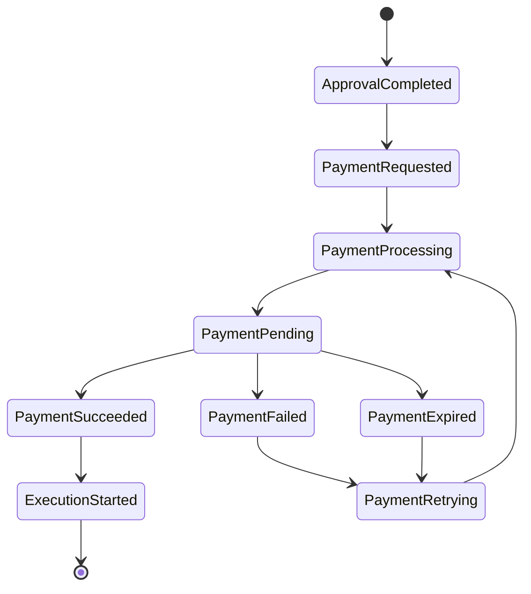

# Payment Journey Animation

## Purpose

This document visualizes the complete lifecycle of the **Payment Stage** in Layer 2 (Guided Journey Layer).

The diagrams illustrate:

- Journey orchestration
- Layer interactions
- Event flow
- Success path
- Failure path
- Retry flow
- Compensation flow

---

# Animation 1 — Payment Request

---

# Animation 2 — Successful Payment

---

# Animation 3 — Payment Failure

---

# Animation 4 — Retry

---

# Animation 5 — Timeout

---

# Animation 6 — Compensation

---

# Animation 7 — Layer Interaction

---

# Animation 8 — Complete Lifecycle

---

# Animation Summary

| Animation | Purpose |
|------------|---------|
| Payment Request | Journey starts payment |
| Success Flow | Normal payment lifecycle |
| Failure Flow | Payment failure handling |
| Retry Flow | Automatic retry |
| Timeout Flow | Gateway timeout |
| Compensation | Saga rollback |
| Layer Interaction | Cross-layer communication |
| Lifecycle | Complete payment state machine |
