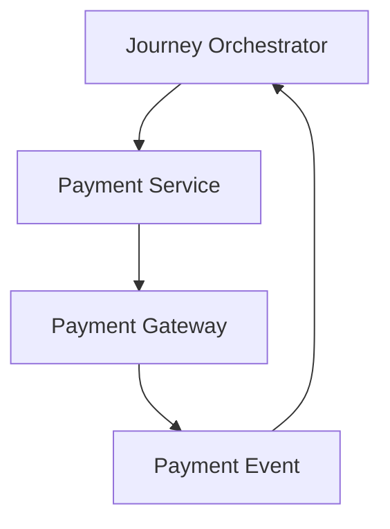
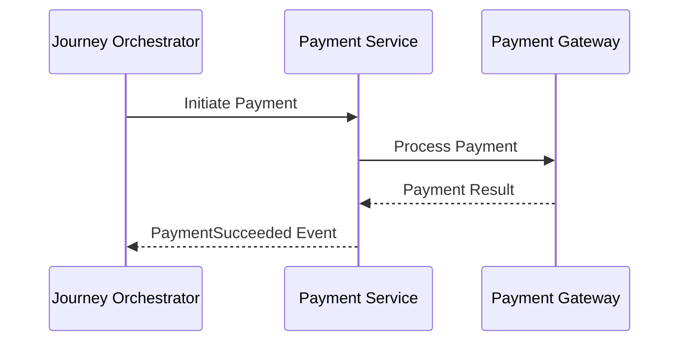
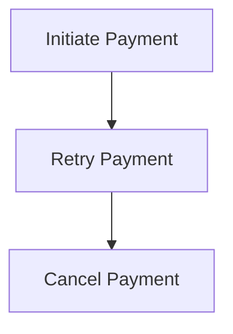
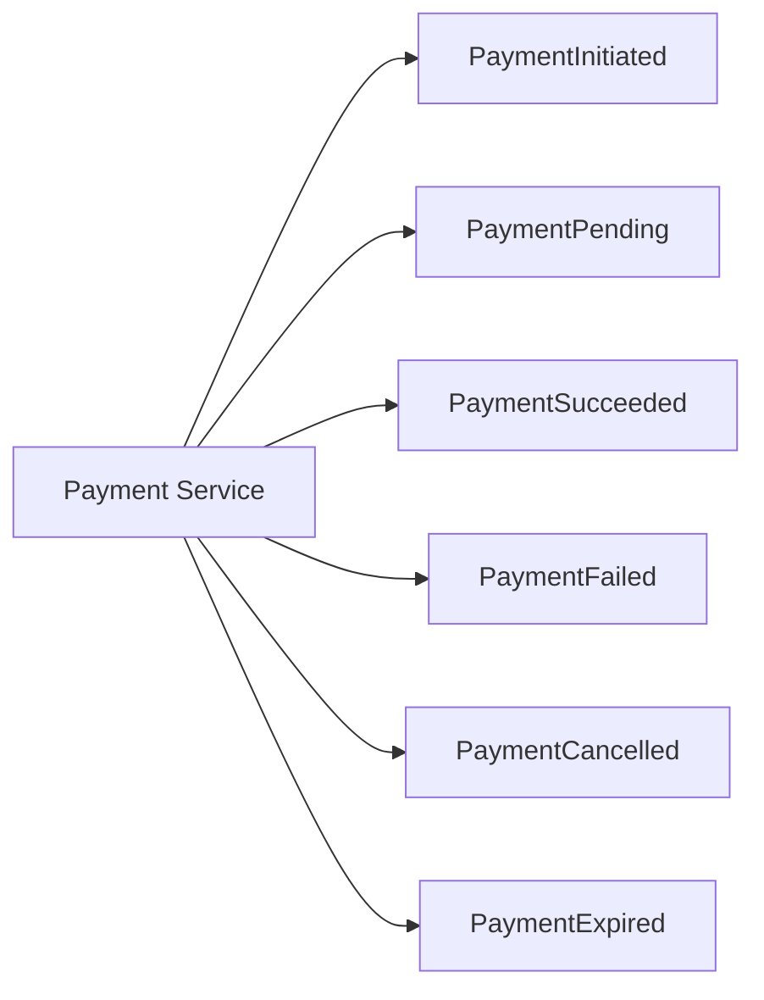
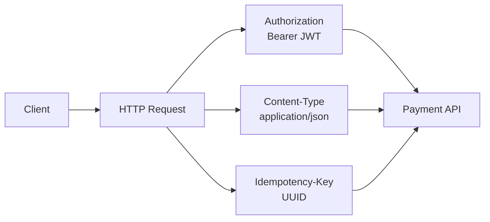
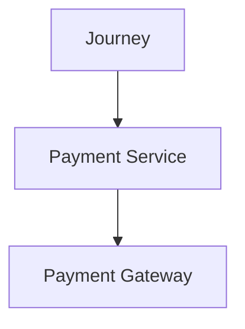

# Payment API Contract

## Document Information

| Property | Value |
|----------|-------|
| Layer | Layer 2 – Guided Journey |
| Module | Payment |
| Document Type | API Contract |
| Communication Model | Request / Response + Event Driven |
| Status | Production |

---

# Purpose

This document defines the interface contract between the Guided Journey Layer (Layer 2) and the Core Business Platform (Layer 4) for payment orchestration.

Layer 2 orchestrates the payment lifecycle.

Layer 4 owns payment execution.

No payment gateway communication occurs directly from Layer 2.

---

# Responsibilities

## Layer 2

Responsible for

- Journey validation
- Workflow orchestration
- Payment initiation
- Workflow checkpointing
- Waiting for asynchronous events
- Retry scheduling
- Timeout handling

---

## Layer 4

Responsible for

- Payment execution
- Gateway integration
- Invoice creation
- Transaction persistence
- Refund execution
- Webhook processing

---

# Communication Pattern



---

# Interaction Overview



---

# API Endpoints

## Create Payment

```
POST /payments
```

Purpose

Creates a payment session.

---

### Request

```json
{
  "journeyId": "JR-1001",
  "quotationId": "QT-2201",
  "customerId": "CUS-201",
  "amount": 150000,
  "currency": "INR",
  "paymentType": "BOOKING",
  "idempotencyKey": "8d76fa..."
}
```

---

### Response

```json
{
  "paymentId": "PAY-9001",
  "status": "PENDING",
  "paymentUrl": "https://..."
}
```

---

## Get Payment Status

```
GET /payments/{paymentId}
```

---

Example Response

```json
{
  "paymentId": "PAY-9001",
  "status": "SUCCESS"
}
```

---

## Cancel Payment

```
POST /payments/{paymentId}/cancel
```

---

## Retry Payment

```
POST /payments/{paymentId}/retry
```

---

# Commands

Layer 2 sends



---

# Events

Layer 4 publishes


Layer 2 subscribes to these events.

---

# Payment States



---

# Request Headers


---

# Authentication

Supported

- OAuth2
- JWT
- OpenID Connect

---

# Authorization

Layer 2 must be authorized to invoke Payment Service.

Recommended

- Service Account
- RBAC
- mTLS

---

# Idempotency

Every payment request MUST include

```
Idempotency-Key
```

Duplicate keys return the previous response.

No duplicate payment execution is permitted.

---

# Timeouts

| Operation | Timeout |
|-----------|----------|
| Create Payment | 30 seconds |
| Status Query | 10 seconds |
| Retry | 30 seconds |

---

# Retry Policy

Retry only

- Network failure
- Gateway timeout
- Temporary service unavailable

Never retry

- Invalid payment
- Authorization failure
- Fraud detected

Use

- Exponential Backoff
- Jitter

---

# Error Codes

| Code | Meaning |
|------|----------|
| PAYMENT_PENDING | Waiting for completion |
| PAYMENT_SUCCESS | Payment completed |
| PAYMENT_FAILED | Payment failed |
| PAYMENT_CANCELLED | User cancelled |
| PAYMENT_TIMEOUT | Gateway timeout |
| DUPLICATE_REQUEST | Idempotency violation |
| FRAUD_DETECTED | Trust validation failed |

---

# Security Requirements

Mandatory

- TLS 1.3
- JWT validation
- Webhook signature verification
- Request validation
- Payload encryption (where required)
- Audit logging

---

# Workflow Checkpoint

Before invoking Payment Service, Layer 2 must persist

- Journey State
- Payment Request
- Correlation ID
- Retry Count
- Timestamp

---

# Correlation

Every request must include

```
Correlation-ID
```

Example

```
CORR-982371
```

Used for

- Logging
- Tracing
- Event correlation
- Debugging

---

# Observability

Every request must emit

Metrics

- Payment Duration
- Gateway Latency
- Success Rate
- Failure Rate

Logs

- Payment Requested
- Payment Completed
- Retry Scheduled

Tracing



---

# Service Level Objectives

| Metric | Target |
|---------|---------|
| Availability | 99.9% |
| Payment API Latency | <300 ms (excluding gateway) |
| Event Delivery | At least once |
| Retry Success | >95% |

---

# Versioning

Current

```
v1
```

Future versions

```
/api/v2/payments
```

Backward compatibility is required.

---

# Design Principles

- Stateless APIs
- Event-driven orchestration
- Loose coupling
- Idempotent operations
- Secure by default
- Observable by design
- Backward compatible
- Production-ready interfaces

---

# Related Documents

- ADR.md
- IMPLEMENTATION_MANIFEST.md
- STATE_MACHINE.md
- EVENT_CATALOG.md
- FAILURE_HANDLING.md
- SECURITY.md
- OBSERVABILITY.md
