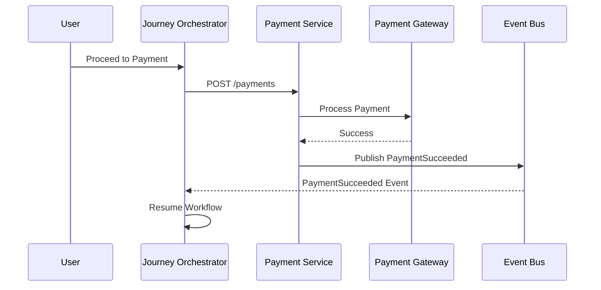
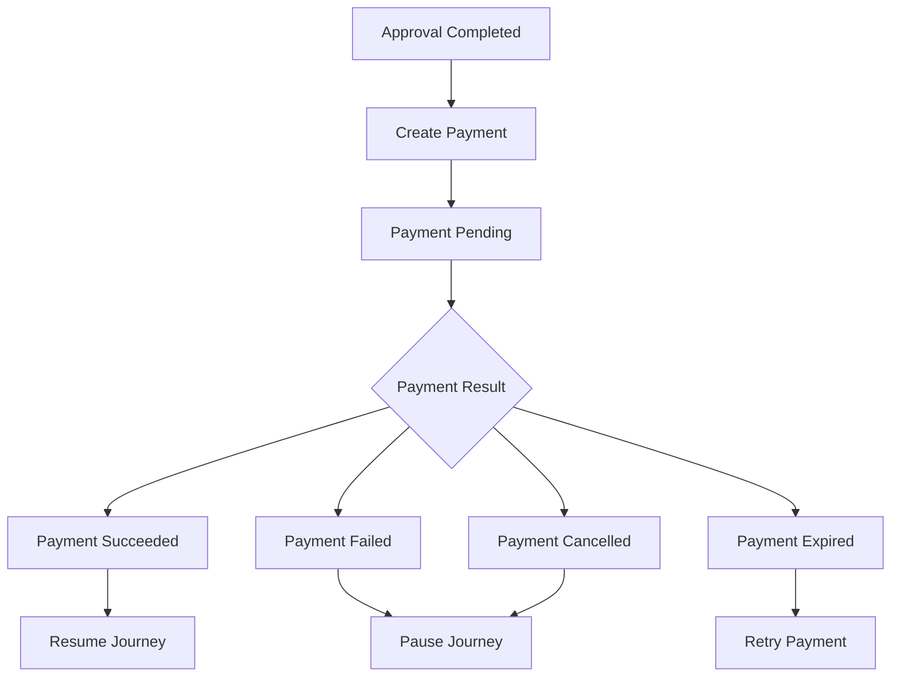
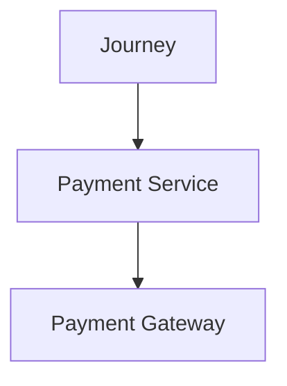

# Payment API Usage

## Document Information

| Property | Value |
|----------|-------|
| Layer | Layer 2 – Guided Journey |
| Module | Payment |
| Document Type | API Usage Guide |
| Audience | Backend Engineers, Architects |
| Status | Production |

---

# Purpose

This document explains how the Guided Journey Layer (Layer 2) interacts with the Payment Service (Layer 4).

It describes:

- When payment APIs are called
- Required inputs
- Expected outputs
- Retry behavior
- Idempotency
- Event handling
- Failure recovery

Layer 2 consumes payment APIs but never executes payment logic.

---

# Payment Workflow



---

# When to Call Payment API

Invoke the Payment Service only after:

- Approval completed
- Quote accepted
- Trust verification successful
- Workflow checkpoint persisted

Never invoke payment before these preconditions are met.

---

# API Usage

## Create Payment

### Endpoint

```
POST /payments
```

### Example Request

```http
POST /payments HTTP/1.1
Authorization: Bearer <JWT>
Content-Type: application/json
Idempotency-Key: 550e8400-e29b-41d4-a716-446655440000
Correlation-ID: CORR-123456
```

### Example Body

```json
{
  "journeyId": "JR-1001",
  "quotationId": "QT-2201",
  "customerId": "CUS-001",
  "amount": 250000,
  "currency": "INR",
  "paymentType": "BOOKING"
}
```

---

## Successful Response

```json
{
  "paymentId": "PAY-9001",
  "status": "PENDING",
  "paymentUrl": "https://payment.example.com/session"
}
```

---

# Expected Events

Layer 2 subscribes to:

| Event | Action |
|--------|--------|
| PaymentInitiated | Update workflow state |
| PaymentPending | Wait for completion |
| PaymentSucceeded | Continue journey |
| PaymentFailed | Pause workflow |
| PaymentCancelled | Cancel journey |
| PaymentExpired | Schedule retry |

---

# Usage Lifecycle



---

# Retry Policy

Retry only when:

- Gateway timeout
- Network interruption
- Temporary service unavailable

Do not retry when:

- Fraud detected
- Invalid payment request
- Authorization failure

Use:

- Exponential Backoff
- Jitter
- Maximum retry limit

---

# Idempotency

Every payment request must include an `Idempotency-Key`.

Benefits:

- Prevents duplicate charges
- Supports safe retries
- Enables recovery after failures

If the same key is received again, the Payment Service returns the original response instead of creating a new transaction.

---

# Correlation ID

Every request must include:

```
Correlation-ID
```

Used for:

- Distributed tracing
- Event correlation
- Audit logging
- Debugging

---

# Error Handling

| Error | Layer 2 Action |
|--------|----------------|
| PaymentPending | Continue waiting |
| PaymentFailed | Pause workflow |
| PaymentCancelled | Cancel journey |
| PaymentExpired | Schedule retry |
| DuplicateRequest | Return previous result |
| GatewayTimeout | Retry according to policy |

---

# Security

Every request must include:

- JWT Authorization
- TLS encryption
- Idempotency-Key
- Correlation-ID

Sensitive payment information must never be logged.

---

# Observability

Capture:

Metrics

- Payment latency
- Success rate
- Failure rate
- Retry count

Logs

- Payment requested
- Payment completed
- Retry scheduled

Tracing


---

# Best Practices

- Validate workflow state before calling the API.
- Persist a workflow checkpoint before initiating payment.
- Use asynchronous events to resume the journey.
- Never block the workflow while waiting for gateway callbacks.
- Treat payment as a Saga step, not as a distributed transaction.
- Use idempotency keys for every payment request.
- Handle retries only for transient failures.
- Publish and consume events through the event bus.

---

# Related Documents

- ADR.md
- API_CONTRACT.md
- IMPLEMENTATION_MANIFEST.md
- EVENT_CATALOG.md
- STATE_MACHINE.md
- FAILURE_HANDLING.md
- OBSERVABILITY.md
