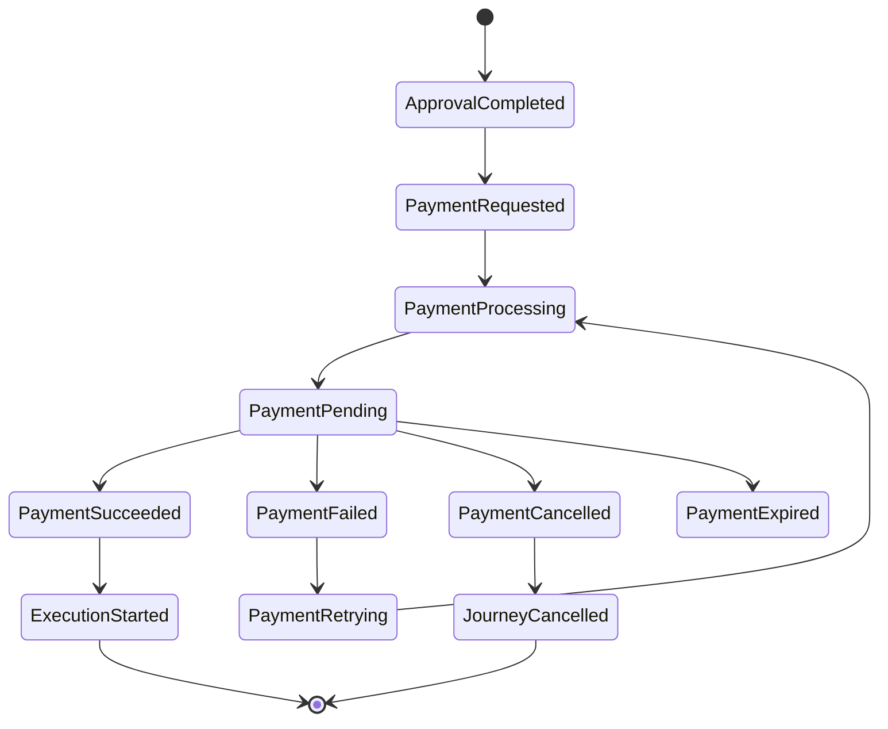

# Payment Business Rules

## Document Information

| Property | Value |
|----------|-------|
| Layer | Layer 2 – Guided Journey |
| Module | Payment |
| Document Type | Business Rules |
| Status | Production |
| Owner | Journey Orchestrator |

---

# Purpose

This document defines the business rules governing the Payment stage within the Guided Journey Layer.

The Journey Orchestrator enforces these rules before initiating, retrying, or completing payment workflows.

---

# Business Objective

The Payment stage confirms the customer's financial commitment before project execution begins.

Successful payment authorizes the workflow to continue into the Execution stage.

---

# Rule Categories

- Journey Validation
- Payment Eligibility
- Payment Processing
- Retry Rules
- Timeout Rules
- Cancellation Rules
- Security Rules
- Workflow Rules

---

# Journey Validation Rules

## BR-001

**Approval must be completed.**

Payment cannot begin until the customer has approved the quotation.

---

## BR-002

**Quotation must be accepted.**

Rejected or expired quotations cannot proceed to payment.

---

## BR-003

**Journey must be active.**

Cancelled or completed journeys cannot initiate payment.

---

## BR-004

**Workflow checkpoint must exist.**

The current journey state must be persisted before payment begins.

---

# Customer Validation Rules

## BR-005

Customer must be authenticated.

---

## BR-006

Customer identity must be verified.

---

## BR-007

Trust verification must succeed before payment.

---

# Payment Eligibility Rules

## BR-008

Only one active payment may exist for a journey.

Duplicate payment sessions are prohibited.

---

## BR-009

Payment amount must match the approved quotation.

---

## BR-010

Currency must be supported.

---

## BR-011

Payment type must be valid.

Supported examples:

- Booking
- Milestone
- Final
- Additional Work

---

# Payment Processing Rules

## BR-012

Every payment request must include an Idempotency Key.

---

## BR-013

A Correlation ID is required for every payment request.

---

## BR-014

Layer 2 never communicates directly with external payment gateways.

Payment execution is delegated to Layer 4.

---

## BR-015

Payment completion is confirmed only through asynchronous events.

---

# Retry Rules

## BR-016

Retries are permitted only for transient failures.

Examples:

- Gateway timeout
- Network interruption
- Temporary service outage

---

## BR-017

Business validation failures must not be retried.

Examples:

- Invalid quotation
- Fraud detection
- Authorization failure

---

## BR-018

Retry attempts must use exponential backoff with jitter.

---

# Timeout Rules

## BR-019

Payments exceeding the configured timeout are marked as expired.

---

## BR-020

Expired payments require a new retry decision before execution continues.

---

# Cancellation Rules

## BR-021

Users may cancel payment before completion.

---

## BR-022

Completed payments cannot be cancelled.

Refunds require a separate business workflow.

---

## BR-023

Journey cancellation terminates all pending payment activities.

---

# Workflow Rules

## BR-024

Payment is a Saga step.

It is not a distributed transaction.

---

## BR-025

Workflow state must be updated after every payment event.

---

## BR-026

Successful payment transitions the journey to the Execution stage.

---

## BR-027

Failed payments pause the journey until resolution.

---

# Security Rules

## BR-028

JWT authentication is mandatory.

---

## BR-029

All communication must use TLS.

---

## BR-030

Sensitive payment information must never be logged.

---

# Event Rules

Layer 2 publishes:

- PaymentRequested
- RetryPaymentRequested
- CancelPaymentRequested

Layer 2 consumes:

- PaymentInitiated
- PaymentPending
- PaymentSucceeded
- PaymentFailed
- PaymentCancelled
- PaymentExpired

---

# State Transition Rules

---

# Decision Matrix

| Condition | Decision |
|-----------|----------|
| Approval incomplete | Reject payment |
| Quote expired | Reject payment |
| Journey cancelled | Reject payment |
| Trust verification failed | Reject payment |
| Duplicate payment request | Return existing payment |
| Gateway timeout | Retry |
| Payment succeeded | Continue journey |
| Payment failed | Pause journey |
| Payment cancelled | Cancel journey |

---

# Business Constraints

- One active payment per journey
- No duplicate charges
- Event-driven workflow
- Eventual consistency
- Payment gateway isolation
- Saga-based orchestration

---

# Compliance Requirements

- Audit every payment action
- Maintain immutable payment history
- Preserve workflow checkpoints
- Record correlation identifiers
- Support regulatory reporting

---

# Related Documents

- ADR.md
- IMPLEMENTATION_MANIFEST.md
- API_CONTRACT.md
- API_USAGE.md
- STATE_MACHINE.md
- EVENT_CATALOG.md
- FAILURE_HANDLING.md
