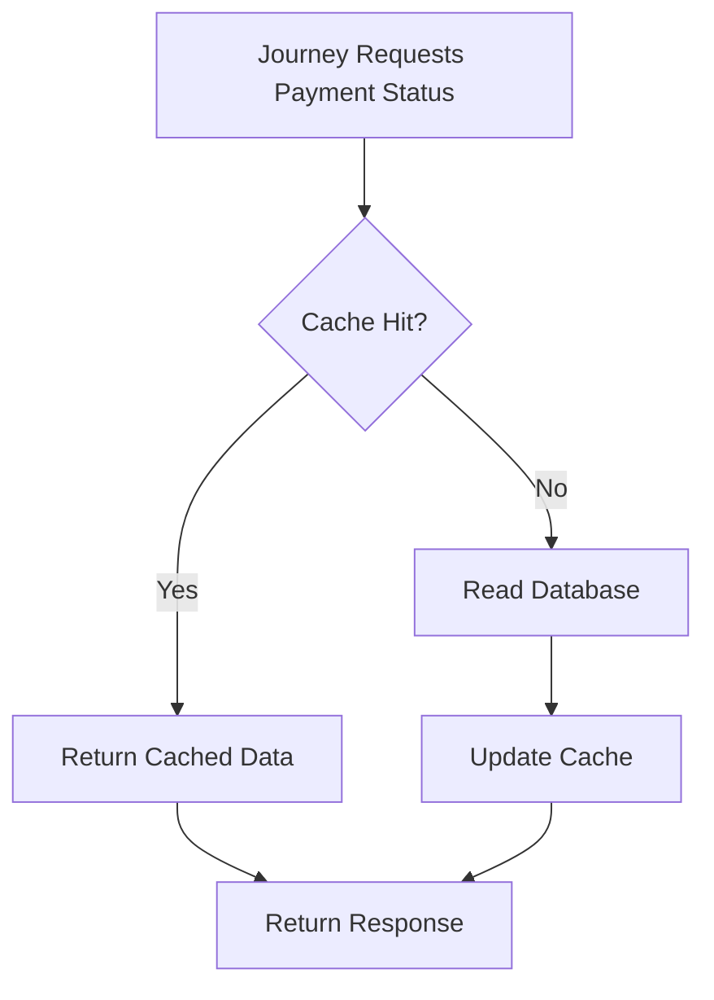
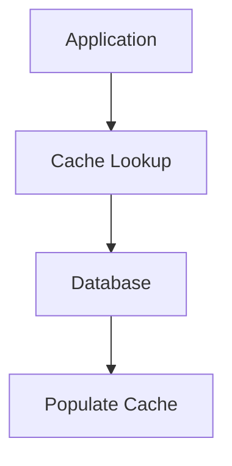
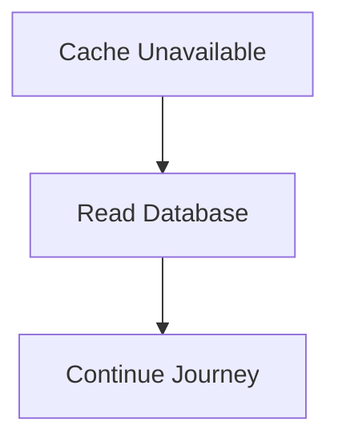

# Payment Cache Strategy

## Document Information

| Property | Value |
|----------|-------|
| Layer | Layer 2 – Guided Journey |
| Module | Payment |
| Document Type | Cache Strategy |
| Status | Production |
| Cache Type | Distributed Cache |

---

# Purpose

This document defines the caching strategy for the Payment stage in Layer 2.

The objective is to improve performance while maintaining payment integrity, consistency, and security.

Payment data is considered highly sensitive.

Therefore, only non-authoritative data may be cached.

The database remains the source of truth.

---

# Cache Objectives

- Reduce database reads
- Reduce repeated workflow lookups
- Improve journey performance
- Support idempotent requests
- Minimize gateway requests
- Improve scalability

---

# Source of Truth

Authoritative storage

- Payment Database
- Journey Database

Cache is never the source of truth.

---

# Cache Architecture

---

# Cacheable Data

Allowed

- Payment Status
- Workflow Checkpoint
- Journey State
- Payment Session
- Idempotency Lookup
- Correlation Mapping

---

# Non-Cacheable Data

Never cache

- Card Numbers
- CVV
- Payment Tokens
- Bank Credentials
- Gateway Secrets
- JWT Tokens
- Personal Financial Information

---

# Cache Keys

Examples

payment:{paymentId}

journey:{journeyId}

checkpoint:{journeyId}

idempotency:{key}

status:{paymentId}

---

# Cache TTL

| Item | TTL |
|------|-----|
| Payment Status | 5 minutes |
| Journey State | 15 minutes |
| Workflow Checkpoint | 30 minutes |
| Idempotency Key | 24 hours |
| Correlation Mapping | 24 hours |

---

# Cache Flow

---

# Cache Invalidation

Invalidate cache when

- Payment succeeds
- Payment fails
- Payment expires
- Payment cancelled
- Journey completed

---

# Update Strategy

---

# Consistency

Model

Eventual Consistency

Payment events refresh cache.

Cache never updates independently.

---

# Event Driven Refresh

---

# Idempotency Cache

Store

- Idempotency Key
- Payment ID
- Response
- Timestamp

Benefits

- Prevent duplicate payments
- Fast retry response
- Safe recovery

---

# Cache Failure Policy

Cache failures must never block payment processing.

---

# Security

Redis must support

- TLS
- Authentication
- Encryption
- Access Control

Sensitive payment information must never be cached.

---

# Monitoring

Metrics

- Cache Hit Ratio
- Cache Miss Ratio
- Cache Latency
- Evictions
- Expired Keys

Alerts

- Low Hit Ratio
- Redis Down
- Memory Pressure
- High Latency

---

# Performance Targets

| Metric | Target |
|---------|---------|
| Cache Read | <5 ms |
| Cache Write | <10 ms |
| Hit Ratio | >90% |
| Miss Ratio | <10% |

---

# Design Principles

- Cache is optional.
- Database is authoritative.
- Cache Aside Pattern.
- Event-driven invalidation.
- Never cache sensitive payment information.
- Idempotency cache is mandatory.
- Cache failures must not interrupt payment workflows.

---

# Related Documents

- IMPLEMENTATION_MANIFEST.md
- API_CONTRACT.md
- API_USAGE.md
- STATE_MACHINE.md
- OBSERVABILITY.md
- SECURITY.md
