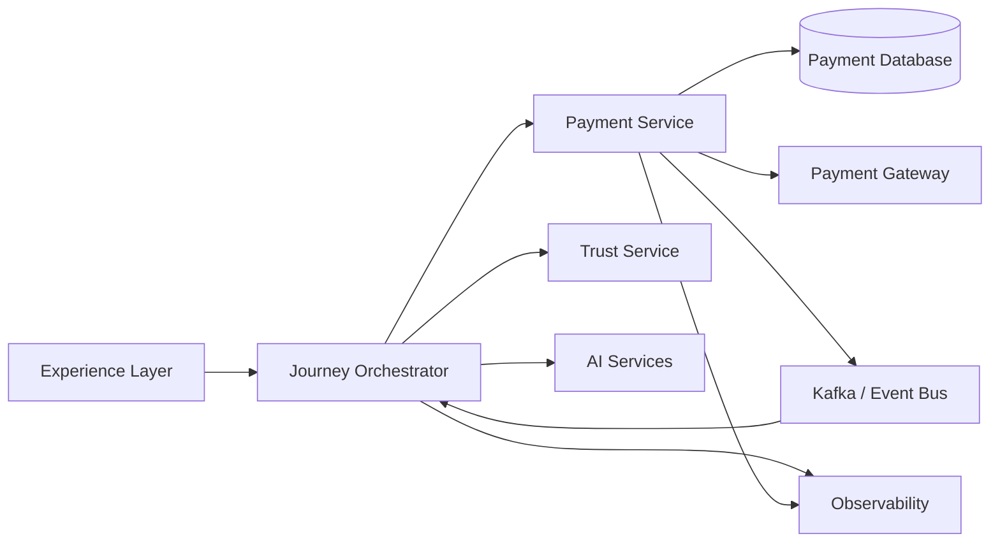
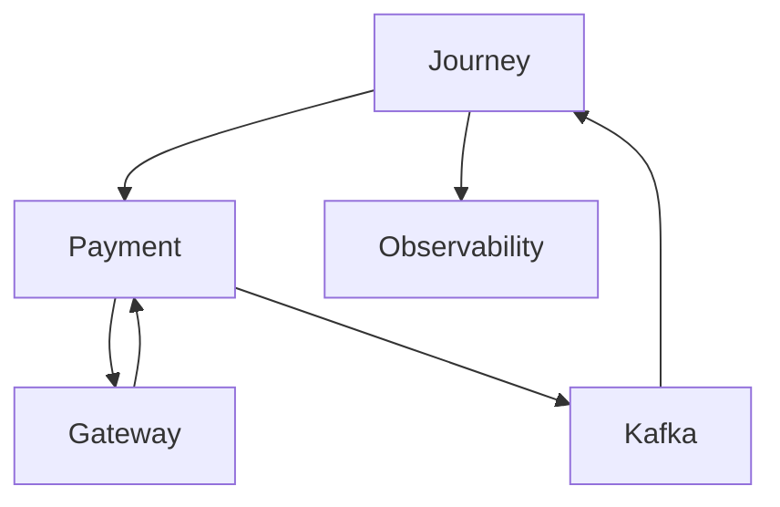

# Payment Component Inventory

## Document Information

| Property | Value |
|----------|-------|
| Layer | Layer 2 – Guided Journey |
| Module | Payment |
| Document Type | Component Inventory |
| Status | Production |

---

# Purpose

This document catalogs every architectural component participating in the Payment stage.

It identifies ownership, responsibilities, dependencies, communication models, and lifecycle roles.

The inventory provides a single source of truth for developers, architects, and AI assistants.

---

# Component Landscape

---

# Component Inventory

| Component | Layer | Responsibility | Owner |
|-----------|-------|---------------|-------|
| Experience Layer | Layer 1 | User payment initiation | Frontend |
| Journey Orchestrator | Layer 2 | Workflow orchestration | Journey Team |
| AI Services | Layer 3 | Fraud & recommendations | AI Platform |
| Payment Service | Layer 4 | Execute payments | Payment Team |
| Trust Service | Layer 5 | Trust verification | Trust Team |
| Kafka/Event Bus | Layer 6 | Event communication | Platform Team |
| Payment Database | Layer 6 | Payment persistence | Platform Team |
| Payment Gateway | External | Financial transaction | Gateway Provider |
| Observability | Layer 7 | Metrics, logs, tracing | Platform Team |

---

# Internal Components

Journey Orchestrator

Responsibilities

- Validate workflow
- Initiate payment
- Wait for payment events
- Resume workflow

---

Payment Service

Responsibilities

- Payment execution
- Gateway integration
- Webhook handling
- Transaction persistence

---

Trust Service

Responsibilities

- Trust score
- Fraud detection
- Risk evaluation

---

AI Services

Responsibilities

- Payment recommendations
- Fraud analysis
- Intelligent routing

---

Kafka/Event Bus

Responsibilities

- Event publication
- Event subscription
- Asynchronous messaging

---

Observability

Responsibilities

- Logging
- Metrics
- Tracing
- Alerts

---

# External Components

Payment Gateway

Examples

- Razorpay
- Stripe
- PayPal
- Adyen

Responsibilities

- Payment authorization
- Payment capture
- Refund processing

---

# Component Relationships

---

# Dependency Matrix

| Component | Depends On |
|------------|------------|
| Journey Orchestrator | Payment Service, AI, Trust |
| Payment Service | Payment Gateway, Database, Kafka |
| Trust Service | Verification Platform |
| AI Services | AI Models |
| Kafka | Infrastructure |
| Observability | All Components |

---

# Communication Model

| Source | Target | Type |
|---------|--------|------|
| Journey | Payment | REST |
| Payment | Gateway | HTTPS |
| Gateway | Payment | HTTPS |
| Payment | Kafka | Event |
| Kafka | Journey | Event |
| Journey | Observability | Metrics |

---

# Lifecycle Ownership

Journey Layer

- Payment initiation
- Workflow state
- Retry scheduling

Payment Layer

- Payment execution
- Payment status
- Refunds

Infrastructure

- Event delivery
- Persistence
- Availability

---

# Component Availability

| Component | Availability Target |
|------------|--------------------|
| Journey | 99.9% |
| Payment Service | 99.9% |
| Kafka | 99.95% |
| Database | 99.99% |
| Gateway | Provider SLA |

---

# Failure Impact

| Component | Impact |
|------------|--------|
| Journey | Workflow paused |
| Payment Service | Payments unavailable |
| Kafka | Events delayed |
| Database | Payment processing blocked |
| Gateway | External payment failure |
| Observability | Reduced visibility only |

---

# Design Principles

- Loose coupling
- Single responsibility
- Event-driven communication
- Stateless orchestration
- Independent deployment
- High observability
- Fault isolation

---

# Related Documents

- ADR.md
- IMPLEMENTATION_MANIFEST.md
- API_CONTRACT.md
- API_USAGE.md
- CACHE.md
- STATE_MACHINE.md
- EVENT_CATALOG.md
