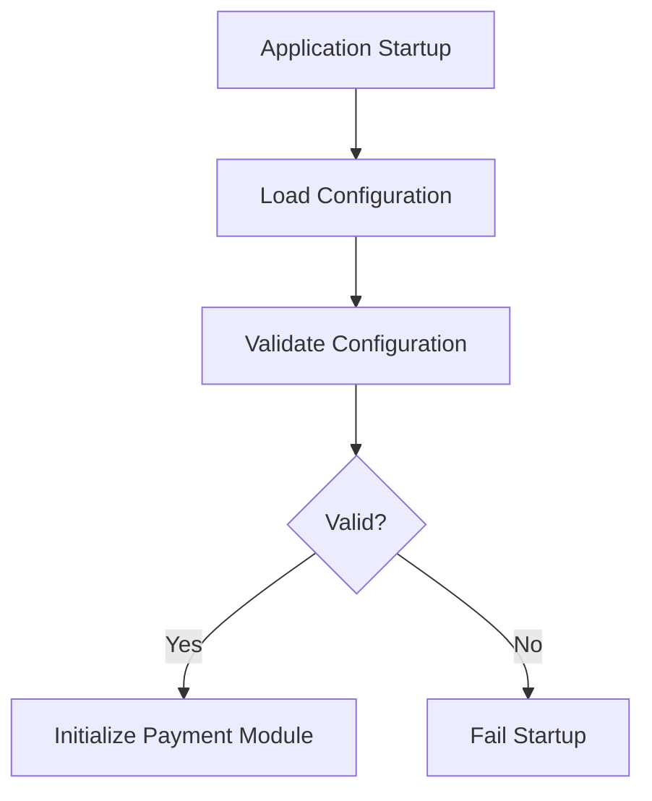

# Payment Configuration

## Document Information

| Property | Value |
|----------|-------|
| Layer | Layer 2 – Guided Journey |
| Module | Payment |
| Document Type | Configuration |
| Status | Production |

---

# Purpose

This document defines the runtime configuration for the Payment stage.

Configuration controls how Layer 2 orchestrates payment workflows without modifying application code.

Configuration must be externalized and environment-specific.

---

# Configuration Principles

- Configuration is external.
- Secrets are never stored in source control.
- Default values are safe.
- Production overrides defaults.
- Feature flags enable gradual rollout.
- Configuration changes should not require recompilation.

---

# Configuration Categories

- Workflow
- Retry
- Timeout
- Events
- Cache
- Security
- Observability
- Feature Flags

---

# Workflow Configuration

| Property | Default | Description |
|----------|----------|-------------|
| payment.enabled | true | Enable payment workflow |
| payment.maxConcurrent | 500 | Maximum concurrent payment workflows |
| payment.workflowTimeout | 24h | Maximum workflow duration |
| payment.checkpointEnabled | true | Persist workflow checkpoints |

---

# Retry Configuration

| Property | Default |
|----------|----------|
| retry.enabled | true |
| retry.maxAttempts | 5 |
| retry.initialDelay | 1 second |
| retry.strategy | Exponential Backoff |
| retry.jitter | Enabled |

---

# Timeout Configuration

| Property | Default |
|----------|----------|
| payment.requestTimeout | 30 seconds |
| payment.gatewayTimeout | 60 seconds |
| payment.callbackTimeout | 5 minutes |
| payment.expiration | 30 minutes |

---

# Event Configuration

| Property | Default |
|----------|----------|
| event.transport | Kafka |
| event.delivery | At Least Once |
| event.outbox | Enabled |
| event.cdc | Enabled |

---

# Cache Configuration

| Property | Default |
|----------|----------|
| cache.enabled | true |
| cache.provider | Redis |
| cache.paymentTTL | 5 minutes |
| cache.idempotencyTTL | 24 hours |

---

# Security Configuration

| Property | Default |
|----------|----------|
| auth.jwtRequired | true |
| auth.mtls | true |
| auth.webhookValidation | true |
| audit.enabled | true |

---

# Observability Configuration

| Property | Default |
|----------|----------|
| metrics.enabled | true |
| tracing.enabled | true |
| logging.level | INFO |
| alerts.enabled | true |

---

# Feature Flags

| Feature | Default |
|---------|----------|
| feature.retry | Enabled |
| feature.refund | Disabled |
| feature.partialPayment | Disabled |
| feature.multiGateway | Disabled |
| feature.manualReview | Enabled |

---

# Environment Variables

| Variable | Purpose |
|----------|---------|
| PAYMENT_API_URL | Payment Service endpoint |
| EVENT_BUS_URL | Kafka bootstrap servers |
| REDIS_URL | Cache connection |
| WORKFLOW_TIMEOUT | Workflow timeout |
| PAYMENT_TIMEOUT | Payment timeout |
| LOG_LEVEL | Logging level |

---

# Configuration Flow

---

# Configuration Sources

Priority (highest to lowest)

1. Environment Variables
2. Secret Manager
3. Kubernetes ConfigMap
4. Application Configuration File
5. Default Values

---

# Configuration Validation

The application validates:

- Required properties exist.
- Timeout values are valid.
- Retry limits are positive.
- URLs are correctly formatted.
- Feature flags are recognized.

Startup fails if mandatory configuration is missing.

---

# Runtime Reload

Supports live reload for:

- Logging level
- Feature flags
- Retry configuration

Requires restart for:

- Event transport
- Authentication mode
- Cache provider

---

# Security

Never store:

- API Keys
- JWT Secrets
- Database Passwords
- Gateway Credentials
- Private Keys

Use:

- Secret Manager
- Kubernetes Secrets
- Vault

---

# Design Principles

- Configuration over hardcoding
- Externalized configuration
- Immutable infrastructure
- Environment-specific settings
- Secure secret management
- Fail-fast validation

---

# Related Documents

- IMPLEMENTATION_MANIFEST.md
- API_CONTRACT.md
- CACHE.md
- SECURITY.md
- OBSERVABILITY.md
- DEPLOYMENT.md
