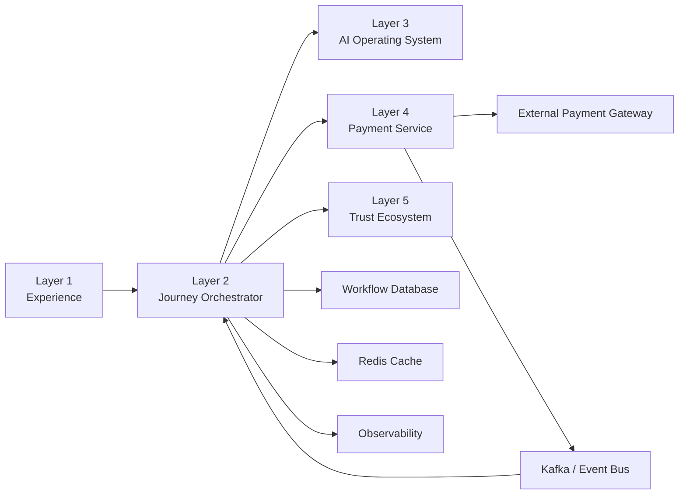
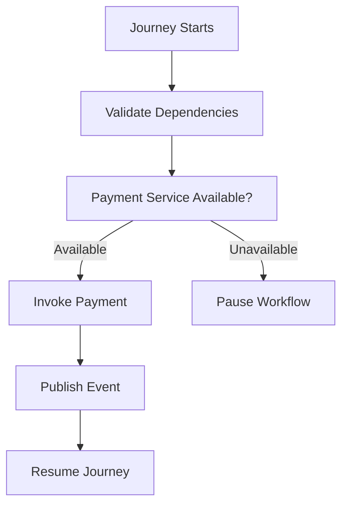
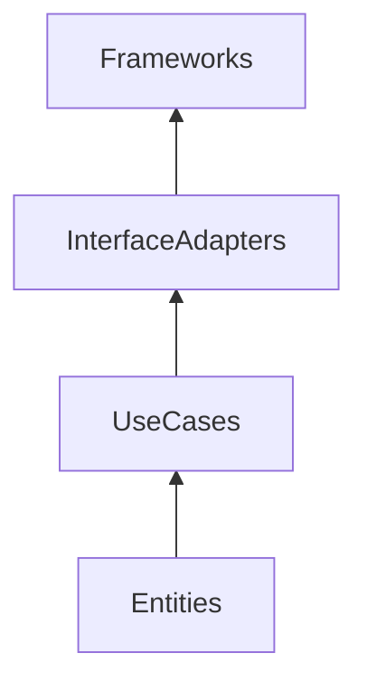
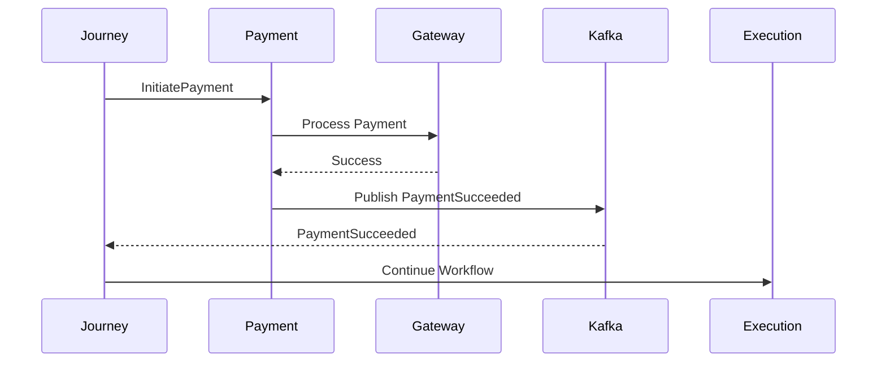

# Payment Dependencies

## Document Information

| Property | Value |
|----------|-------|
| Layer | Layer 2 – Guided Journey |
| Module | Payment |
| Document Type | Dependencies |
| Status | Production |

---

# Purpose

This document defines all architectural dependencies for the Payment stage.

It identifies upstream systems, downstream systems, runtime services, infrastructure dependencies, and external integrations.

The objective is to maintain loose coupling while clearly documenting required interactions.

---

# Dependency Principles

- Prefer loose coupling.
- Prefer asynchronous communication.
- Minimize synchronous dependencies.
- Avoid circular dependencies.
- Infrastructure is replaceable.
- Business logic must not depend directly on external systems.

---

# Dependency Overview

---

# Upstream Dependencies

These components must complete successfully before payment begins.

| Component | Purpose |
|------------|----------|
| Experience Layer | User initiates payment |
| Journey Workflow | Payment stage activation |
| Approval Stage | Approved quotation |
| Trust Service | Identity verification |
| AI Services | Optional recommendations |

---

# Internal Dependencies

| Component | Required | Communication |
|------------|----------|---------------|
| Journey Database | Yes | Synchronous |
| Workflow Checkpoint Store | Yes | Synchronous |
| Redis Cache | Optional | Synchronous |
| Kafka/Event Bus | Yes | Asynchronous |
| Observability | Yes | Asynchronous |

---

# Downstream Dependencies

| Component | Purpose |
|------------|----------|
| Payment Service | Execute payment |
| Payment Gateway | Process transaction |
| Notification Service | Notify customer |
| Execution Stage | Continue workflow |

---

# External Dependencies

| Dependency | Purpose |
|------------|----------|
| Payment Gateway | Financial transaction processing |
| Identity Provider | Authentication |
| Monitoring Platform | Metrics and alerts |

---

# Communication Matrix

| Source | Target | Type |
|---------|--------|------|
| Journey | Payment Service | REST / gRPC |
| Payment Service | Gateway | HTTPS |
| Payment Service | Kafka | Event |
| Kafka | Journey | Event |
| Journey | Redis | Cache |
| Journey | Database | SQL |

---

# Dependency Classification

## Mandatory

- Journey Database
- Payment Service
- Kafka
- Authentication
- Workflow Checkpoint

---

## Optional

- Redis Cache
- AI Recommendation
- Analytics

---

# Dependency Lifecycle

---

# Failure Handling

| Dependency | Failure Strategy |
|------------|------------------|
| Redis | Read database directly |
| Kafka | Retry publication |
| Payment Service | Retry with backoff |
| Gateway | Retry or pause workflow |
| AI Service | Continue without AI |
| Observability | Log locally and continue |

---

# Resilience Patterns

Applied patterns

- Circuit Breaker
- Retry
- Timeout
- Bulkhead
- Idempotency
- Saga
- Transactional Outbox
- CDC

---

# Dependency Direction

Business logic always depends inward.

Infrastructure never influences business rules.

---

# Runtime Dependency Flow

---

# Dependency Health

Monitor

- Payment Service availability
- Gateway latency
- Kafka availability
- Database latency
- Redis availability
- Workflow persistence
- Event delivery success

---

# Availability Targets

| Dependency | SLA |
|------------|-----|
| Payment Service | 99.9% |
| Kafka | 99.95% |
| Workflow Database | 99.99% |
| Redis | 99.9% |
| Payment Gateway | Provider SLA |

---

# Design Principles

- Loose coupling
- Event-driven communication
- Independent deployment
- Replaceable infrastructure
- Fail-fast validation
- Graceful degradation
- Observable dependencies

---

# Related Documents

- ADR.md
- IMPLEMENTATION_MANIFEST.md
- API_CONTRACT.md
- API_USAGE.md
- COMPONENT_INVENTORY.md
- CACHE.md
- SECURITY.md
- OBSERVABILITY.md
