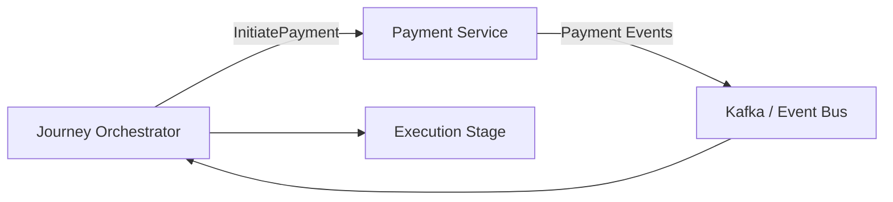
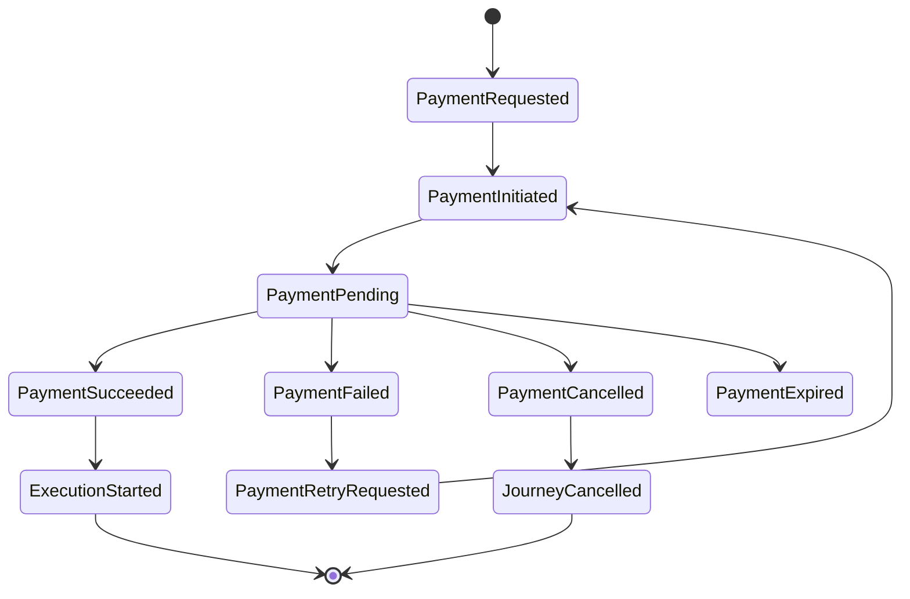
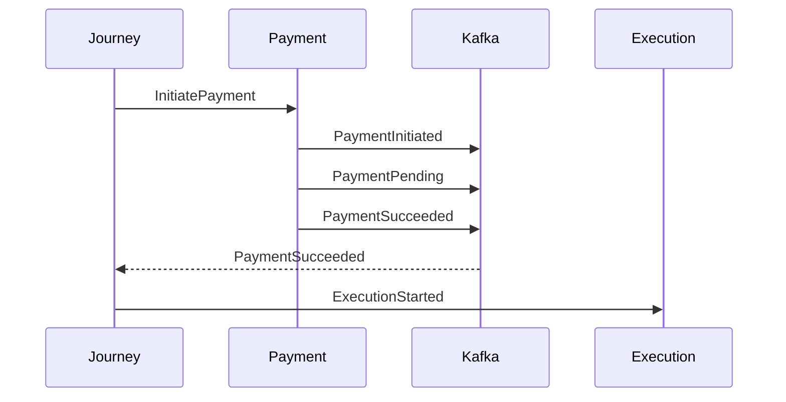
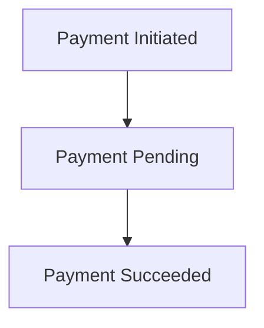
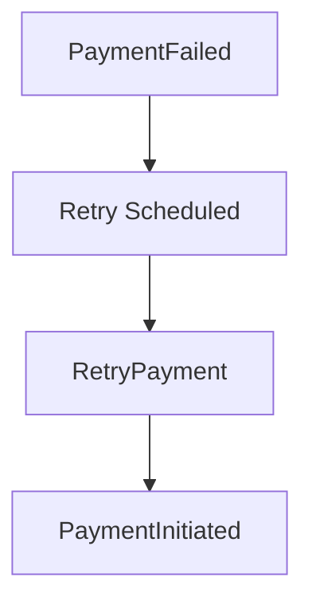
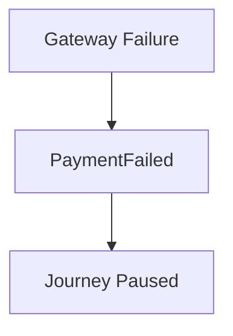

# Payment Events

## Document Information

| Property | Value |
|----------|-------|
| Layer | Layer 2 – Guided Journey |
| Module | Payment |
| Document Type | Event Catalog |
| Communication | Event-Driven |
| Status | Production |

---

# Purpose

This document defines every event exchanged during the Payment stage.

The Guided Journey Layer relies on asynchronous events to continue long-running workflows.

The Payment Service publishes events.

The Journey Orchestrator consumes them.

---

# Event Architecture



---

# Event Lifecycle



---

# Event Categories

## Commands

Layer 2 publishes

- InitiatePayment
- RetryPayment
- CancelPayment

---

## Domain Events

Layer 4 publishes

- PaymentInitiated
- PaymentPending
- PaymentSucceeded
- PaymentFailed
- PaymentCancelled
- PaymentExpired

---

## Workflow Events

Layer 2 publishes

- ExecutionStarted
- JourneyPaused
- JourneyCancelled

---

# Event Matrix

| Event | Publisher | Consumer |
|--------|-----------|----------|
| InitiatePayment | Journey | Payment Service |
| RetryPayment | Journey | Payment Service |
| CancelPayment | Journey | Payment Service |
| PaymentInitiated | Payment Service | Journey |
| PaymentPending | Payment Service | Journey |
| PaymentSucceeded | Payment Service | Journey |
| PaymentFailed | Payment Service | Journey |
| PaymentCancelled | Payment Service | Journey |
| PaymentExpired | Payment Service | Journey |
| ExecutionStarted | Journey | Execution Layer |

---

# Event Flow



---

# Event Topics

| Topic | Description |
|---------|-------------|
| payment.commands | Commands from Journey |
| payment.events | Payment lifecycle events |
| journey.events | Workflow events |

---

# Event Schema

Example

```json
{
  "eventId": "EVT-10001",
  "eventType": "PaymentSucceeded",
  "paymentId": "PAY-1001",
  "journeyId": "JR-2001",
  "correlationId": "CORR-12345",
  "timestamp": "2026-01-01T10:15:00Z",
  "version": "1.0"
}
```

---

# Required Metadata

Every event must contain

- Event ID
- Event Type
- Correlation ID
- Journey ID
- Payment ID
- Timestamp
- Version

---

# Event Ordering

Ordering must be preserved per payment.

Example



Ordering across unrelated payments is not required.

---

# Delivery Guarantees

Required

- At Least Once Delivery

Consumers must therefore implement idempotent processing.

---

# Idempotency

Each event is processed once logically.

Duplicates must be ignored using

- Event ID
- Correlation ID
- Payment ID

---

# Retry Events



---

# Failure Events



---

# Event Consumers

Journey Orchestrator

Consumes

- PaymentInitiated
- PaymentPending
- PaymentSucceeded
- PaymentFailed
- PaymentCancelled
- PaymentExpired

---

Execution Layer

Consumes

- ExecutionStarted

---

Observability

Consumes

- All Events

---

# Event Publishers

Journey

Publishes

- InitiatePayment
- RetryPayment
- CancelPayment
- ExecutionStarted

Payment Service

Publishes

- PaymentInitiated
- PaymentPending
- PaymentSucceeded
- PaymentFailed
- PaymentCancelled
- PaymentExpired

---

# Event Versioning

Current

```
v1
```

Rules

- Backward compatible
- Immutable event payloads
- Additive schema evolution

---

# Security

Every event must include

- Correlation ID
- Trace ID
- Audit metadata

Sensitive payment information must never appear in event payloads.

---

# Observability

Track

- Event publication latency
- Event consumption latency
- Processing failures
- Duplicate events
- Dead-letter queue size

---

# Design Principles

- Asynchronous communication
- Event-driven orchestration
- Immutable events
- Idempotent consumers
- Eventual consistency
- Loose coupling
- Schema versioning
- Durable messaging

---

# Related Documents

- ADR.md
- API_CONTRACT.md
- API_USAGE.md
- IMPLEMENTATION_MANIFEST.md
- STATE_MACHINE.md
- FAILURE_HANDLING.md
- OBSERVABILITY.md
