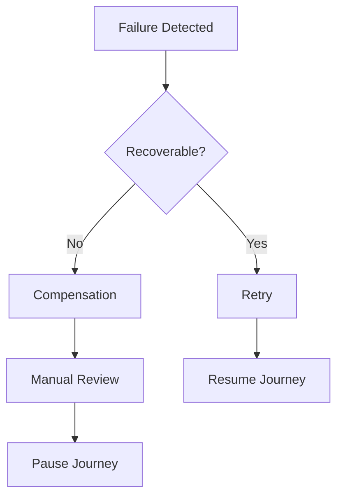
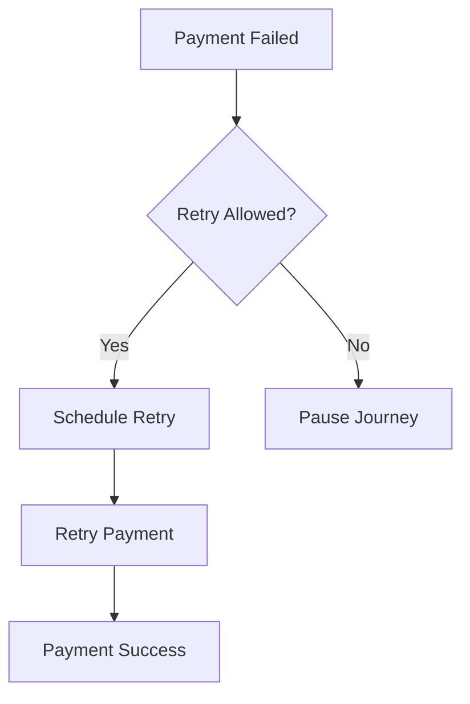
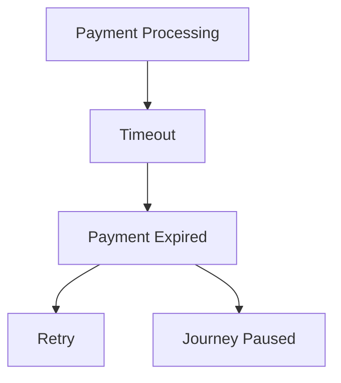
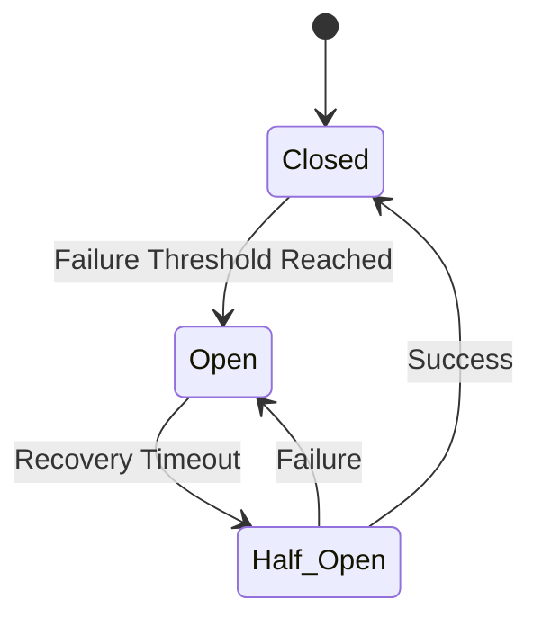
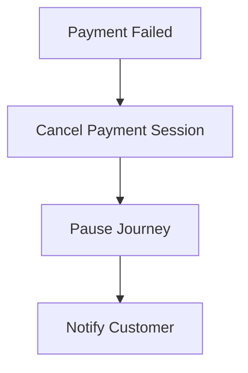
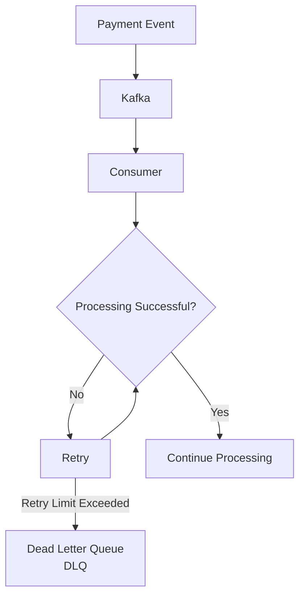
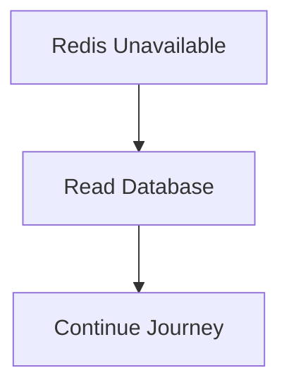
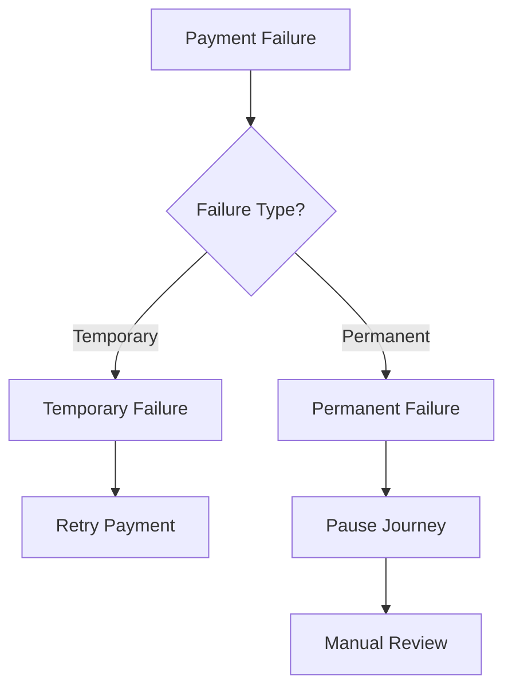

# Payment Failure Strategy

## Document Information

| Property | Value |
|----------|-------|
| Layer | Layer 2 – Guided Journey |
| Module | Payment |
| Document Type | Failure Strategy |
| Status | Production |

---

# Purpose

This document defines how failures occurring during the Payment stage are detected, classified, recovered, and monitored.

The objective is to ensure that payment failures never corrupt workflow state while maintaining high availability and resilience.

Layer 2 orchestrates failure recovery.

Layer 4 owns payment execution.

---

# Failure Principles

- Never lose workflow state.
- Never process duplicate payments.
- Never leave workflows in an inconsistent state.
- Recover automatically whenever possible.
- Escalate only when recovery fails.
- Use eventual consistency.

---

# Failure Classification

| Category | Examples | Recoverable |
|-----------|----------|-------------|
| Network | Connection timeout | Yes |
| Infrastructure | Kafka unavailable | Yes |
| Gateway | Temporary gateway outage | Yes |
| Validation | Invalid quotation | No |
| Authentication | JWT expired | No |
| Authorization | Access denied | No |
| Fraud | Trust verification failed | No |
| Internal Service | Payment service unavailable | Yes |

---

# Failure Lifecycle

---

# Retry Strategy

Recoverable failures

- Gateway timeout
- Temporary network interruption
- Kafka unavailable
- Service unavailable

Retry Policy

- Exponential Backoff
- Jitter
- Maximum 5 attempts

---

# Retry Flow

---

# Timeout Strategy

Timeouts occur when

- Gateway does not respond
- Callback never arrives
- Workflow exceeds configured duration

Action

- Mark payment as expired
- Schedule retry
- Notify Journey

---

# Timeout Flow

---

# Circuit Breaker

Protect external payment gateways.

States

---

# Saga Compensation

Payment is one Saga step.

Compensation is triggered when payment cannot complete.

Example

---

# Dead Letter Queue

Events failing repeatedly are moved to a DLQ.

---

# Event Replay

DLQ events may be replayed after issue resolution.

Replay requirements

- Preserve ordering
- Preserve correlation ID
- Preserve event version

---

# Idempotency

Every retry must reuse the original:

- Payment ID
- Idempotency Key
- Correlation ID

Duplicate payment execution is prohibited.

---

# Cache Failure

Cache failure must never block payment processing.

---

# Database Failure

If database unavailable

- Pause workflow
- Retry persistence
- Prevent payment execution until checkpoint is stored

---

# Gateway Failure

---

# Observability

Monitor

- Retry count
- Failure rate
- Timeout rate
- DLQ size
- Gateway latency
- Circuit breaker state

---

# Alerts

Generate alerts when

- Retry limit exceeded
- DLQ growing
- Gateway unavailable
- High payment failure rate
- Circuit breaker open

---

# Failure Matrix

| Failure | Action |
|----------|--------|
| Network Timeout | Retry |
| Gateway Timeout | Retry |
| Kafka Down | Retry Event |
| Redis Down | Read Database |
| Payment Failed | Pause Journey |
| Fraud | Reject Payment |
| Invalid Request | Reject Immediately |
| Duplicate Request | Return Existing Result |

---

# Design Principles

- Fail Fast
- Recover Automatically
- Retry Only Recoverable Errors
- Never Duplicate Payments
- Event-Driven Recovery
- Saga Compensation
- High Observability
- Graceful Degradation

---

# Related Documents

- ADR.md
- IMPLEMENTATION_MANIFEST.md
- API_CONTRACT.md
- EVENTS.md
- STATE_MACHINE.md
- OBSERVABILITY.md
- SECURITY.md
