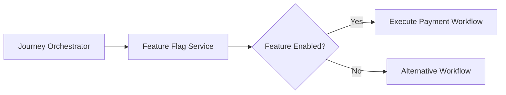
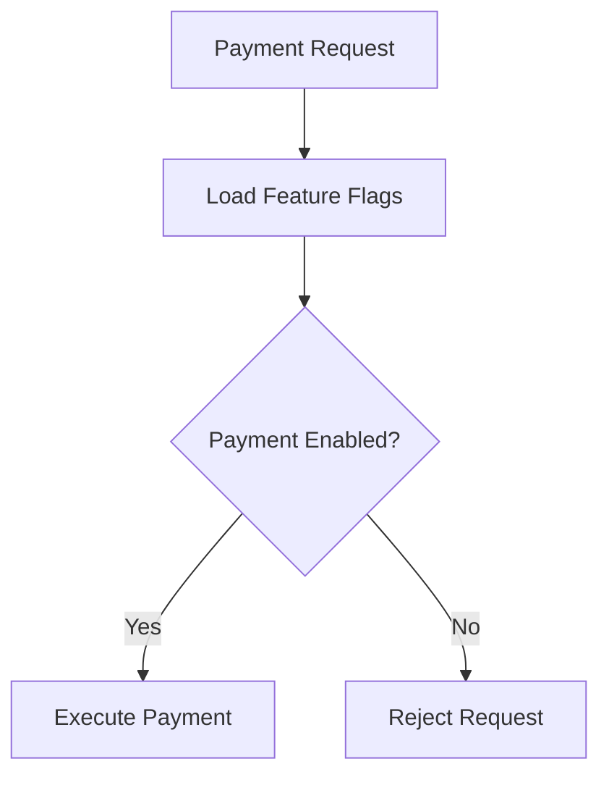

# Payment Feature Flags

## Document Information

| Property | Value |
|----------|-------|
| Layer | Layer 2 – Guided Journey |
| Module | Payment |
| Document Type | Feature Flags |
| Status | Production |
| Owner | Journey Team |

---

# Purpose

This document defines all runtime feature flags used by the Payment stage.

Feature flags allow operational teams to safely enable, disable, or gradually roll out payment capabilities without requiring application redeployment.

---

# Objectives

- Safe feature rollout
- Emergency feature disablement
- Canary deployments
- A/B testing
- Operational flexibility
- Reduced deployment risk

---

# Feature Flag Architecture

---

# Feature Flag Categories

- Payment Features
- Retry Features
- Gateway Features
- Security Features
- Workflow Features
- Experimental Features

---

# Payment Features

| Flag | Default | Description |
|------|----------|-------------|
| payment.enabled | true | Enable payment stage |
| payment.booking | true | Booking payment |
| payment.milestone | true | Milestone payment |
| payment.final | true | Final payment |
| payment.partial | false | Partial payment support |
| payment.refund | false | Refund workflow |

---

# Retry Features

| Flag | Default |
|------|----------|
| retry.enabled | true |
| retry.exponentialBackoff | true |
| retry.jitter | true |
| retry.autoResume | true |

---

# Gateway Features

| Flag | Default |
|------|----------|
| gateway.primary | Enabled |
| gateway.secondary | Disabled |
| gateway.failover | Enabled |
| gateway.multiProvider | Disabled |

---

# Security Features

| Flag | Default |
|------|----------|
| security.jwt | true |
| security.webhookValidation | true |
| security.auditLogging | true |
| security.manualReview | true |

---

# Workflow Features

| Flag | Default |
|------|----------|
| workflow.checkpoints | true |
| workflow.resume | true |
| workflow.autoPause | true |
| workflow.compensation | true |

---

# Experimental Features

| Flag | Default |
|------|----------|
| ai.paymentRecommendation | false |
| ai.dynamicRouting | false |
| predictiveRetry | false |
| smartGatewaySelection | false |

---

# Feature Evaluation Flow

---

# Runtime Evaluation

Feature flags are evaluated:

- At workflow start
- Before retry
- Before gateway selection
- Before compensation
- Before manual review

---

# Rollout Strategy

| Strategy | Use Case |
|-----------|----------|
| Global | Enable for all users |
| Percentage | Canary rollout |
| Region | Regional deployment |
| Environment | Dev / QA / Production |
| User Group | Beta testing |

---

# Emergency Kill Switch

Critical flags

- payment.enabled
- gateway.primary
- retry.enabled

These flags may be disabled immediately during production incidents.

---

# Configuration Sources

Priority

1. Feature Flag Service
2. Environment Variables
3. Configuration File
4. Default Values

---

# Monitoring

Track

- Feature evaluations
- Enabled features
- Disabled features
- Rollout percentage
- Feature errors

---

# Audit Requirements

Every feature change must record

- User
- Timestamp
- Previous value
- New value
- Reason

---

# Best Practices

- Keep feature flags temporary where possible.
- Remove obsolete flags after rollout.
- Never use feature flags for secrets.
- Test both enabled and disabled paths.
- Document all new flags before release.

---

# Related Documents

- CONFIGURATION.md
- IMPLEMENTATION_MANIFEST.md
- API_CONTRACT.md
- FAILURE_STRATEGY.md
- SECURITY.md
