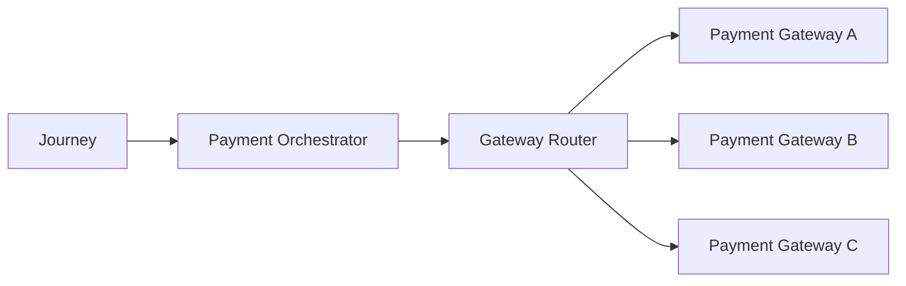
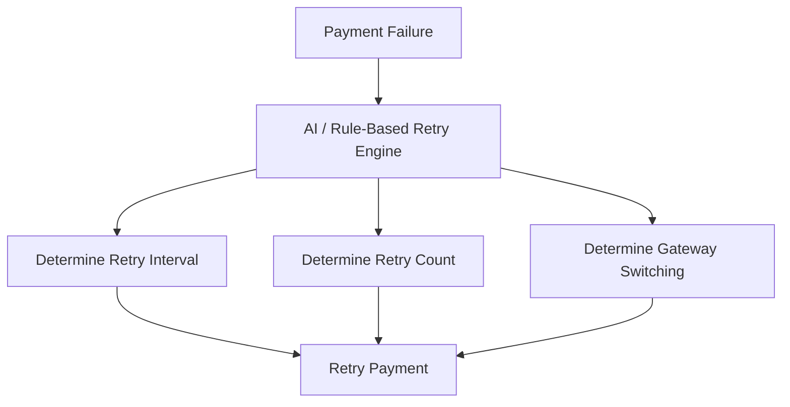
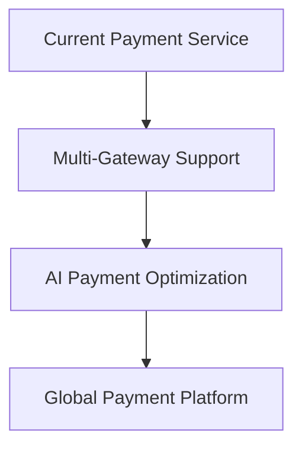

# Payment Future Scope

## Document Information

| Property | Value |
|----------|-------|
| Layer | Layer 2 – Guided Journey |
| Module | Payment |
| Document Type | Future Scope |
| Status | Planning |
| Owner | Architecture Team |

---

# Purpose

This document outlines the long-term architectural vision for the Payment stage.

The features described here are not part of the current implementation but represent future enhancements intended to improve scalability, flexibility, resilience, customer experience, and operational efficiency.

---

# Vision

Transform the Payment stage into an intelligent, resilient, multi-provider payment orchestration platform capable of supporting global payment ecosystems while maintaining high reliability and security.

---

# Future Roadmap

## Phase 1 – Operational Improvements

Objectives

- Intelligent retry scheduling
- Better observability
- Advanced monitoring
- Gateway health detection
- Automated incident recovery

---

## Phase 2 – Payment Enhancements

Objectives

- Partial payments
- Split payments
- Milestone-based payments
- Scheduled payments
- Installment plans

---

## Phase 3 – Multi-Gateway Support

Objectives

- Multiple payment providers
- Automatic gateway failover
- Gateway routing
- Cost-based gateway selection
- Regional gateway support

---

## Phase 4 – AI-Assisted Payment

Objectives

- Smart retry recommendations
- Payment failure prediction
- Dynamic gateway selection
- Fraud risk prediction
- Customer payment recommendations

---

## Future Architecture

---

# Planned Features

## Multi-Gateway Routing

Future payment requests may be routed dynamically based on

- Gateway availability
- Cost
- Latency
- Success rate
- Region

---

## Dynamic Retry Engine

---

## Smart Gateway Selection

Selection factors

- Success rate
- Historical latency
- Transaction cost
- Customer region
- Payment type

---

## Payment Analytics

Future dashboards

- Revenue trends
- Gateway performance
- Retry success
- Failure trends
- Payment conversion

---

## Event Replay Dashboard

Support

- Replay failed events
- DLQ inspection
- Retry visualization
- Event auditing

---

## Self-Healing Workflows

Automatically

- Detect failures
- Retry
- Switch gateway
- Resume workflow

without manual intervention.

---

## Advanced Workflow Engine

Potential migration

- Temporal
- Camunda
- Netflix Conductor

for complex long-running workflows.

---

## Compliance Enhancements

Potential support

- PCI DSS automation
- GDPR reporting
- Audit automation
- Regional compliance

---

## Security Enhancements

Future capabilities

- Tokenization
- HSM integration
- Zero Trust networking
- Continuous fraud analysis

---

## Customer Experience

Possible improvements

- Saved payment methods
- One-click payments
- Payment reminders
- Payment history
- Digital receipts

---

## Scalability Goals

Future architecture should support

- Millions of payment events
- Horizontal scaling
- Multi-region deployment
- Active-active architecture

---

## Observability Enhancements

Future metrics

- Gateway SLA
- Payment conversion rate
- Fraud detection rate
- Workflow completion time
- Event replay statistics

---

# Long-Term Evolution

---

# Architectural Goals

- Fully event-driven
- Multi-cloud compatible
- Gateway independent
- Highly observable
- AI-assisted decision support
- Self-healing workflows
- Global scalability

---

# Risks

Potential challenges

- Increased architectural complexity
- Higher operational cost
- Gateway integration overhead
- Compliance requirements
- AI governance

---

# Success Metrics

Future implementation should achieve

- Higher payment success rate
- Lower retry latency
- Reduced manual intervention
- Improved gateway availability
- Faster workflow completion

---

# Related Documents

- ADR.md
- IMPLEMENTATION_MANIFEST.md
- API_CONTRACT.md
- EVENTS.md
- FAILURE_STRATEGY.md
- OBSERVABILITY.md
- SECURITY.md
