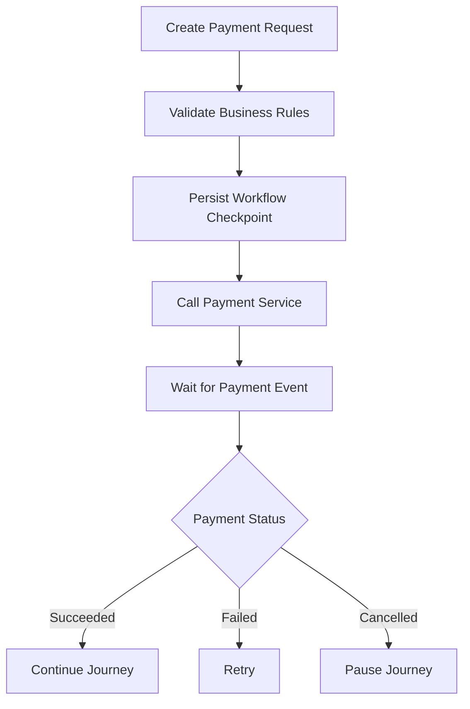
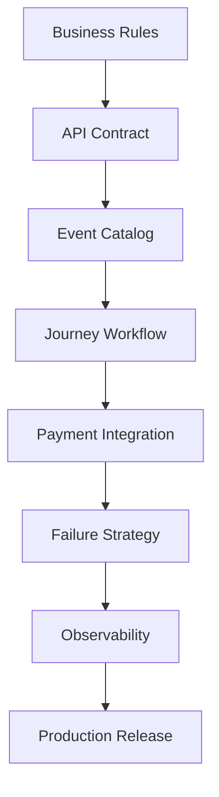
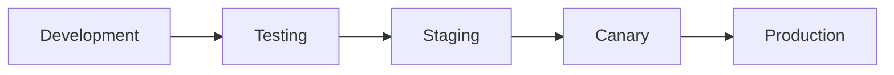

# Payment Implementation Plan

## Document Information

| Property | Value |
|----------|-------|
| Layer | Layer 2 – Guided Journey |
| Module | Payment |
| Document Type | Implementation Plan |
| Status | Planned |
| Owner | Journey Team |

---

# Purpose

This document defines the implementation roadmap for the Payment stage.

It describes implementation phases, dependencies, milestones, testing strategy, rollout plan, and success criteria.

---

# Goals

- Implement a production-grade payment orchestration workflow.
- Support long-running Saga workflows.
- Enable asynchronous event-driven communication.
- Ensure idempotent payment processing.
- Provide resilience through retries and compensation.
- Achieve observability and operational readiness.

---

# Implementation Strategy

---

# Phase 1 – Foundation

Objectives

- Create payment module
- Define API contracts
- Define event catalog
- Configure workflow persistence
- Configure Kafka topics

Deliverables

- API_CONTRACT.md
- EVENTS.md
- IMPLEMENTATION_MANIFEST.md

---

# Phase 2 – Journey Integration

Objectives

- Implement payment orchestration
- Persist workflow checkpoints
- Validate business rules
- Integrate trust verification

Deliverables

- Payment workflow
- Journey state transitions

---

# Phase 3 – Payment Service Integration

Objectives

- Connect Layer 2 to Layer 4
- Implement idempotency
- Handle asynchronous callbacks
- Publish payment events

Deliverables

- Payment API integration
- Event publishing

---

# Phase 4 – Failure Handling

Objectives

- Retry strategy
- Timeout handling
- Saga compensation
- Circuit breaker

Deliverables

- FAILURE_STRATEGY.md
- Retry implementation

---

# Phase 5 – Observability

Objectives

- Logging
- Metrics
- Distributed tracing
- Alerting

Deliverables

- OBSERVABILITY.md

---

# Phase 6 – Production Readiness

Objectives

- Performance testing
- Security validation
- Load testing
- Documentation review

Deliverables

- Production release candidate

---

# Implementation Workflow

---

# Dependency Order

---

# Testing Plan

## Unit Tests

- Workflow validation
- Business rules
- Retry logic
- Idempotency

---

## Integration Tests

- Payment Service
- Kafka
- Database
- Cache

---

## End-to-End Tests

- Successful payment
- Failed payment
- Retry
- Timeout
- Cancellation

---

## Performance Tests

- Concurrent payments
- Event throughput
- Workflow latency
- Database load

---

# Rollout Strategy

---

# Success Criteria

The implementation is complete when:

- All business rules are enforced.
- Payment workflow executes successfully.
- Events are published and consumed correctly.
- Retry logic works.
- Compensation executes correctly.
- Observability dashboards are operational.
- Security validation passes.
- Performance targets are met.

---

# Risks

| Risk | Mitigation |
|------|------------|
| Gateway downtime | Retry + Circuit Breaker |
| Duplicate requests | Idempotency Keys |
| Event loss | Transactional Outbox + Kafka |
| Workflow inconsistency | Checkpoint persistence |
| High traffic | Horizontal scaling |

---

# Deliverables

- ADR.md
- IMPLEMENTATION_MANIFEST.md
- API_CONTRACT.md
- API_USAGE.md
- EVENTS.md
- FAILURE_STRATEGY.md
- CACHE.md
- CONFIGURATION.md
- SECURITY.md
- OBSERVABILITY.md

---

# Related Documents

- ADR.md
- IMPLEMENTATION_MANIFEST.md
- API_CONTRACT.md
- EVENTS.md
- FAILURE_STRATEGY.md
- OBSERVABILITY.md
