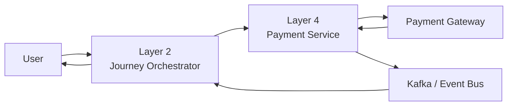
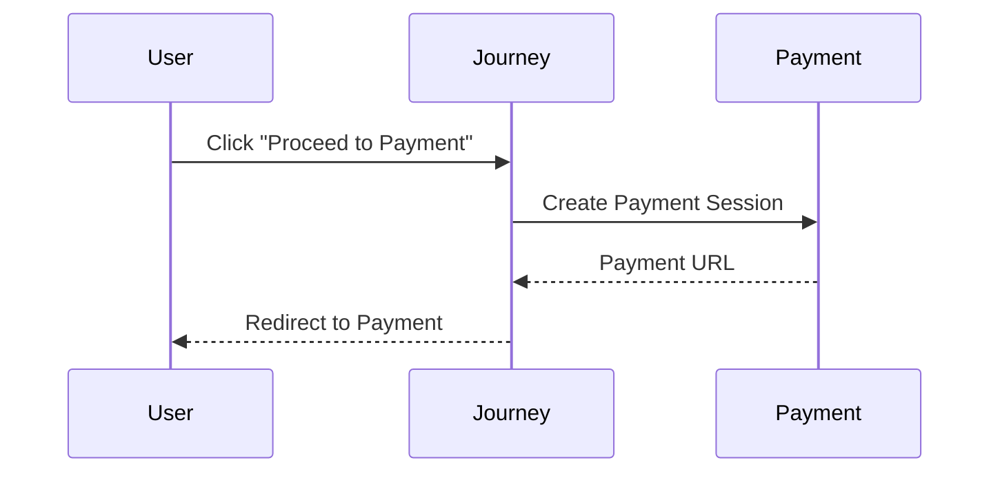
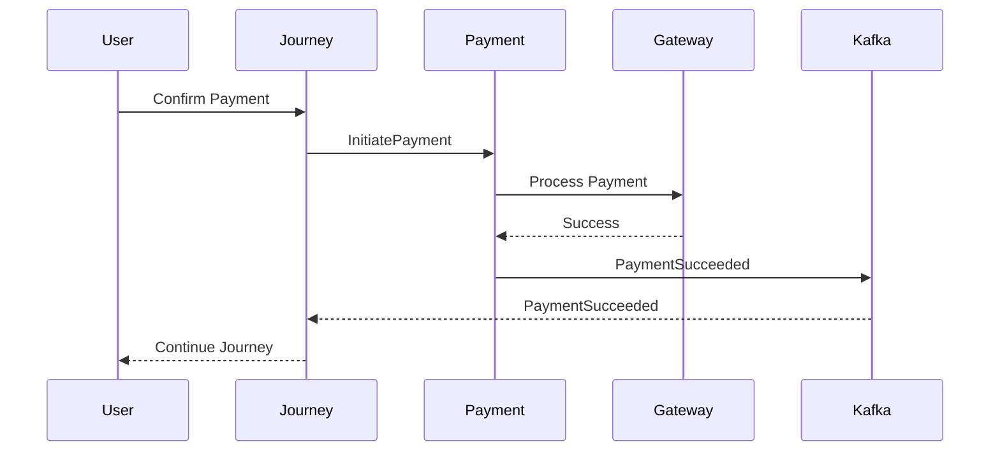
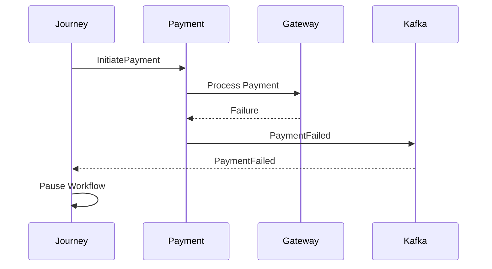
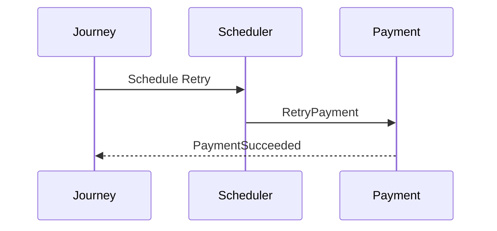
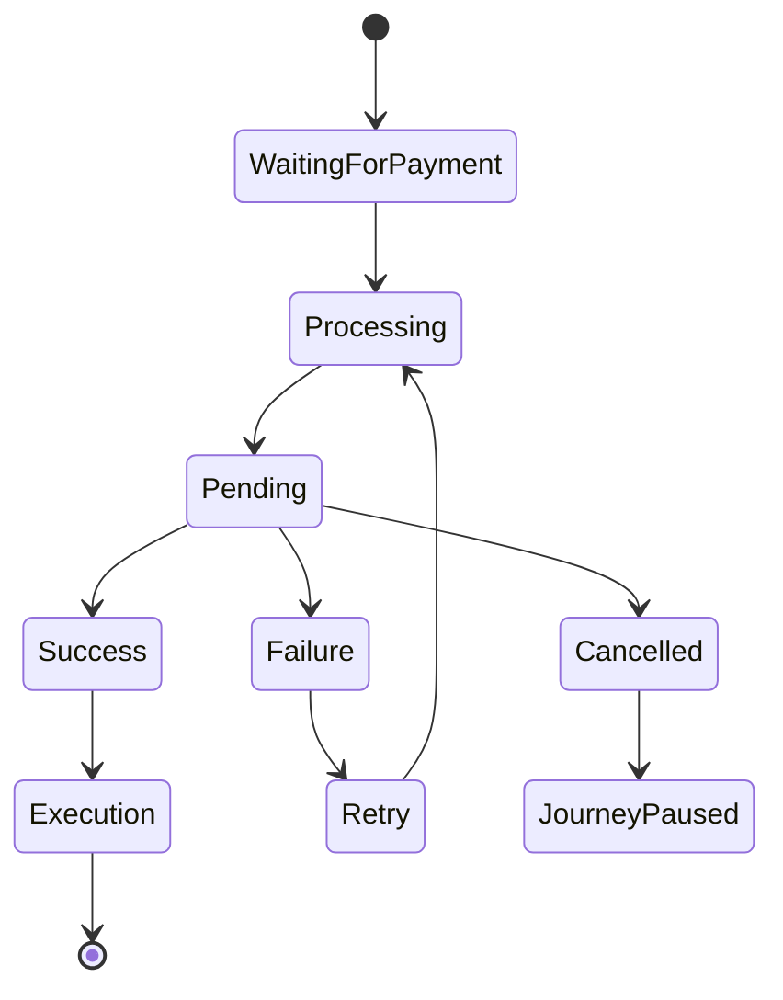
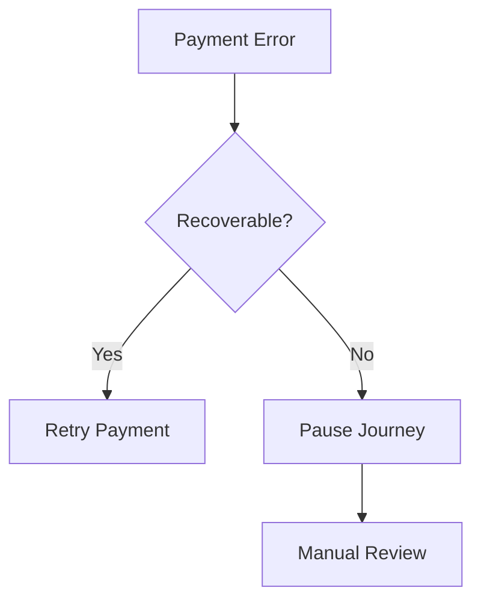

# Payment Interaction Design

## Document Information

| Property | Value |
|----------|-------|
| Layer | Layer 2 – Guided Journey |
| Module | Payment |
| Document Type | Interaction Design |
| Status | Production |
| Owner | Journey Team |

---

# Purpose

This document describes the interaction patterns between users, Layer 2 (Journey Orchestrator), Layer 4 (Payment Service), external payment gateways, and supporting services during the Payment stage.

The objective is to ensure consistent workflow behavior, asynchronous communication, and resilient payment orchestration.

---

# Interaction Principles

- Layer 2 orchestrates interactions.
- Layer 4 executes payments.
- External gateways process financial transactions.
- Communication is asynchronous wherever possible.
- Journey state is persisted before external interactions.
- Payment completion is event-driven.

---

# High-Level Interaction

---

# User Interaction Flow

---

# Successful Payment Flow

---

# Failed Payment Flow

---

# Retry Interaction

---

# Layer Interaction Matrix

| Source | Target | Interaction |
|---------|--------|-------------|
| User | Journey | Payment request |
| Journey | Payment Service | Initiate payment |
| Payment Service | Gateway | Financial transaction |
| Gateway | Payment Service | Transaction result |
| Payment Service | Kafka | Publish payment event |
| Kafka | Journey | Resume workflow |

---

# Communication Pattern

| Interaction | Type |
|-------------|------|
| Journey → Payment | REST / gRPC |
| Payment → Gateway | HTTPS |
| Payment → Kafka | Event |
| Kafka → Journey | Event |

---

# Interaction States

---

# Error Interaction

---

# UX Considerations

The user should always receive clear feedback during payment processing:

- Payment initiated
- Payment in progress
- Payment successful
- Payment failed
- Retry available
- Journey resumed

---

# Design Principles

- Event-driven interaction
- Loose coupling
- Idempotent communication
- Asynchronous workflow
- Graceful error handling
- Observable interactions
- Secure communication

---

# Related Documents

- API_CONTRACT.md
- API_USAGE.md
- EVENTS.md
- STATE_MACHINE.md
- FAILURE_STRATEGY.md
- IMPLEMENTATION_MANIFEST.md
