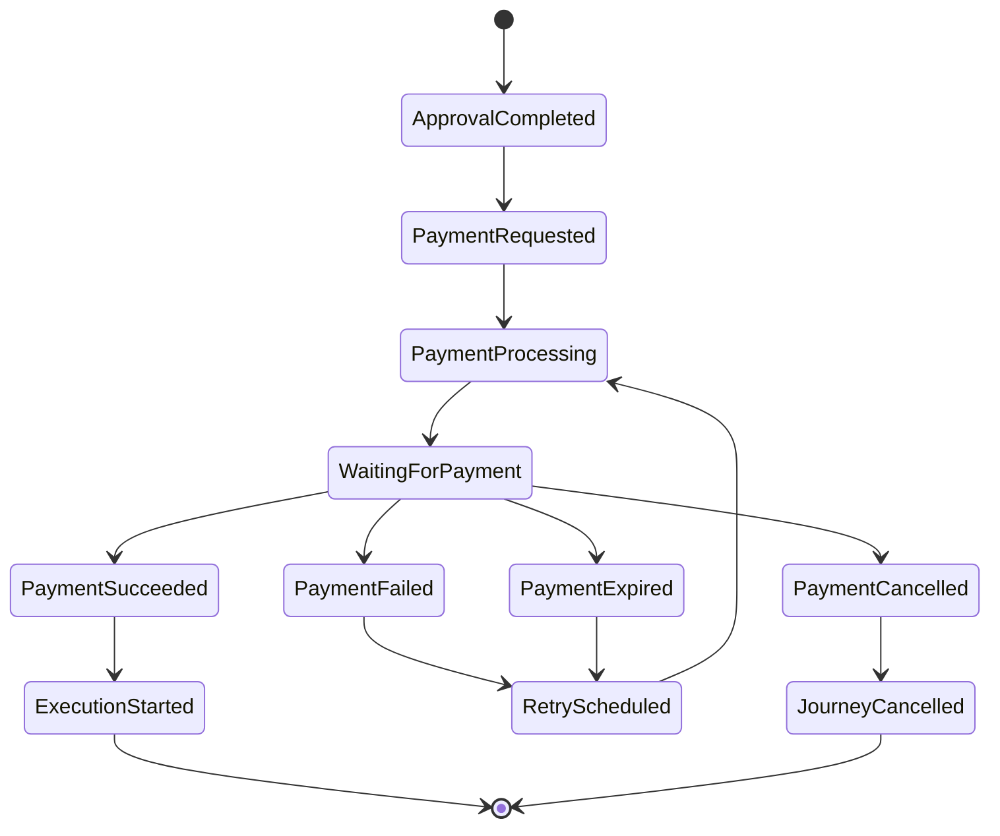
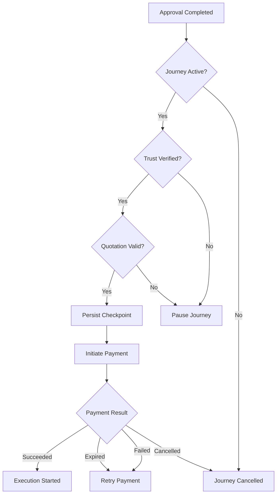
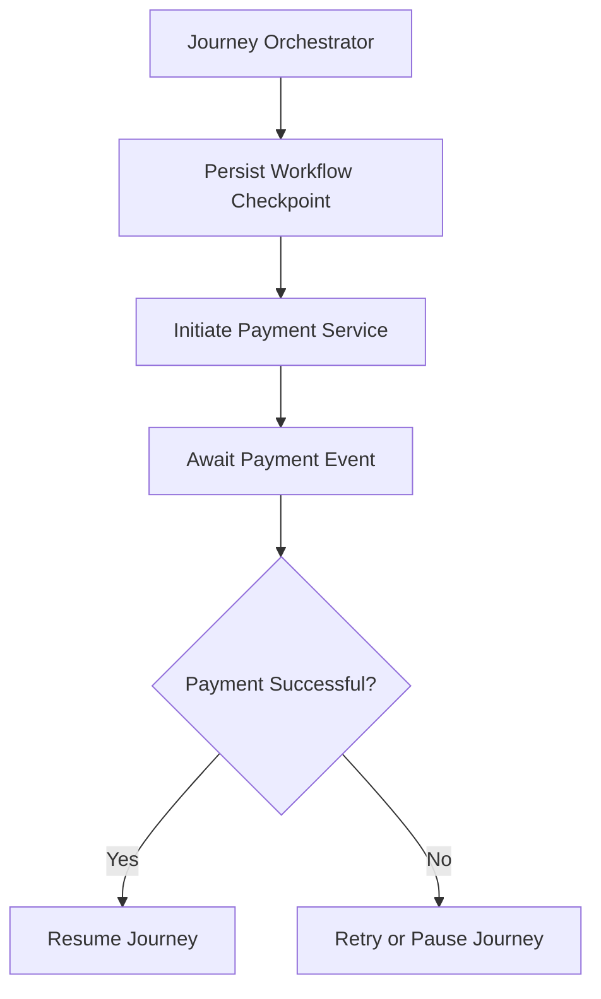

# Payment Journey Rules

## Document Information

| Property | Value |
|----------|-------|
| Layer | Layer 2 – Guided Journey |
| Module | Payment |
| Document Type | Journey Rules |
| Status | Production |
| Owner | Journey Team |

---

# Purpose

This document defines the workflow rules governing the Payment stage within the Guided Journey.

The Journey Orchestrator enforces these rules to ensure consistent, resilient, and recoverable workflow execution.

---

# Journey Objectives

- Maintain deterministic workflow progression
- Prevent duplicate payment execution
- Support workflow pause and resume
- Persist checkpoints before external calls
- Enable event-driven continuation
- Preserve journey consistency

---

# Journey Lifecycle

---

# Journey Entry Rules

The Payment stage may begin only when:

- Approval is completed.
- Quotation is accepted.
- Journey is active.
- Trust verification succeeds.
- Workflow checkpoint is persisted.

---

# Journey Exit Rules

The Payment stage ends when:

- Payment succeeds.
- Journey is cancelled.
- Manual intervention terminates the workflow.

---

# Checkpoint Rules

Before invoking the Payment Service, the Journey must persist:

- Journey ID
- Current state
- Payment request
- Correlation ID
- Timestamp
- Retry count

---

# Pause Rules

The Journey pauses when:

- Payment fails
- Gateway is unavailable
- Manual review is required
- External dependency is unavailable

Paused journeys must remain recoverable.

---

# Resume Rules

The Journey resumes after receiving:

- PaymentSucceeded
- Successful retry
- Manual approval (if applicable)

The workflow resumes from the latest persisted checkpoint.

---

# Retry Rules

Retry only for transient failures:

- Network timeout
- Gateway timeout
- Temporary infrastructure failure

Retry policy:

- Exponential backoff
- Maximum retry limit
- Preserve idempotency key

---

# Cancellation Rules

The Journey is cancelled when:

- User cancels payment
- Journey expires
- Business workflow terminates

Cancellation stops further payment processing.

---

# Event Rules

Journey publishes:

- InitiatePayment
- RetryPayment
- CancelPayment

Journey consumes:

- PaymentInitiated
- PaymentPending
- PaymentSucceeded
- PaymentFailed
- PaymentCancelled
- PaymentExpired

---

# Journey Decision Flow

---

# Workflow Checkpoint Flow

---

# State Transition Matrix

| Current State | Event | Next State |
|---------------|-------|------------|
| ApprovalCompleted | InitiatePayment | PaymentRequested |
| PaymentRequested | PaymentInitiated | PaymentProcessing |
| PaymentProcessing | PaymentPending | WaitingForPayment |
| WaitingForPayment | PaymentSucceeded | ExecutionStarted |
| WaitingForPayment | PaymentFailed | RetryScheduled |
| WaitingForPayment | PaymentCancelled | JourneyCancelled |
| WaitingForPayment | PaymentExpired | RetryScheduled |

---

# Journey Constraints

- One active payment per journey
- One active workflow checkpoint
- Duplicate payment requests are rejected
- Workflow state must always be recoverable
- External failures must not corrupt journey state

---

# Recovery Strategy

If the Journey is interrupted:

1. Load the latest checkpoint.
2. Verify payment status.
3. Resume from the saved state.
4. Continue or retry as appropriate.

---

# Design Principles

- Event-driven orchestration
- Deterministic state transitions
- Checkpoint-based recovery
- Idempotent operations
- Loose coupling
- Saga-based workflow
- High resilience

---

# Related Documents

- BUSINESS_RULES.md
- STATE_MACHINE.md
- EVENTS.md
- API_USAGE.md
- FAILURE_STRATEGY.md
- IMPLEMENTATION_MANIFEST.md
