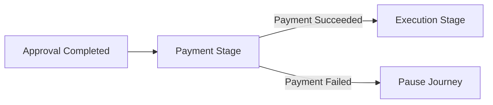
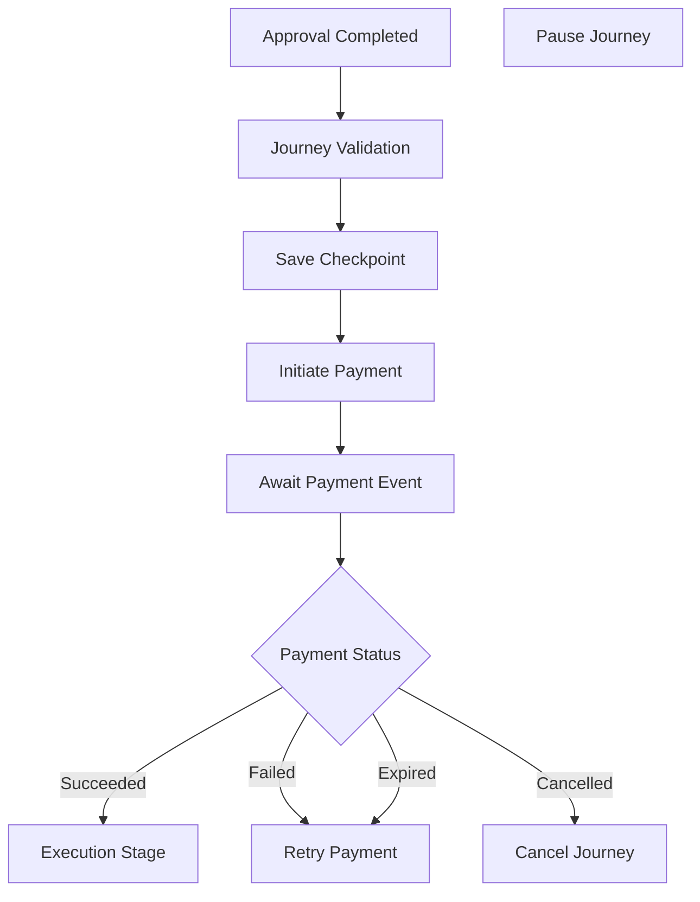
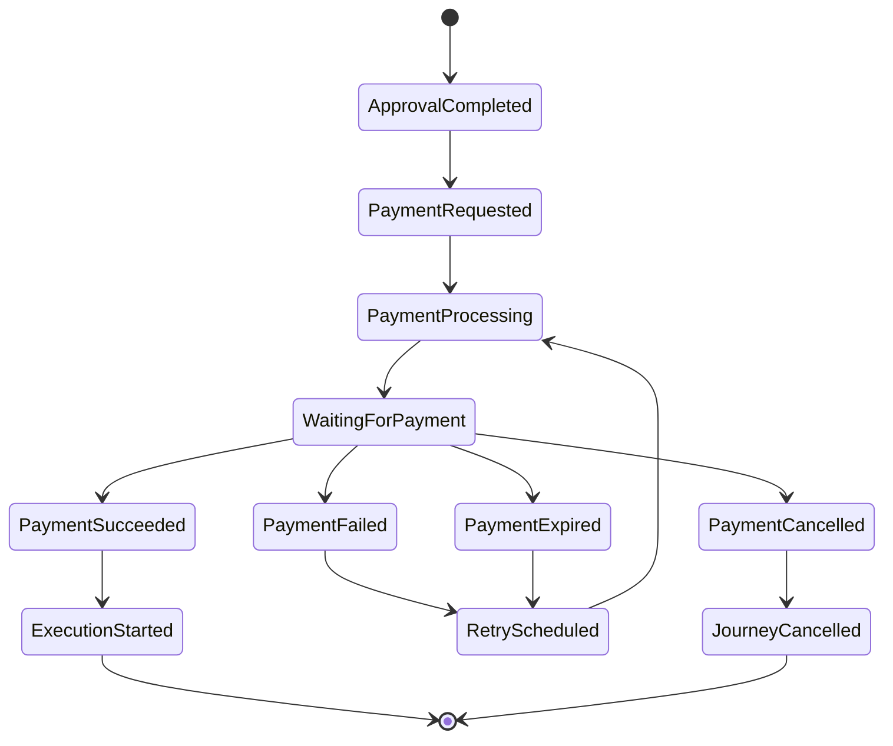
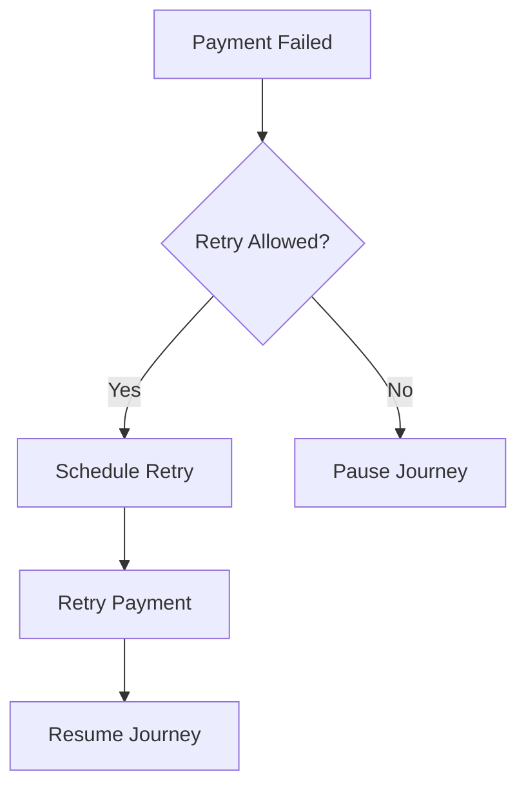
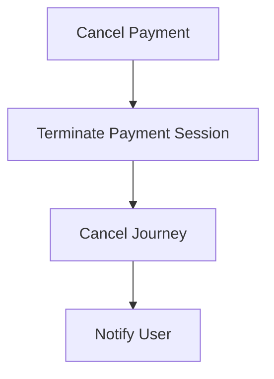

# Payment Navigation

## Document Information

| Property | Value |
|----------|-------|
| Layer | Layer 2 – Guided Journey |
| Module | Payment |
| Document Type | Navigation |
| Status | Production |
| Owner | Journey Team |

---

# Purpose

This document defines the navigation rules for the Payment stage within the Guided Journey.

Navigation describes how the workflow enters, progresses through, exits, pauses, and resumes during payment processing.

---

# Navigation Principles

- Navigation is workflow-driven.
- Payment is a long-running asynchronous stage.
- Checkpoints are mandatory before external calls.
- Events determine navigation.
- Navigation must always be recoverable.

---

# Navigation Overview

---

# Entry Conditions

The workflow may enter Payment only when:

- Approval is completed
- Journey is active
- Trust verification succeeds
- Quotation is accepted
- Checkpoint is persisted

---

# Navigation Flow

---

# Navigation States

---

# Pause Navigation

The journey pauses when:

- Payment fails
- Gateway is unavailable
- Manual review is required
- External dependency is unavailable

The workflow remains recoverable from the latest checkpoint.

---

# Resume Navigation

The journey resumes after:

- PaymentSucceeded event
- Successful retry
- Manual approval (if applicable)

Resume always starts from the persisted checkpoint.

---

# Retry Navigation

---

# Cancellation Navigation

---

# Navigation Decision Matrix

| Event | Next Navigation |
|--------|-----------------|
| PaymentInitiated | Wait for payment |
| PaymentPending | Continue waiting |
| PaymentSucceeded | Execution Stage |
| PaymentFailed | Retry or Pause |
| PaymentExpired | Retry |
| PaymentCancelled | Journey Cancelled |

---

# Navigation Checkpoints

Persist before:

- Payment initiation
- Retry
- Cancellation
- Journey resume

Checkpoint includes:

- Journey ID
- Payment ID
- Current State
- Correlation ID
- Retry Count
- Timestamp

---

# Navigation Constraints

- One active payment per journey
- One active checkpoint
- Navigation must be deterministic
- External failures must not corrupt workflow
- Resume from checkpoint only

---

# Design Principles

- Event-driven navigation
- Deterministic workflow
- Checkpoint-based recovery
- Asynchronous orchestration
- Idempotent navigation
- Saga-compatible execution

---

# Related Documents

- JOURNEY_RULES.md
- BUSINESS_RULES.md
- API_USAGE.md
- EVENTS.md
- STATE_MACHINE.md
- FAILURE_STRATEGY.md
