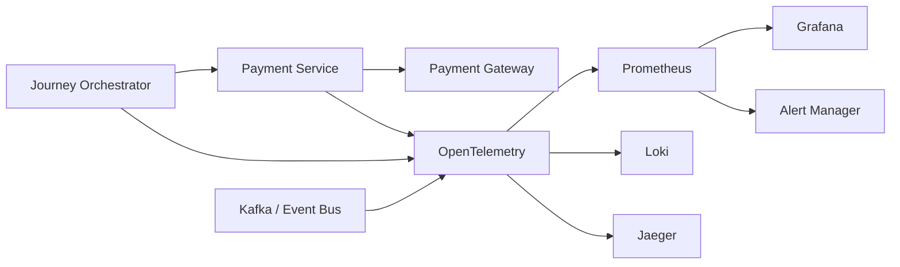
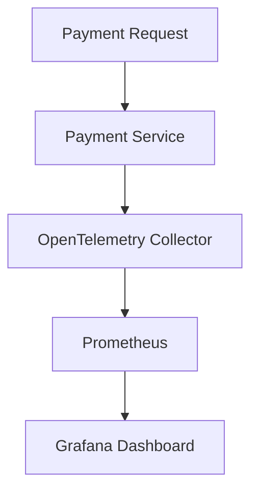
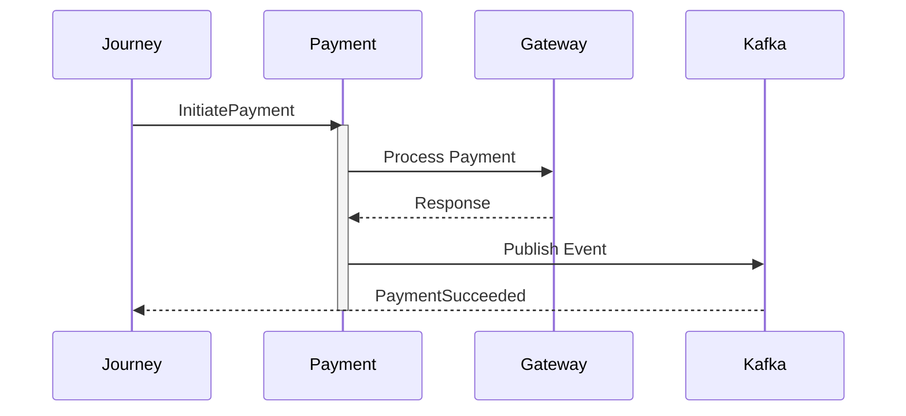
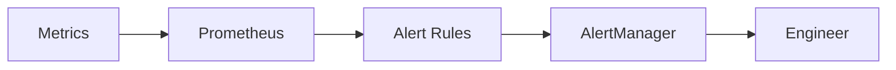

# Payment Observability

## Document Information

| Property | Value |
|----------|-------|
| Layer | Layer 2 – Guided Journey |
| Module | Payment |
| Document Type | Observability |
| Status | Production |
| Owner | Platform Engineering |

---

# Purpose

This document defines the observability strategy for the Payment stage.

The objective is to provide complete operational visibility into payment workflows using logs, metrics, traces, health checks, and alerts.

Observability enables engineers to detect, diagnose, and resolve issues quickly while ensuring reliable payment processing.

---

# Observability Goals

- End-to-end workflow visibility
- Distributed tracing
- Real-time metrics
- Structured logging
- Intelligent alerting
- Failure diagnosis
- SLA monitoring
- Capacity planning

---

# Observability Architecture



---

# Monitoring Components

| Component | Purpose |
|------------|----------|
| OpenTelemetry | Collect traces, logs, metrics |
| Prometheus | Metrics storage |
| Grafana | Dashboards |
| Loki | Log aggregation |
| Jaeger | Distributed tracing |
| AlertManager | Alert routing |

---

# Logging Strategy

Every payment request must generate logs for

- Payment Requested
- Payment Started
- Payment Pending
- Payment Completed
- Payment Failed
- Retry Scheduled
- Journey Resumed

---

# Structured Logging

Required fields

- Timestamp
- Journey ID
- Payment ID
- Correlation ID
- Trace ID
- Event Type
- Service Name
- Log Level

---

Example

```json
{
  "timestamp":"2026-01-01T12:00:00Z",
  "service":"payment-service",
  "journeyId":"JR-1001",
  "paymentId":"PAY-2001",
  "correlationId":"CORR-12345",
  "traceId":"TRACE-9988",
  "event":"PaymentSucceeded",
  "level":"INFO"
}
```

---

# Metrics

## Business Metrics

- Payment Success Rate
- Payment Failure Rate
- Retry Rate
- Payment Conversion
- Journey Completion Rate

---

## Technical Metrics

- API Latency
- Gateway Latency
- Kafka Lag
- Database Latency
- Redis Latency
- Event Processing Time

---

## Infrastructure Metrics

- CPU
- Memory
- Network
- Disk
- Pod Restart Count

---

# Metrics Collection Flow



---

# Distributed Tracing

Every payment transaction must produce a trace.

Trace Flow



---

# Trace Metadata

Every span includes

- Trace ID
- Span ID
- Parent Span ID
- Journey ID
- Payment ID
- Correlation ID

---

# Dashboards

Dashboard categories

- Payment Overview
- Gateway Performance
- Retry Analysis
- Kafka Health
- Workflow Health
- Journey Progress

---

# Health Checks

Monitor

- Payment Service
- Kafka
- Redis
- Database
- Gateway
- Workflow Engine

---

# Alerts

Critical Alerts

- Payment Failure Rate > 5%
- Gateway Down
- Kafka Consumer Lag
- Retry Limit Exceeded
- Circuit Breaker Open

Warning Alerts

- High Latency
- Slow Database
- Low Cache Hit Ratio

---

# Alert Flow



---

# Correlation Strategy

Every request must contain

- Correlation ID
- Trace ID
- Journey ID
- Payment ID

These identifiers must propagate across all services.

---

# SLO Targets

| Metric | Target |
|---------|---------|
| Payment Availability | 99.9% |
| API Latency | <300 ms |
| Gateway Response | <2 s |
| Event Processing | <500 ms |
| Retry Success | >95% |

---

# Observability Maturity

Level 1

- Logs

Level 2

- Metrics

Level 3

- Distributed Tracing

Level 4

- Alerting

Level 5

- Predictive Monitoring

---

# Best Practices

- Use structured logs only.
- Never log sensitive payment information.
- Propagate correlation IDs across services.
- Instrument every external dependency.
- Monitor business and technical metrics separately.
- Create dashboards for both operations and engineering.
- Regularly review alert thresholds.

---

# Related Documents

- FAILURE_STRATEGY.md
- EVENTS.md
- IMPLEMENTATION_MANIFEST.md
- SECURITY.md
- CONFIGURATION.md
- API_CONTRACT.md
