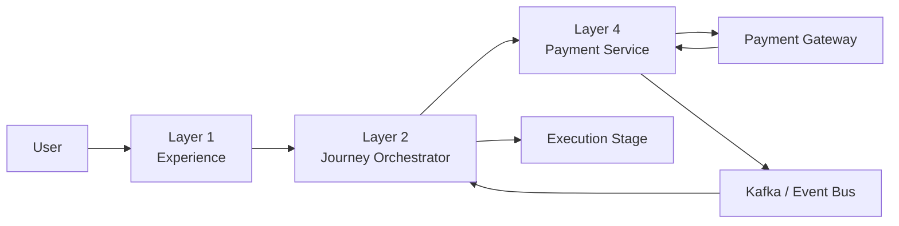
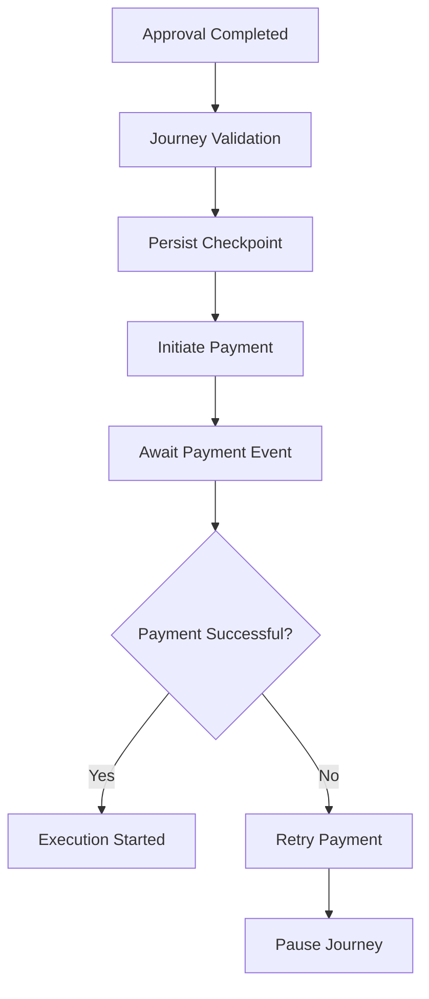
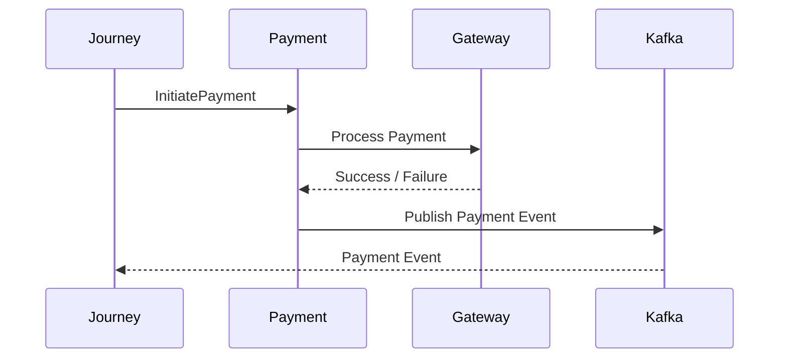
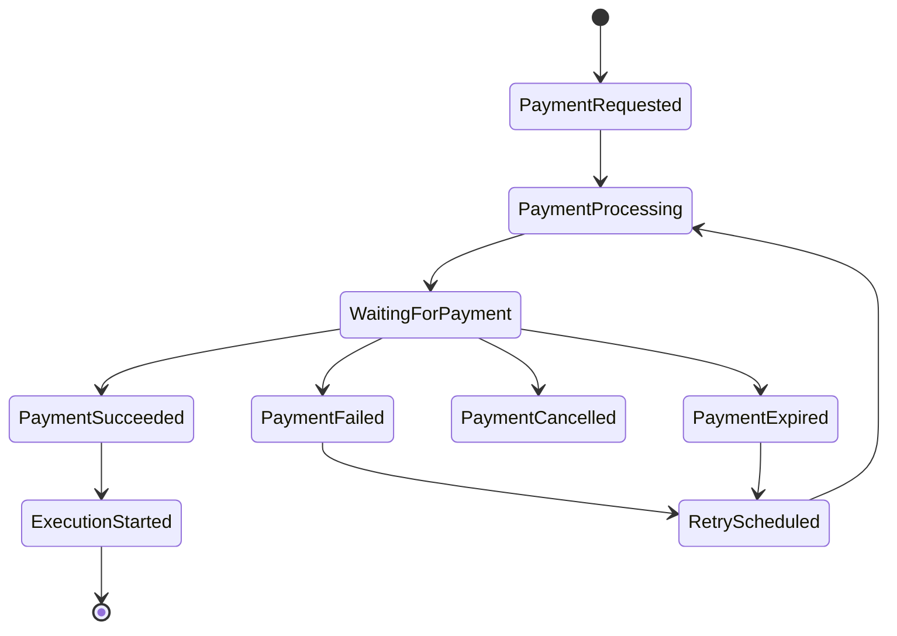

# Payment Module Overview

## Document Information

| Property | Value |
|----------|-------|
| Layer | Layer 2 – Guided Journey |
| Module | Payment |
| Document Type | Overview |
| Status | Production |
| Owner | Journey Team |

---

# Purpose

The Payment module is responsible for orchestrating the payment stage of the Guided Journey.

It does **not execute payments directly**.

Instead, it coordinates workflow progression by interacting with the Layer 4 Payment Service and reacting to asynchronous payment events.

The module ensures that every payment workflow is:

- Reliable
- Recoverable
- Event-driven
- Idempotent
- Observable

---

# Responsibilities

The Payment module is responsible for:

- Validating payment prerequisites
- Persisting workflow checkpoints
- Initiating payment requests
- Waiting for asynchronous payment events
- Managing retries
- Handling failures
- Resuming or pausing the journey
- Triggering the Execution stage after successful payment

---

# Architecture Overview

---

# Payment Journey

---

# High-Level Workflow

1. User completes quotation approval.
2. Journey validates payment prerequisites.
3. Workflow checkpoint is persisted.
4. Payment request is sent to the Payment Service.
5. Payment Service communicates with the external Payment Gateway.
6. Payment events are published through Kafka.
7. Journey resumes when a successful payment event is received.

---

# Core Components

| Component | Responsibility |
|-----------|---------------|
| Journey Orchestrator | Workflow orchestration |
| Payment Service | Payment execution |
| Payment Gateway | Financial transaction processing |
| Kafka/Event Bus | Event delivery |
| Workflow Checkpoint Store | Recovery support |
| Observability Platform | Logging, metrics, tracing |

---

# Communication Model

---

# Key Characteristics

- Event-driven workflow
- Saga-compatible orchestration
- Checkpoint-based recovery
- Idempotent payment requests
- Asynchronous processing
- High observability
- Fault tolerance
- Loose coupling

---

# Payment Lifecycle

---

# Design Principles

- Separation of orchestration and execution
- Event-driven communication
- Stateless orchestration
- Eventual consistency
- Secure by default
- Observable by design
- Recoverable workflows
- Independent deployment

---

# Module Documentation

| Document | Purpose |
|----------|---------|
| README.md | Module introduction |
| ADR.md | Architectural decisions |
| API_CONTRACT.md | API specification |
| API_USAGE.md | Integration guide |
| BUSINESS_RULES.md | Business policies |
| JOURNEY_RULES.md | Workflow rules |
| EVENTS.md | Event catalog |
| CACHE.md | Cache strategy |
| CONFIGURATION.md | Runtime configuration |
| COMPONENT_INVENTORY.md | Components and ownership |
| DEPENDENCIES.md | Architectural dependencies |
| FAILURE_STRATEGY.md | Failure handling |
| FEATURE_FLAGS.md | Runtime feature toggles |
| IMPLEMENTATION_PLAN.md | Delivery roadmap |
| IMPLEMENTATION_MANIFEST.md | Implementation requirements |
| INTERACTION_DESIGN.md | Interaction patterns |
| NAVIGATION.md | Journey navigation |
| OBSERVABILITY.md | Monitoring and tracing |
| FUTURE_SCOPE.md | Long-term evolution |

---

# Success Criteria

The Payment module is considered successful when it:

- Processes payments reliably.
- Never creates duplicate payment requests.
- Recovers safely from failures.
- Maintains consistent journey state.
- Supports asynchronous workflows.
- Provides complete operational visibility.
