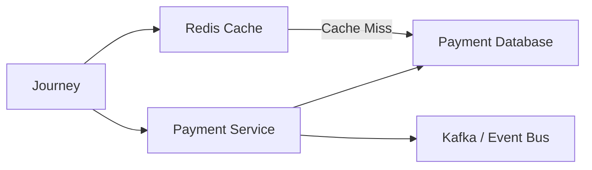
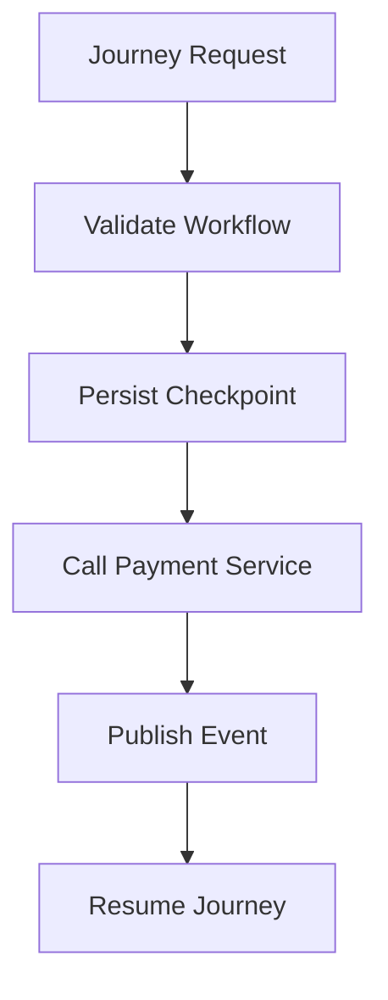
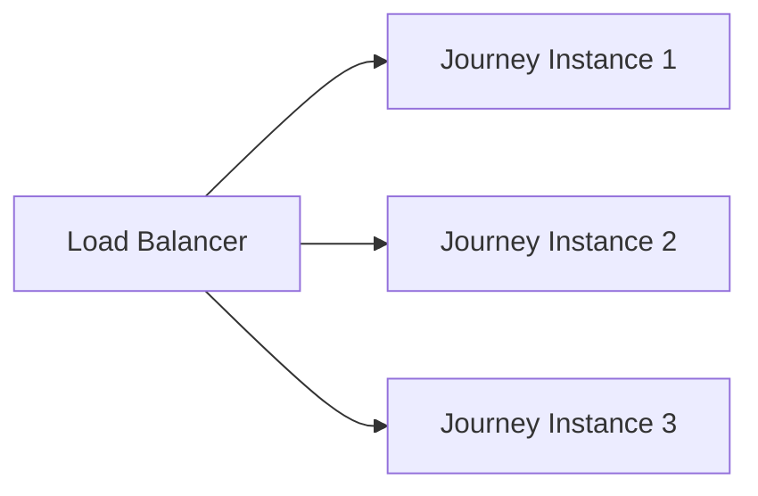
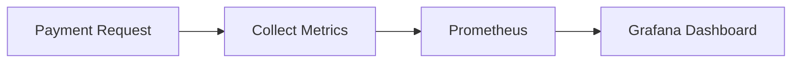

# Payment Performance

## Document Information

| Property | Value |
|----------|-------|
| Layer | Layer 2 – Guided Journey |
| Module | Payment |
| Document Type | Performance |
| Status | Production |
| Owner | Platform Engineering |

---

# Purpose

This document defines the performance objectives, scalability strategy, and optimization techniques for the Payment stage.

The goal is to ensure that payment workflows remain responsive, resilient, and scalable under increasing system load while maintaining workflow consistency.

---

# Performance Goals

- Low API latency
- High throughput
- Fast workflow recovery
- Efficient event processing
- Horizontal scalability
- Minimal gateway wait time
- High cache efficiency

---

# Performance Architecture

---

# Performance Objectives

| Metric | Target |
|---------|---------|
| Payment API Response | <300 ms |
| Journey Validation | <100 ms |
| Checkpoint Persistence | <50 ms |
| Kafka Publish | <100 ms |
| Event Processing | <500 ms |
| Cache Lookup | <5 ms |
| Database Query | <50 ms |

---

# Throughput Targets

| Component | Target |
|-----------|---------|
| Payment Requests | 5,000/min |
| Event Processing | 10,000/min |
| Kafka Publishing | 15,000/min |
| Cache Reads | 100,000/min |

---

# Performance Flow

---

# Bottlenecks

Potential bottlenecks

- External payment gateway latency
- Database contention
- Kafka consumer lag
- Redis cache misses
- Network latency

---

# Optimization Strategy

## Cache

- Cache payment status
- Cache workflow state
- Cache idempotency lookups

---

## Database

- Index payment ID
- Index journey ID
- Optimize checkpoint queries
- Use connection pooling

---

## Kafka

- Partition topics
- Batch event publishing
- Scale consumers horizontally

---

## Workflow

- Asynchronous orchestration
- Non-blocking event handling
- Checkpoint before external calls

---

# Scaling Strategy

---

# Performance Monitoring

Monitor

- API latency
- Event latency
- Gateway latency
- Cache hit ratio
- Database response time
- Kafka lag
- Retry rate

---

# Load Testing

Scenarios

- Single payment
- Concurrent payments
- Gateway slowdown
- Kafka backlog
- Cache outage

---

# Performance Metrics

---

# Performance Alerts

Trigger alerts when

- API latency >300 ms
- Cache hit ratio <90%
- Kafka lag exceeds threshold
- Database latency >100 ms
- Gateway response >2 s

---

# Capacity Planning

Current design should support

- Horizontal scaling
- Stateless journey instances
- Distributed cache
- Distributed messaging
- Active-active deployment

---

# Best Practices

- Keep Journey Orchestrator stateless.
- Persist checkpoints before external calls.
- Use asynchronous event processing.
- Minimize synchronous dependencies.
- Cache only non-authoritative data.
- Monitor end-to-end latency.
- Scale consumers independently from producers.

---

# Related Documents

- CACHE.md
- OBSERVABILITY.md
- CONFIGURATION.md
- FAILURE_STRATEGY.md
- IMPLEMENTATION_MANIFEST.md
