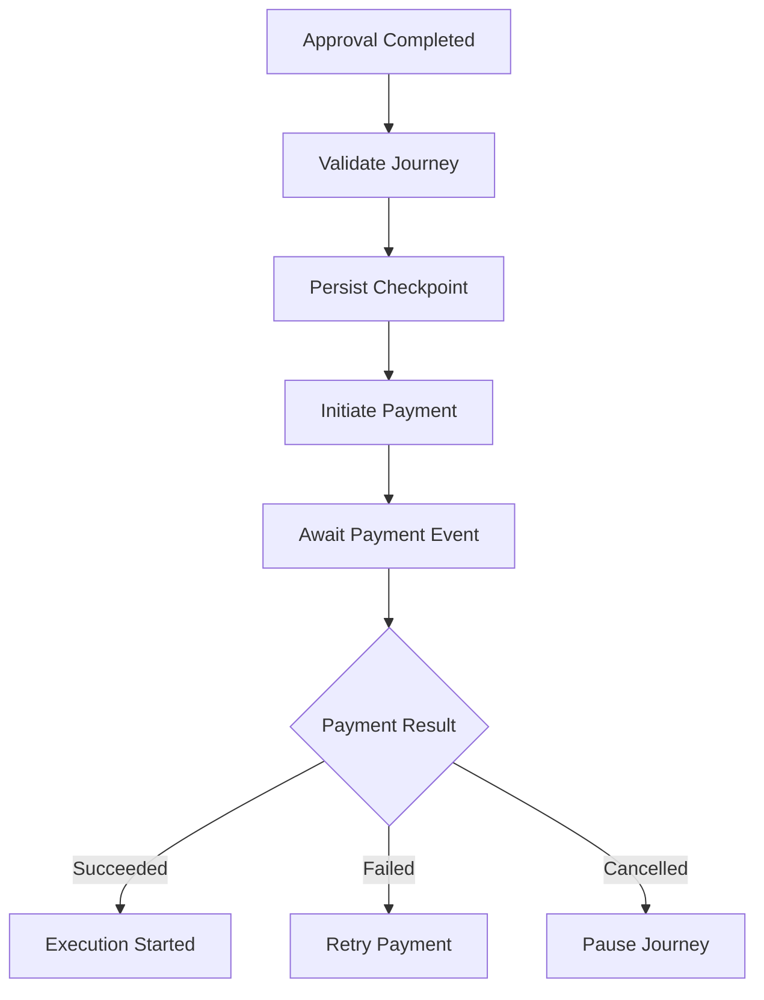
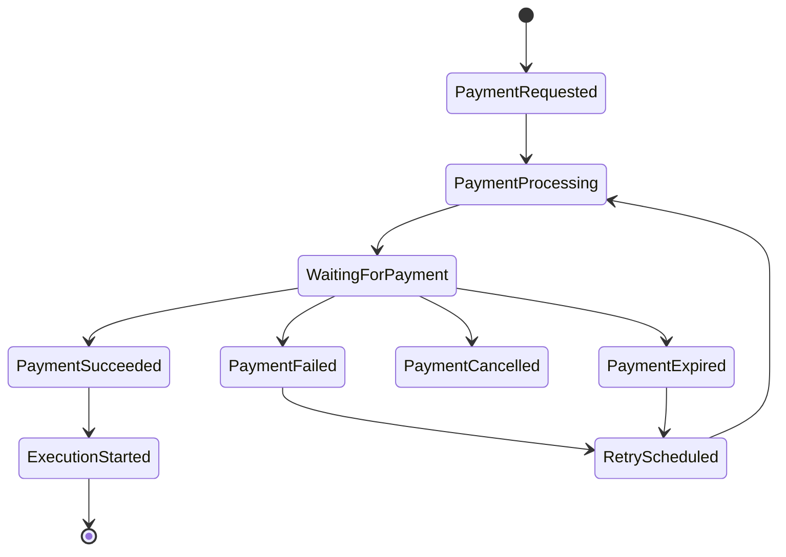

# Payment Requirements

## Document Information

| Property | Value |
|----------|-------|
| Layer | Layer 2 – Guided Journey |
| Module | Payment |
| Document Type | Requirements Specification |
| Status | Production |
| Owner | Journey Team |

---

# Purpose

This document defines the functional, non-functional, security, operational, and integration requirements for the Payment stage.

These requirements establish the baseline capabilities expected from the Payment module before it can be considered production-ready.

---

# Scope

The Payment module is responsible for orchestrating payment workflows within Layer 2.

Responsibilities include:

- Journey validation
- Payment orchestration
- Workflow checkpointing
- Event handling
- Retry orchestration
- Journey continuation

The module does **not** execute financial transactions directly.

Payment execution belongs to Layer 4.

---

# Functional Requirements

## FR-001

The Journey shall validate all payment prerequisites before initiating payment.

---

## FR-002

The Journey shall persist a workflow checkpoint before calling the Payment Service.

---

## FR-003

The Journey shall initiate payment through the Payment Service only.

---

## FR-004

The module shall never communicate directly with external payment gateways.

---

## FR-005

The Journey shall wait asynchronously for payment events.

---

## FR-006

The Journey shall resume automatically after receiving a PaymentSucceeded event.

---

## FR-007

The Journey shall pause after receiving a PaymentFailed event.

---

## FR-008

The Journey shall support payment retry according to configured retry policies.

---

## FR-009

Duplicate payment requests shall be prevented using idempotency keys.

---

## FR-010

Every payment request shall include a Correlation ID.

---

# Functional Workflow

---

# Integration Requirements

The Payment module shall integrate with

- Payment Service
- Kafka/Event Bus
- Workflow Database
- Redis Cache
- Trust Service
- Observability Platform

---

# Event Requirements

The module shall publish

- InitiatePayment
- RetryPayment
- CancelPayment

The module shall consume

- PaymentInitiated
- PaymentPending
- PaymentSucceeded
- PaymentFailed
- PaymentCancelled
- PaymentExpired

---

# Non-Functional Requirements

## Availability

99.9%

---

## Scalability

Horizontal scaling supported.

---

## Reliability

No duplicate payment execution.

---

## Performance

Payment API latency

<300 ms

---

## Recoverability

Workflow recovery from persisted checkpoints.

---

## Security Requirements

The module shall

- Require JWT authentication
- Use TLS for all communications
- Validate webhooks
- Protect sensitive payment data
- Generate audit logs

---

# Performance Requirements

| Metric | Target |
|---------|---------|
| Journey Validation | <100 ms |
| Checkpoint Save | <50 ms |
| Payment Request | <300 ms |
| Event Processing | <500 ms |
| Cache Lookup | <5 ms |

---

# Reliability Requirements

- Idempotent APIs
- Saga orchestration
- Eventual consistency
- Retry with exponential backoff
- Circuit breaker protection

---

# Monitoring Requirements

The module shall expose

- Success rate
- Failure rate
- Retry count
- Gateway latency
- Kafka lag
- Workflow duration

---

# Failure Requirements

The module shall

- Detect payment failures
- Retry recoverable failures
- Pause unrecoverable workflows
- Preserve checkpoints
- Support event replay

---

# Configuration Requirements

Configuration shall support

- Retry count
- Timeout
- Cache TTL
- Feature flags
- Gateway selection

without code changes.

---

# Journey Constraints

- One active payment per journey
- One active checkpoint
- One active retry schedule
- One workflow owner

---

# State Requirements

---

# Requirement Traceability

| Requirement | Related Document |
|-------------|------------------|
| Journey Rules | JOURNEY_RULES.md |
| Business Rules | BUSINESS_RULES.md |
| API | API_CONTRACT.md |
| Events | EVENTS.md |
| Retry | FAILURE_STRATEGY.md |
| Cache | CACHE.md |
| Performance | PERFORMANCE.md |
| Monitoring | OBSERVABILITY.md |
| Security | SECURITY.md |

---

# Acceptance Criteria

The Payment module is accepted when:

- All functional requirements are implemented.
- Business rules are enforced.
- Events are correctly published and consumed.
- Workflow checkpoints are recoverable.
- Retry logic passes integration tests.
- Performance targets are achieved.
- Security validation succeeds.
- Observability dashboards are operational.

---

# Design Principles

- Event-driven orchestration
- Loose coupling
- Stateless services
- Checkpoint-based recovery
- Idempotent operations
- High observability
- Secure by default

---

# Related Documents

- OVERVIEW.md
- API_CONTRACT.md
- API_USAGE.md
- BUSINESS_RULES.md
- JOURNEY_RULES.md
- EVENTS.md
- FAILURE_STRATEGY.md
- PERFORMANCE.md
- OBSERVABILITY.md
- SECURITY.md
