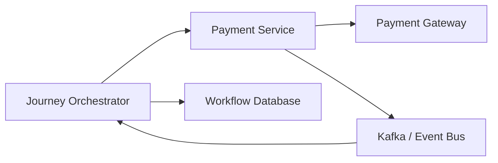
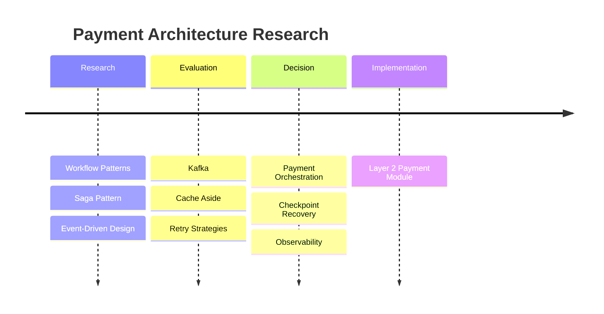

# Payment Research

## Document Information

| Property | Value |
|----------|-------|
| Layer | Layer 2 – Guided Journey |
| Module | Payment |
| Document Type | Technical Research |
| Status | Reference |
| Owner | Architecture Team |

---

# Purpose

This document summarizes the architectural research that influenced the design of the Payment module.

It evaluates architectural patterns, distributed system principles, payment workflow designs, messaging strategies, workflow orchestration approaches, and resilience mechanisms used in modern payment systems.

---

# Research Objectives

The Payment module should:

- Support long-running workflows
- Prevent duplicate payments
- Remain resilient to failures
- Scale horizontally
- Recover automatically
- Maintain eventual consistency
- Provide complete observability

---

# Industry Challenges

Modern payment systems face several challenges:

- Distributed transactions
- Network failures
- Duplicate requests
- Gateway outages
- Event ordering
- Workflow recovery
- Long-running operations
- High availability

---

# Research Areas

## 1. Clean Architecture

### Why

Business logic must remain independent of:

- Frameworks
- Databases
- Payment gateways
- Infrastructure

Benefits

- Testability
- Maintainability
- Replaceable infrastructure

---

## 2. Saga Pattern

Traditional ACID transactions cannot span multiple services.

Research concluded that Saga orchestration is more suitable because it:

- Supports long-running workflows
- Enables compensating actions
- Avoids distributed locks
- Scales across microservices

---

## 3. Transactional Outbox Pattern

Problem

Database update and event publication are separate operations.

Solution

Use a Transactional Outbox.

Benefits

- Reliable event publication
- No dual-write problem
- Eventual consistency

---

## 4. Event-Driven Architecture

Research supports asynchronous communication using an event broker.

Benefits

- Loose coupling
- Horizontal scalability
- Fault isolation
- Independent deployment

---

## 5. Idempotency

Payment APIs must tolerate retries.

Technique

- Idempotency-Key
- Cached response
- Duplicate detection

Result

No duplicate payment execution.

---

## 6. Workflow Engines

Evaluated options

| Engine | Strength |
|---------|----------|
| Temporal | Durable code-based workflows |
| Camunda | BPMN and auditability |
| Netflix Conductor | Microservice orchestration |
| AWS Step Functions | Managed cloud workflows |

Conclusion

The architecture remains workflow-engine agnostic while exposing deterministic state transitions.

---

## 7. Caching Strategy

Evaluated patterns

- Cache Aside ✅
- Read Through
- Write Through
- Write Back

Chosen

Cache Aside

Reason

- Simplicity
- Database remains source of truth
- Graceful degradation

---

## 8. Retry Strategy

Compared

- Fixed retry
- Linear retry
- Exponential backoff
- Exponential backoff with jitter ✅

Reason

Reduces retry storms and improves resilience.

---

## 9. Circuit Breaker

Purpose

Prevent cascading failures when external gateways become unavailable.

Benefits

- Fast failure
- Reduced resource consumption
- Automatic recovery

---

## 10. Observability

Research recommends three pillars:

- Logs
- Metrics
- Distributed Tracing

Suggested stack

- OpenTelemetry
- Prometheus
- Grafana
- Jaeger
- Loki

---

# Architectural Comparison

| Problem | Evaluated Options | Selected |
|----------|------------------|----------|
| Workflow | Sequential API Calls, Saga | Saga |
| Messaging | Sync Calls, Kafka | Kafka |
| Retry | Fixed, Linear, Exponential | Exponential + Jitter |
| Cache | Write Through, Cache Aside | Cache Aside |
| Workflow Engine | Temporal, Camunda, Conductor | Engine Agnostic |
| Recovery | Manual, Checkpoints | Checkpoints |
| Consistency | ACID, Eventual | Eventual Consistency |

---

# High-Level Architecture

---

# Research Timeline

---

# Key Findings

- Distributed transactions should be avoided.
- Saga orchestration is preferred for long-running workflows.
- Events provide better scalability than synchronous communication.
- Idempotency is mandatory for payment safety.
- Cache should improve performance but never become the source of truth.
- Observability must be built into the architecture from the beginning.

---

# Future Research

Potential areas for future evaluation:

- Multi-gateway routing
- AI-assisted retry strategies
- Dynamic gateway selection
- Predictive fraud detection
- Self-healing workflows
- Global payment orchestration

---

# Related Documents

- ADR.md
- IMPLEMENTATION_MANIFEST.md
- API_CONTRACT.md
- EVENTS.md
- FAILURE_STRATEGY.md
- PERFORMANCE.md
- FUTURE_SCOPE.md
