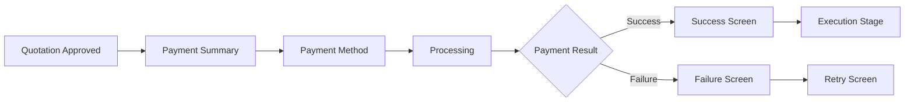
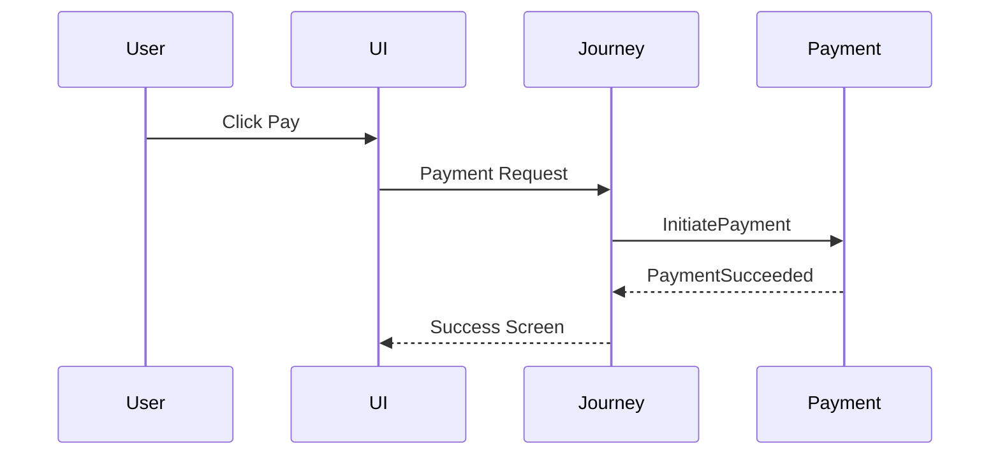
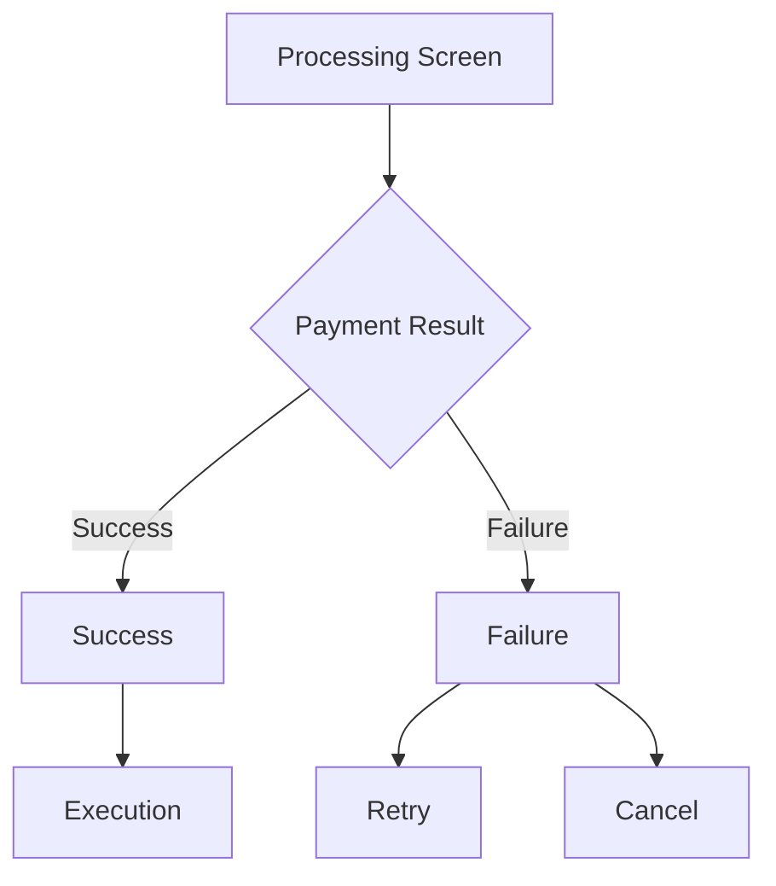
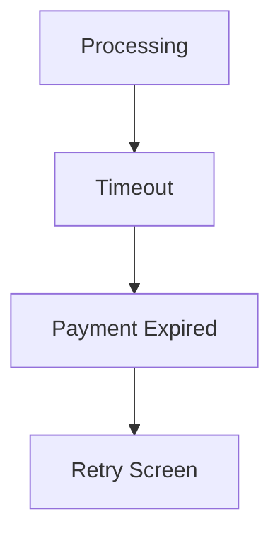

# Payment Screen Flow

## Document Information

| Property | Value |
|----------|-------|
| Layer | Layer 2 – Guided Journey |
| Module | Payment |
| Document Type | Screen Flow |
| Status | Production |
| Owner | Journey Team |

---

# Purpose

This document describes the end-to-end user screen flow during the Payment stage.

It maps frontend screens to backend workflow states and payment events.

---

# Objectives

- Define user navigation
- Map UI actions to backend events
- Ensure recoverable navigation
- Support asynchronous payment processing
- Provide clear user feedback

---

# Screen Overview

| Screen | Purpose |
|----------|---------|
| Quotation Review | Review accepted quotation |
| Payment Summary | Review payable amount |
| Payment Method | Select payment option |
| Processing | Waiting for gateway |
| Success | Payment completed |
| Failure | Payment failed |
| Retry | Retry payment |
| Cancel | Cancel payment |
| Execution | Continue journey |

---

# High-Level Screen Flow



---

# User Journey

## Screen 1 – Payment Summary

User can

- Review quotation
- Review total amount
- Continue
- Cancel

Action

↓

Proceed to Payment

---

## Screen 2 – Payment Method

User selects

- UPI
- Credit Card
- Debit Card
- Net Banking
- Wallet

Action

↓

Pay Now

Backend Event

```
InitiatePayment
```

---

## Screen 3 – Payment Processing

Display

- Loading indicator
- Payment in progress
- Do not refresh message

Backend

- Save checkpoint
- Call Payment Service
- Wait for payment event

---

## Screen 4 – Payment Success

Display

- Payment successful
- Transaction ID
- Continue button

Backend Event

```
PaymentSucceeded
```

Journey resumes.

---

## Screen 5 – Payment Failed

Display

- Failure reason
- Retry option
- Contact support

Backend Event

```
PaymentFailed
```

Journey pauses.

---

## Screen 6 – Retry

User chooses

Retry

↓

RetryPayment Event

↓

Payment Processing

---

## Screen 7 – Cancel

User cancels payment

↓

CancelPayment Event

↓

Journey Cancelled

---

# Backend Interaction



---

# Screen State Mapping

| Screen | Journey State |
|----------|---------------|
| Payment Summary | ApprovalCompleted |
| Payment Method | PaymentRequested |
| Processing | PaymentProcessing |
| Success | PaymentSucceeded |
| Failure | PaymentFailed |
| Retry | RetryScheduled |
| Execution | ExecutionStarted |

---

# Navigation Rules

The user cannot:

- Skip payment
- Open execution before payment
- Trigger duplicate payment requests

The system must:

- Prevent duplicate submissions
- Resume from checkpoints
- Restore screen after refresh (where applicable)

---

# Error Flow



---

# Timeout Flow



---

# UX Guidelines

During payment

- Disable duplicate clicks
- Display progress indicator
- Show meaningful status
- Preserve navigation state

After payment

- Display confirmation
- Allow continuation
- Provide receipt (if available)

---

# Accessibility

- Keyboard navigation
- Screen reader support
- High contrast
- Clear error messages
- Responsive design

---

# Related Documents

- INTERACTION_DESIGN.md
- JOURNEY_RULES.md
- NAVIGATION.md
- API_USAGE.md
- EVENTS.md
