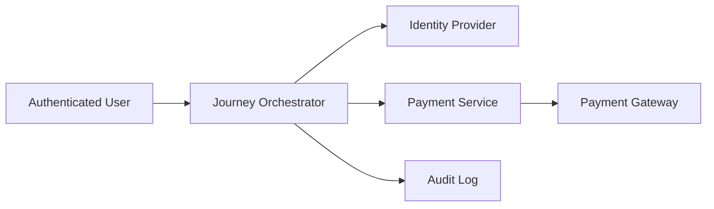
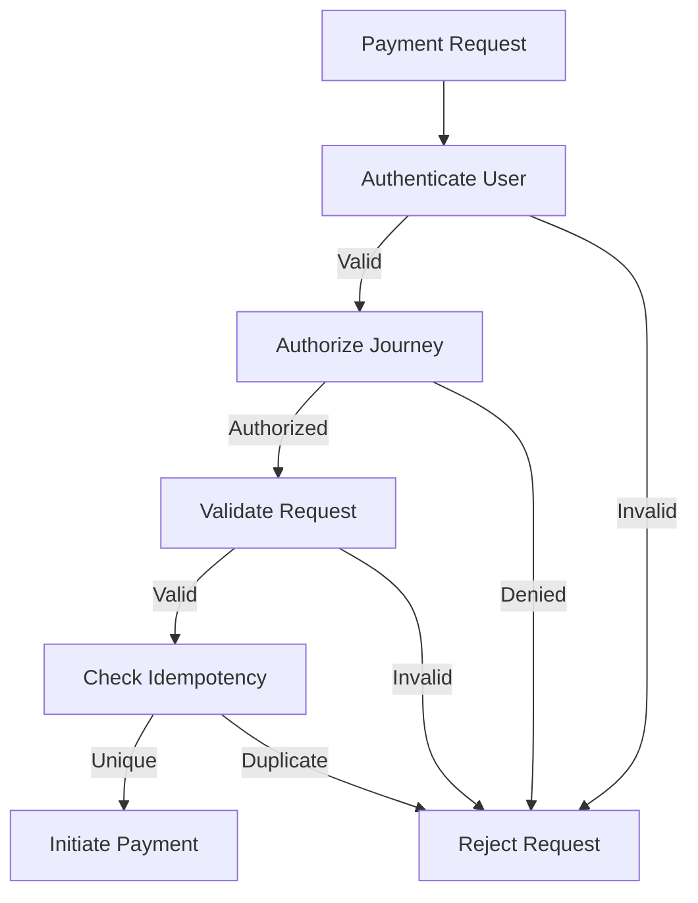

# Payment Security

## Document Information

| Property | Value |
|----------|-------|
| Layer | Layer 2 – Guided Journey |
| Module | Payment |
| Document Type | Security Architecture |
| Status | Production |
| Owner | Security Team |

---

# Purpose

This document defines the security architecture for the Payment stage within Layer 2.

The Journey Orchestrator is responsible for secure orchestration, identity propagation, workflow integrity, and auditability.

Financial transaction security remains the responsibility of the Payment Service (Layer 4).

---

# Security Objectives

- Protect customer identity
- Prevent unauthorized payment requests
- Ensure workflow integrity
- Prevent duplicate payments
- Secure service-to-service communication
- Protect audit data
- Enable end-to-end traceability

---

# Security Architecture



---

# Security Principles

- Zero Trust Architecture
- Least Privilege Access
- Defense in Depth
- Secure by Default
- Immutable Audit Logs
- End-to-End Encryption

---

# Authentication

Every request must be authenticated.

Supported mechanisms

- OAuth 2.0
- OpenID Connect
- JWT

Unauthenticated requests are rejected.

---

# Authorization

Layer 2 validates authorization before initiating payment.

Checks include

- Authenticated user
- Journey ownership
- Active session
- Payment eligibility

---

# Service Authentication

Internal communication uses

- Mutual TLS (mTLS)
- Service identities
- Short-lived service tokens

---

# Secure Communication

All communication must use

- HTTPS
- TLS 1.3
- Certificate validation

No plaintext traffic is permitted.

---

# Identity Propagation

Every request propagates

- User ID
- Journey ID
- Correlation ID
- Trace ID

These identifiers are used for auditing and distributed tracing.

---

# Data Protection

Sensitive information must never be stored in Layer 2.

Allowed

- Journey ID
- Payment ID
- Status
- Correlation ID

Never store

- Card number
- CVV
- Bank credentials
- Payment tokens
- Gateway secrets

---

# Security Headers

Required headers

```
Authorization: Bearer <JWT>

Correlation-ID: UUID

Idempotency-Key: UUID

Content-Type: application/json
```

---

# Request Validation

Every request validates

- JWT signature
- Request schema
- Journey ownership
- Payment eligibility
- Idempotency key

---

# Idempotency Protection

Duplicate payment requests are prevented using

- Idempotency-Key
- Payment ID
- Journey ID

Duplicate requests return the original response.

---

# Audit Logging

Every security-sensitive action is logged.

Events include

- Payment requested
- Payment cancelled
- Payment retried
- Authorization failure
- Authentication failure

Audit logs are immutable.

---

# Threat Model

| Threat | Mitigation |
|----------|------------|
| Replay Attack | Idempotency Keys |
| Token Theft | Short-lived JWT |
| Man-in-the-Middle | TLS 1.3 + mTLS |
| Duplicate Payment | Idempotency Validation |
| Unauthorized Access | RBAC + JWT |
| Workflow Tampering | Checkpoint Validation |

---

# Security Flow



---

# Secret Management

Secrets must never be stored in source control.

Use

- Kubernetes Secrets
- HashiCorp Vault
- Cloud Secret Manager

Secrets include

- JWT signing keys
- API credentials
- Service certificates

---

# Event Security

Every event must include

- Correlation ID
- Event ID
- Timestamp
- Version

Events must never include sensitive payment information.

---

# Monitoring

Monitor

- Authentication failures
- Authorization failures
- Invalid JWT tokens
- Duplicate requests
- Suspicious retry activity

---

# Incident Response

On suspicious activity

1. Reject request.
2. Record audit event.
3. Generate security alert.
4. Notify security team.
5. Preserve forensic evidence.

---

# Compliance Considerations

The architecture should support

- PCI DSS (via Layer 4)
- GDPR
- SOC 2
- ISO 27001

Layer 2 minimizes exposure by avoiding storage of payment credentials.

---

# Best Practices

- Validate every request.
- Use short-lived tokens.
- Enforce TLS everywhere.
- Never trust client input.
- Propagate correlation IDs.
- Keep audit logs immutable.
- Do not log sensitive payment data.

---

# Related Documents

- API_CONTRACT.md
- FAILURE_STRATEGY.md
- OBSERVABILITY.md
- CONFIGURATION.md
- REQUIREMENTS.md
- IMPLEMENTATION_MANIFEST.md
