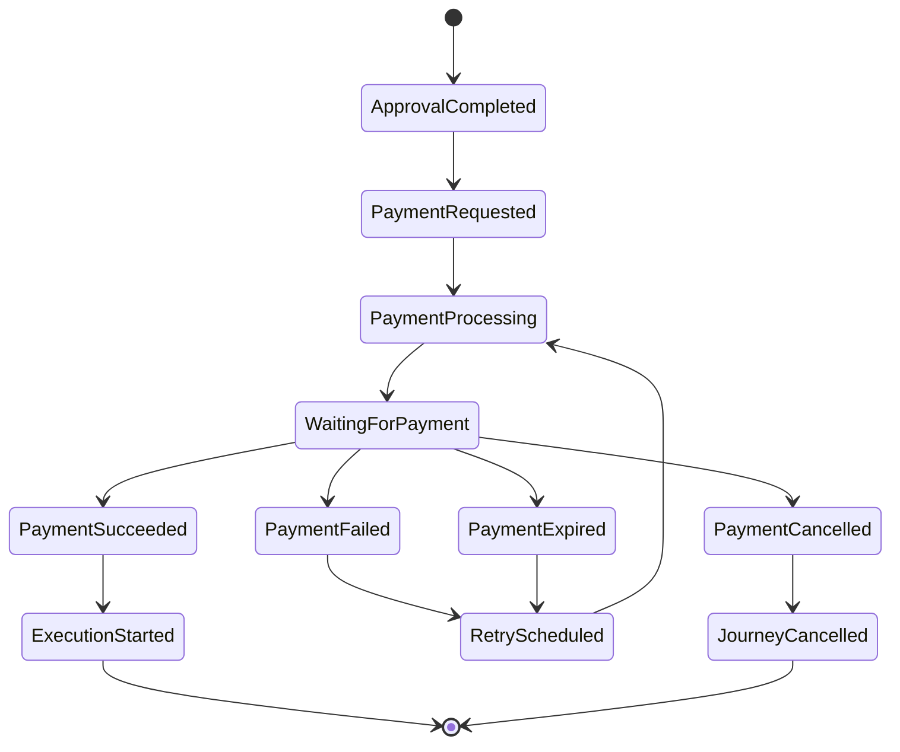
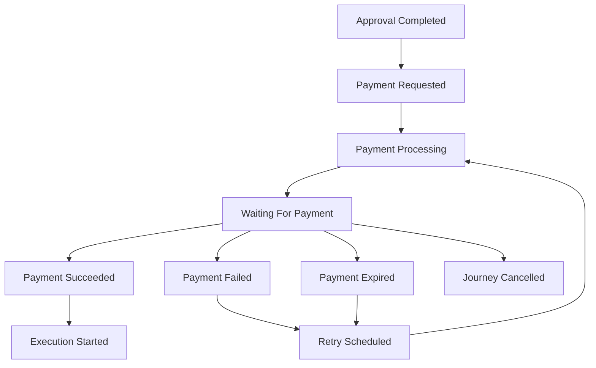
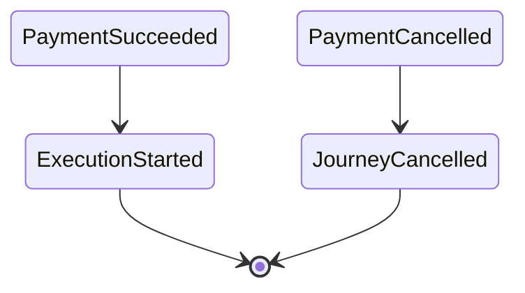
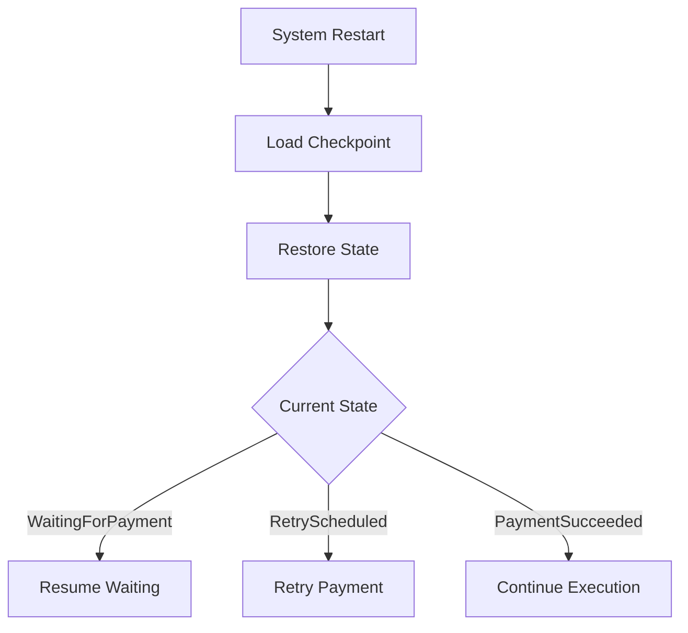
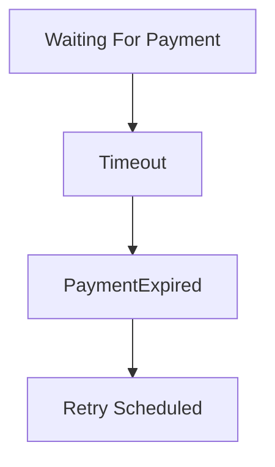
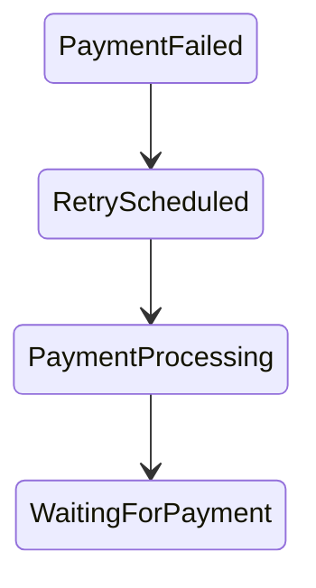

# Payment State Machine

## Document Information

| Property | Value |
|----------|-------|
| Layer | Layer 2 – Guided Journey |
| Module | Payment |
| Document Type | State Machine |
| Status | Production |
| Owner | Journey Team |

---

# Purpose

This document defines the finite state machine governing the Payment stage.

Every payment workflow progresses through a deterministic sequence of states.

Only documented transitions are permitted.

The Journey Orchestrator owns all state transitions.

---

# Design Principles

- Deterministic transitions
- Single active state
- Event-driven progression
- Checkpoint before state changes
- Recoverable workflow
- Idempotent transitions

---

# High-Level State Machine

---

# State Definitions

| State | Description |
|--------|-------------|
| ApprovalCompleted | Quotation approved |
| PaymentRequested | Payment request created |
| PaymentProcessing | Request sent to Payment Service |
| WaitingForPayment | Awaiting asynchronous payment event |
| PaymentSucceeded | Payment completed successfully |
| PaymentFailed | Payment failed |
| PaymentExpired | Payment timed out |
| RetryScheduled | Retry has been scheduled |
| PaymentCancelled | User cancelled payment |
| ExecutionStarted | Journey proceeds to execution |
| JourneyCancelled | Workflow terminated |

---

# Transition Diagram

---

# State Transition Matrix

| Current State | Event | Next State |
|---------------|-------|------------|
| ApprovalCompleted | InitiatePayment | PaymentRequested |
| PaymentRequested | PaymentInitiated | PaymentProcessing |
| PaymentProcessing | PaymentPending | WaitingForPayment |
| WaitingForPayment | PaymentSucceeded | PaymentSucceeded |
| WaitingForPayment | PaymentFailed | PaymentFailed |
| WaitingForPayment | PaymentExpired | PaymentExpired |
| WaitingForPayment | PaymentCancelled | PaymentCancelled |
| PaymentFailed | RetryPayment | RetryScheduled |
| PaymentExpired | RetryPayment | RetryScheduled |
| RetryScheduled | RetryInitiated | PaymentProcessing |
| PaymentSucceeded | ExecutionStarted | ExecutionStarted |

---

# Entry Actions

## ApprovalCompleted

- Validate quotation
- Validate journey

---

## PaymentRequested

- Persist workflow checkpoint
- Generate correlation ID
- Generate idempotency key

---

## PaymentProcessing

- Invoke Payment Service
- Start timeout timer

---

## WaitingForPayment

- Await payment event
- Monitor timeout

---

## PaymentSucceeded

- Record completion
- Publish execution event

---

## PaymentFailed

- Record failure
- Evaluate retry policy

---

## RetryScheduled

- Schedule retry
- Preserve checkpoint

---

## ExecutionStarted

- Continue Guided Journey

---

# Terminal States

---

# Invalid Transitions

The following transitions are prohibited:

- PaymentSucceeded → PaymentRequested
- PaymentSucceeded → PaymentProcessing
- JourneyCancelled → RetryScheduled
- ExecutionStarted → PaymentProcessing
- PaymentCancelled → PaymentSucceeded

---

# Recovery Flow

---

# Timeout Handling

---

# Retry Lifecycle

---

# State Invariants

Every state must satisfy:

- Exactly one active state
- Valid checkpoint exists
- Correlation ID preserved
- Payment ID preserved
- Idempotency key unchanged

---

# State Persistence

Persist after every transition:

- Journey ID
- Payment ID
- Current State
- Correlation ID
- Retry Count
- Timestamp

---

# Best Practices

- Never skip states.
- Never allow multiple active states.
- Persist before external calls.
- Resume only from checkpoints.
- Reject invalid transitions.
- Make transitions idempotent.

---

# Related Documents

- JOURNEY_RULES.md
- EVENTS.md
- NAVIGATION.md
- FAILURE_STRATEGY.md
- IMPLEMENTATION_MANIFEST.md
- API_USAGE.md
