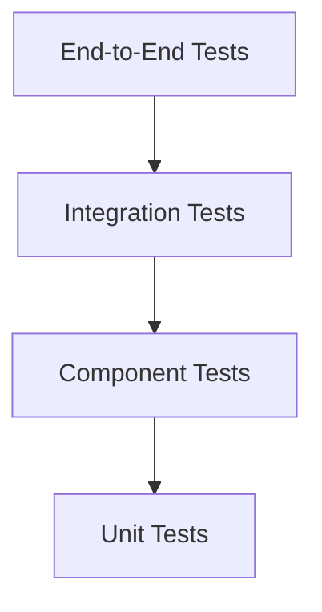
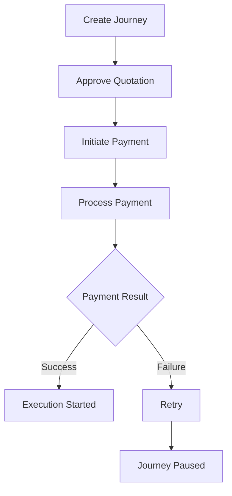
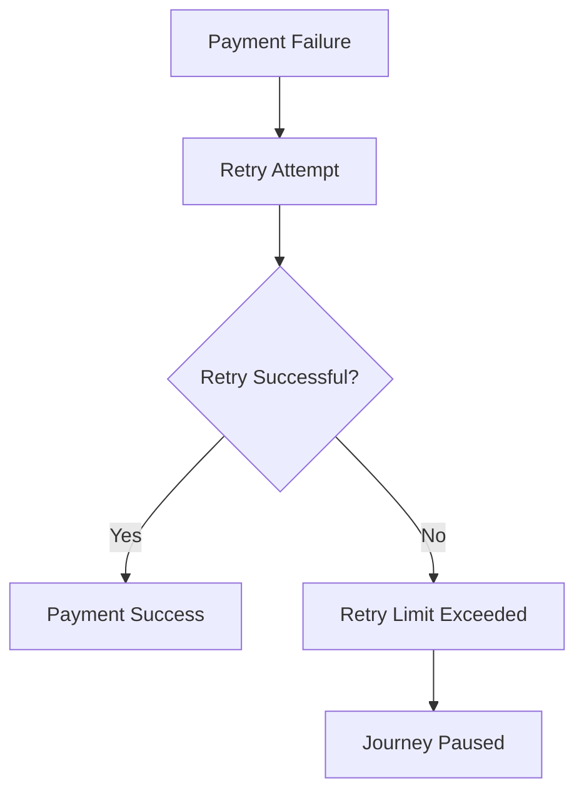
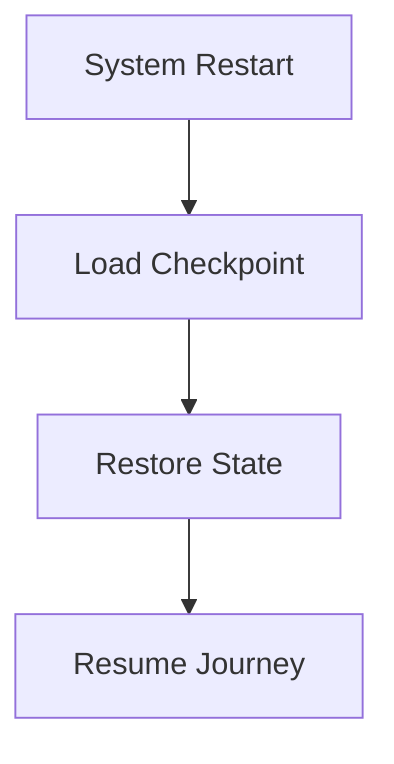

# Payment Testing Strategy

## Document Information

| Property | Value |
|----------|-------|
| Layer | Layer 2 – Guided Journey |
| Module | Payment |
| Document Type | Testing Strategy |
| Status | Production |
| Owner | QA / Platform Engineering |

---

# Purpose

This document defines the testing strategy for the Payment stage.

The objective is to verify that payment workflows are reliable, secure, recoverable, scalable, and production-ready before deployment.

Testing covers both functional and non-functional aspects of the payment orchestration workflow.

---

# Testing Objectives

- Verify business rules
- Validate workflow state transitions
- Test API contracts
- Validate event publishing and consumption
- Verify retry mechanisms
- Validate checkpoint recovery
- Ensure security controls
- Measure performance and scalability

---

# Testing Pyramid

---

# Test Categories

| Test Type | Purpose |
|------------|----------|
| Unit Testing | Validate business logic |
| Component Testing | Validate payment module behavior |
| Integration Testing | Verify external integrations |
| End-to-End Testing | Validate complete payment journey |
| Performance Testing | Measure latency and throughput |
| Security Testing | Validate authentication and authorization |
| Chaos Testing | Verify resilience under failures |
| Recovery Testing | Validate checkpoint restoration |

---

# Unit Testing

Verify

- Journey validation
- Business rules
- Idempotency
- Retry logic
- State transitions
- Configuration loading

---

# Component Testing

Test

- Payment orchestration
- Event handlers
- Workflow checkpoints
- Cache integration
- Timeout handling

---

# Integration Testing

Validate communication with

- Payment Service
- Kafka/Event Bus
- Workflow Database
- Redis Cache
- Identity Provider

---

# End-to-End Workflow

---

# Event Testing

Verify

- PaymentInitiated
- PaymentPending
- PaymentSucceeded
- PaymentFailed
- PaymentCancelled
- PaymentExpired

Validate

- Ordering
- Delivery
- Idempotency
- Replay

---

# API Testing

Verify

- Authentication
- Authorization
- Request validation
- Response validation
- Idempotency
- Error handling

---

# Retry Testing

---

# Failure Testing

Scenarios

- Gateway timeout
- Kafka unavailable
- Redis unavailable
- Database unavailable
- Duplicate requests
- Invalid JWT
- Expired session

Expected outcome

- No data loss
- No duplicate payment
- Recoverable workflow

---

# Recovery Testing

---

# Performance Testing

Targets

| Metric | Target |
|---------|---------|
| API Latency | <300 ms |
| Event Processing | <500 ms |
| Checkpoint Save | <50 ms |
| Cache Lookup | <5 ms |

Scenarios

- High concurrency
- Burst traffic
- Long-running workflows
- Large event volume

---

# Security Testing

Validate

- JWT authentication
- Authorization rules
- TLS enforcement
- Idempotency protection
- Audit logging
- Sensitive data masking

---

# Chaos Testing

Inject failures into

- Kafka
- Redis
- Payment Service
- Database
- Network

Verify

- Automatic recovery
- Retry behavior
- Workflow consistency

---

# Test Data

Create representative datasets for

- Successful payments
- Failed payments
- Expired payments
- Duplicate requests
- Invalid users
- Retry scenarios

Test data must never include real payment credentials.

---

# Test Environment

Environment includes

- Journey Orchestrator
- Payment Service
- Kafka
- Redis
- Database
- Mock Payment Gateway

---

# CI/CD Validation

Tests executed

1. Unit Tests
2. Component Tests
3. Integration Tests
4. Security Tests
5. Performance Tests
6. End-to-End Tests

Deployment proceeds only if all mandatory tests pass.

---

# Acceptance Criteria

The module is considered production-ready when

- All functional tests pass
- No critical defects remain
- Performance targets are achieved
- Security validation succeeds
- Recovery tests pass
- Event processing is reliable
- State transitions are valid

---

# Best Practices

- Automate all repeatable tests.
- Use mock gateways for integration testing.
- Keep test environments isolated.
- Verify both success and failure paths.
- Test idempotency for every payment request.
- Include recovery and chaos testing in release validation.

---

# Related Documents

- REQUIREMENTS.md
- STATE_MACHINE.md
- EVENTS.md
- API_CONTRACT.md
- FAILURE_STRATEGY.md
- PERFORMANCE.md
- SECURITY.md
- IMPLEMENTATION_PLAN.md
