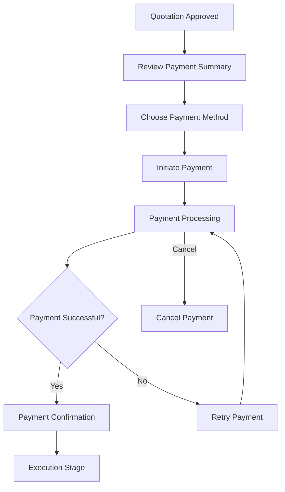

# Payment User Stories

## Document Information

| Property | Value |
|----------|-------|
| Layer | Layer 2 – Guided Journey |
| Module | Payment |
| Document Type | User Stories |
| Status | Production |
| Owner | Product Team |

---

# Purpose

This document defines the user stories for the Payment stage of the Guided Journey.

The stories describe user goals, expected outcomes, acceptance criteria, and business value.

---

# Personas

| Persona | Description |
|----------|-------------|
| Homeowner | Pays for interior design services |
| Designer | Waits for payment confirmation before work begins |
| Journey Orchestrator | Coordinates the workflow |
| Payment Service | Executes financial transactions |
| Administrator | Monitors payment activities |

---

# Epic

**Payment Processing**

Enable customers to complete secure payments so that the interior design project can move from approval to execution.

---

# User Story 1

## Title

Initiate Payment

### Story

**As a homeowner, I want to initiate payment after approving my quotation so that my project can proceed.**

### Acceptance Criteria

- Approved quotation exists.
- Payment request is created.
- Workflow checkpoint is saved.
- User is redirected to payment.
- Duplicate requests are prevented.

---

# User Story 2

## Title

View Payment Summary

### Story

**As a homeowner, I want to review the payment amount before confirming payment so that I understand what I am paying for.**

### Acceptance Criteria

- Total amount displayed.
- Project reference shown.
- Taxes and fees visible.
- Payment method selection available.

---

# User Story 3

## Title

Complete Payment

### Story

**As a homeowner, I want to securely complete my payment so that my project can continue.**

### Acceptance Criteria

- Payment request reaches Payment Service.
- Payment gateway processes transaction.
- Success event is received.
- Journey resumes automatically.

---

# User Story 4

## Title

Receive Payment Confirmation

### Story

**As a homeowner, I want immediate confirmation after payment succeeds so that I know my payment was accepted.**

### Acceptance Criteria

- Success screen displayed.
- Transaction reference available.
- Journey proceeds automatically.

---

# User Story 5

## Title

Retry Failed Payment

### Story

**As a homeowner, I want to retry payment if a temporary failure occurs so that I can complete my transaction without restarting the journey.**

### Acceptance Criteria

- Retry option displayed.
- Existing payment reused through idempotency.
- Journey checkpoint restored.
- Payment restarts safely.

---

# User Story 6

## Title

Cancel Payment

### Story

**As a homeowner, I want to cancel payment before completion if I choose not to continue.**

### Acceptance Criteria

- Payment session cancelled.
- Journey marked cancelled.
- No duplicate transactions created.

---

# User Story 7

## Title

Recover Interrupted Journey

### Story

**As a homeowner, I want my payment progress preserved if the application closes unexpectedly so that I do not lose my progress.**

### Acceptance Criteria

- Workflow checkpoint exists.
- Journey resumes from last checkpoint.
- Payment status verified before continuing.

---

# User Story 8

## Title

Notify Designer

### Story

**As a designer, I want to receive confirmation after successful payment so that I know work can begin.**

### Acceptance Criteria

- Payment success event published.
- Execution stage starts.
- Designer notified.

---

# User Story 9

## Title

Monitor Payments

### Story

**As a system administrator, I want to monitor payment workflows so that I can quickly detect failures and operational issues.**

### Acceptance Criteria

- Dashboard available.
- Success and failure metrics visible.
- Alerts generated for critical failures.

---

# User Story Workflow

---

# Story Mapping

| Activity | User Goal |
|----------|-----------|
| Review | Verify payment details |
| Select | Choose payment method |
| Pay | Complete transaction |
| Confirm | Receive confirmation |
| Retry | Recover from failure |
| Resume | Continue project |

---

# Business Value

The Payment module should:

- Enable secure transactions.
- Minimize payment failures.
- Prevent duplicate payments.
- Improve customer confidence.
- Reduce manual intervention.
- Ensure reliable project progression.

---

# Definition of Done

A user story is complete when:

- Acceptance criteria pass.
- Business rules are enforced.
- Events are published correctly.
- Workflow resumes successfully.
- Security validation passes.
- Observability metrics are generated.

---

# Related Documents

- REQUIREMENTS.md
- BUSINESS_RULES.md
- JOURNEY_RULES.md
- SCREEN_FLOW.md
- INTERACTION_DESIGN.md
- API_USAGE.md
- TESTING.md
