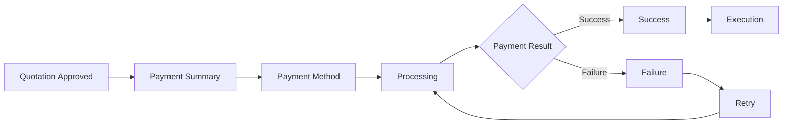
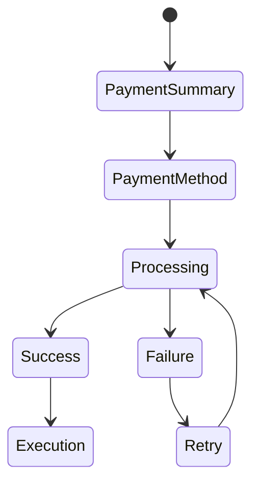
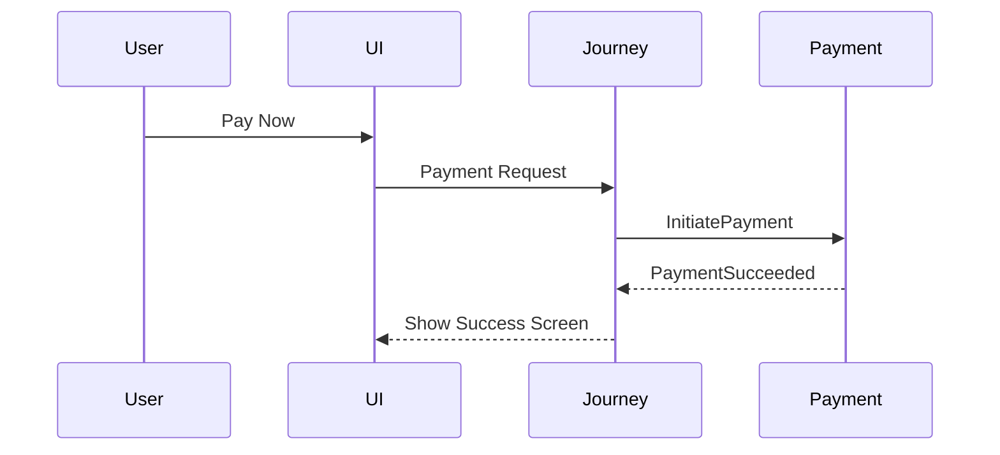

# Payment Wireframe Reference

## Document Information

| Property | Value |
|----------|-------|
| Layer | Layer 2 – Guided Journey |
| Module | Payment |
| Document Type | Wireframe Reference |
| Status | Production |
| Owner | UX Team |

---

# Purpose

This document provides a reference for the user interface screens involved in the Payment stage.

It describes each screen's purpose, expected UI components, user actions, and corresponding backend workflow.

Visual mockups should be maintained separately in the design system (e.g., Figma).

---

# Design Principles

- Minimal user friction
- Clear payment progress
- Prevent duplicate submissions
- Consistent branding
- Responsive design
- Accessible UI
- Clear error recovery

---

# Screen Navigation



---

# Screen Inventory

| Screen | Purpose |
|----------|----------|
| Payment Summary | Review payment details |
| Payment Method | Select payment option |
| Processing | Show payment progress |
| Success | Confirm successful payment |
| Failure | Explain failure and recovery |
| Retry | Retry failed payment |

---

# Screen 1 — Payment Summary

## Purpose

Allow the customer to review the payment before proceeding.

### UI Components

- Project name
- Customer name
- Total amount
- Tax breakdown
- Payment button
- Cancel button

### User Actions

- Proceed to payment
- Cancel

### Backend Action

```
InitiatePayment
```

---

# Screen 2 — Payment Method

## UI Components

- UPI
- Credit Card
- Debit Card
- Net Banking
- Wallet

### User Action

```
Pay Now
```

### Backend

Journey creates payment request.

---

# Screen 3 — Processing

Purpose

Display payment progress.

### UI Components

- Progress indicator
- Loading animation
- Status message
- Transaction reference (optional)

User interaction is disabled until payment completes or fails.

---

# Screen 4 — Payment Success

### UI Components

- Success icon
- Payment reference
- Transaction ID
- Continue button

### Backend Event

```
PaymentSucceeded
```

Journey resumes.

---

# Screen 5 — Payment Failure

### UI Components

- Failure message
- Retry button
- Cancel button
- Contact support

### Backend Event

```
PaymentFailed
```

---

# Screen 6 — Retry

User selects

```
Retry Payment
```

↓

Journey publishes

```
RetryPayment
```

---

# UI State Flow



---

# Backend Interaction



---

# Screen-to-State Mapping

| Screen | Journey State |
|----------|---------------|
| Payment Summary | ApprovalCompleted |
| Payment Method | PaymentRequested |
| Processing | PaymentProcessing |
| Success | PaymentSucceeded |
| Failure | PaymentFailed |
| Retry | RetryScheduled |

---

# UX Guidelines

- Show progress during payment processing.
- Disable duplicate clicks.
- Display meaningful error messages.
- Preserve state after refresh (where applicable).
- Keep the number of steps minimal.

---

# Accessibility

- Keyboard navigation
- Screen reader compatibility
- High contrast support
- Clear focus indicators
- Responsive layout

---

# Design References

Design artifacts should be maintained externally.

Suggested assets:

- Figma wireframes
- Design system
- Component library
- UI prototypes

---

# Related Documents

- SCREEN_FLOW.md
- INTERACTION_DESIGN.md
- NAVIGATION.md
- USER_STORY.md
- API_USAGE.md
