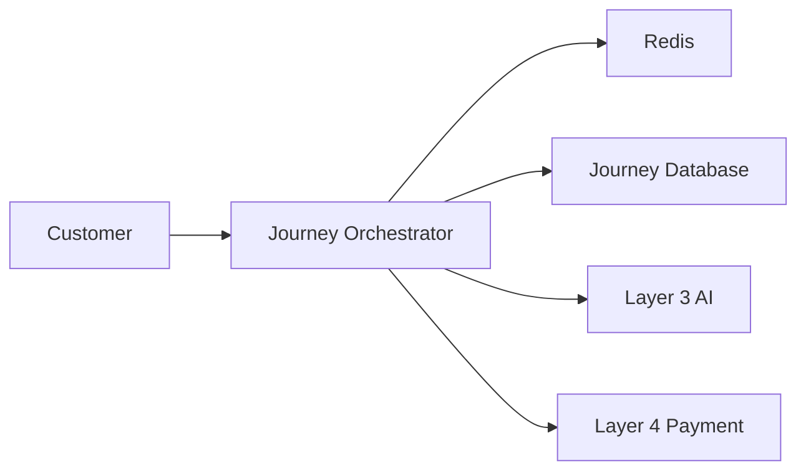
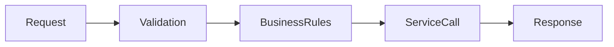
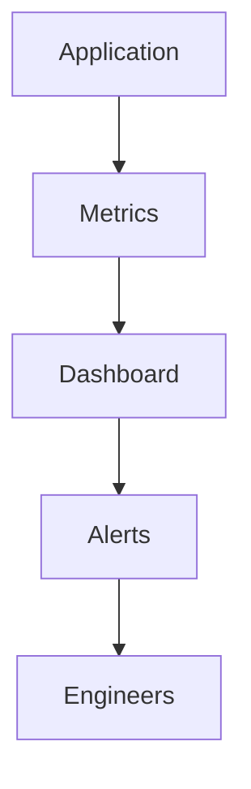

# Performance Budget

## Document Information

| Property | Value |
|----------|-------|
| Layer | Layer 2 – Guided Journey |
| Document | Performance Budget |
| Status | Production |
| Version | 1.0 |

---

# Purpose

This document defines the performance budgets for Layer 2.

Performance budgets establish measurable limits that ensure the Guided Journey remains responsive, scalable, and reliable under expected production workloads.

---

# Objectives

- Maintain low latency
- Ensure high availability
- Support horizontal scaling
- Reduce resource consumption
- Improve user experience

---

# Performance Architecture

---

# Request Lifecycle

---

# Performance Targets

| Metric | Target |
|---------|---------|
| API Response Time | < 300 ms |
| Journey Start | < 500 ms |
| AI Recommendation | < 5 s |
| Payment Initiation | < 3 s |
| Event Processing | < 1 s |
| Cache Lookup | < 20 ms |
| Database Query | < 100 ms |
| Page Load | < 2 s |

---

# Availability Targets

| Component | Target |
|-----------|---------|
| Journey Service | 99.9% |
| Payment Integration | 99.9% |
| AI Integration | 99.5% |
| Event Processing | 99.9% |

---

# Scalability Goals

- Stateless services
- Horizontal scaling
- Event-driven processing
- Asynchronous workflows
- Distributed caching

---

# Resource Budget

| Resource | Target |
|----------|---------|
| CPU Usage | < 70% |
| Memory Usage | < 75% |
| Cache Hit Rate | > 90% |
| Error Rate | < 1% |
| Retry Rate | < 5% |

---

# Performance Monitoring

---

# Optimization Guidelines

- Prefer asynchronous processing.
- Cache frequently accessed data.
- Minimize database queries.
- Batch external requests when appropriate.
- Use idempotent operations.
- Reduce unnecessary network calls.

---

# Performance Validation

The following tests should be executed before release:

- Load testing
- Stress testing
- Spike testing
- Endurance testing
- API latency testing
- Database performance testing

---

# Monitoring Metrics

Monitor:

- Response time
- Throughput
- Error rate
- CPU utilization
- Memory utilization
- Cache hit ratio
- Event processing latency
- Workflow completion time

---

# Related Documents

- architecture.md
- observability.md
- dependency_graph.md
- implementation_rules.md
- payment/performance.md
