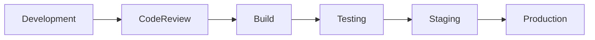
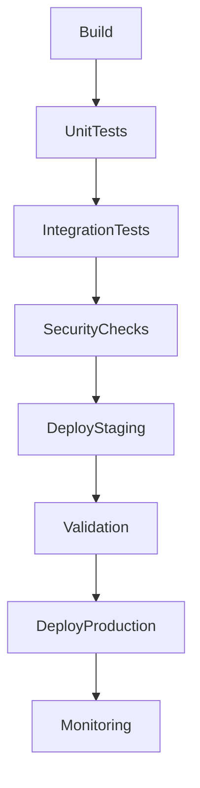
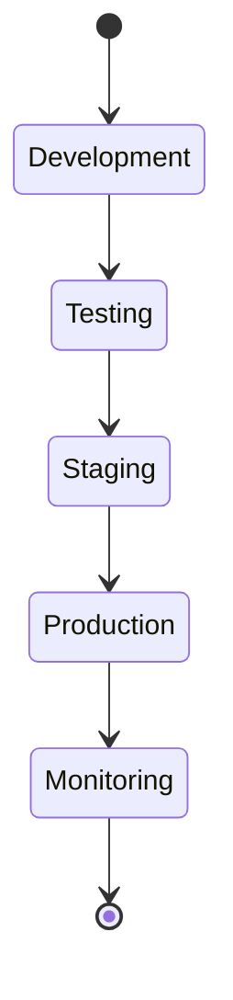
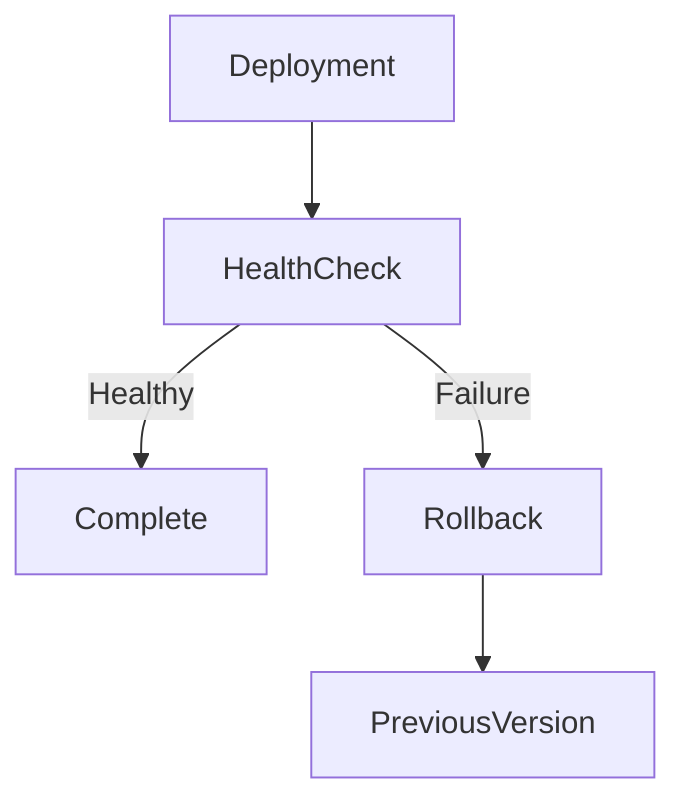

# Release Strategy

## Document Information

| Property | Value |
|----------|-------|
| Layer | Layer 2 – Guided Journey |
| Document | Release Strategy |
| Status | Production |
| Version | 1.0 |

---

# Purpose

This document defines the release strategy for Layer 2.

The objective is to ensure reliable, low-risk, and repeatable deployments while maintaining service availability throughout the release lifecycle.

---

# Release Objectives

- Minimize deployment risk
- Ensure zero or minimal downtime
- Support rollback
- Validate system health
- Enable incremental feature delivery

---

# Release Pipeline

---

# Deployment Flow

---

# Release Lifecycle

---

# Release Types

| Release | Description |
|----------|-------------|
| Major | New platform capabilities |
| Minor | Feature enhancements |
| Patch | Bug fixes |
| Hotfix | Critical production fixes |

---

# Deployment Strategy

Supported deployment strategies include:

- Rolling Deployment
- Blue-Green Deployment
- Canary Release
- Feature Flag Rollout

Deployment strategy should be selected based on business impact and operational risk.

---

# Release Checklist

Before production deployment:

- Code review completed
- Unit tests passed
- Integration tests passed
- Security validation completed
- Performance validation completed
- Documentation updated
- Database migrations verified
- Rollback plan prepared

---

# Rollback Strategy

---

# Post-Release Validation

Validate:

- Journey execution
- API availability
- Payment workflow
- AI integration
- Event processing
- Monitoring dashboards
- Error rates
- Performance metrics

---

# Monitoring

Monitor:

- Deployment success rate
- API latency
- Workflow completion
- Error rate
- Service availability
- Resource utilization

---

# Best Practices

- Automate deployments.
- Deploy during approved release windows.
- Monitor production immediately after deployment.
- Release small, incremental changes.
- Keep deployments reversible.
- Use feature flags for gradual rollout.

---

# Related Documents

- README.md
- architecture.md
- implementation_order.md
- implementation_rules.md
- observability.md
- performance_budget.md
- testing.md
