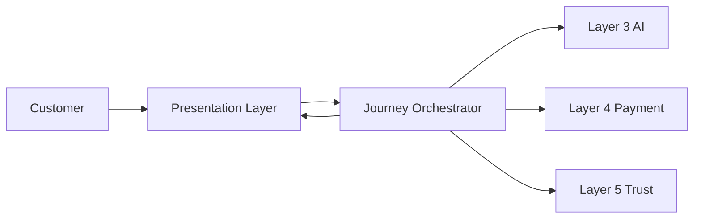
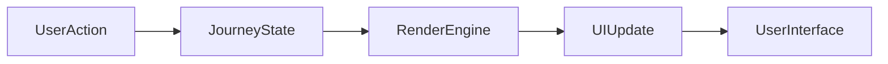
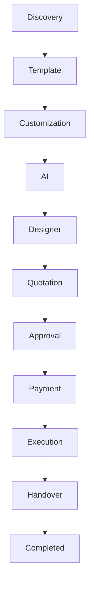
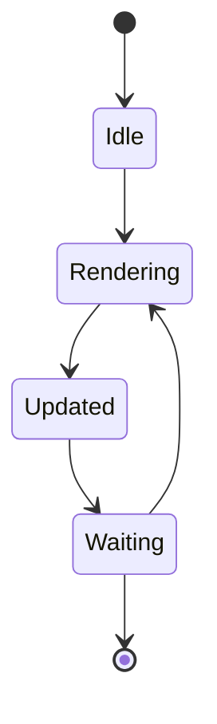
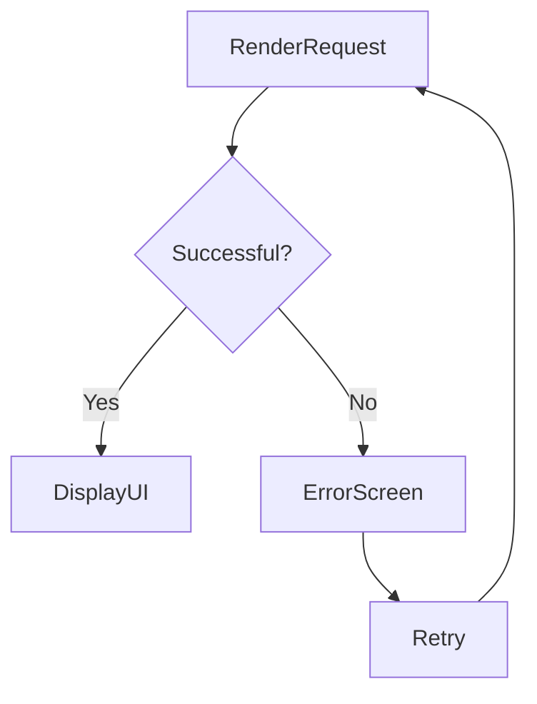

# Rendering Architecture

## Document Information

| Property | Value |
|----------|-------|
| Layer | Layer 2 – Guided Journey |
| Document | Rendering Architecture |
| Status | Production |
| Version | 1.0 |

---

# Purpose

This document describes how Layer 2 generates, updates, and delivers visual representations of the Guided Journey.

Rendering transforms business workflow states into interactive user interfaces while remaining independent of business logic.

---

# Objectives

- Render journey progress
- Display real-time workflow state
- Present AI recommendations
- Support responsive user interfaces
- Synchronize UI with backend events

---

# High-Level Rendering Architecture

---

# Rendering Pipeline

---

# Journey Rendering Flow

---

# Rendering Lifecycle

---

# Rendering Components

- Journey View
- Progress Tracker
- Template Viewer
- AI Recommendation Panel
- Designer View
- Quotation Screen
- Payment Screen
- Execution Dashboard
- Completion Screen

---

# Rendering Principles

- Render only the current journey state.
- Keep UI synchronized with backend events.
- Avoid blocking rendering during long-running operations.
- Display loading indicators during asynchronous processing.
- Preserve user progress during refreshes.

---

# Performance Guidelines

- Lazy load non-critical components.
- Cache static resources.
- Minimize unnecessary re-renders.
- Update only changed UI sections.
- Support responsive layouts.

---

# Error Handling

---

# Accessibility

Rendering should support:

- Keyboard navigation
- Screen readers
- Responsive layouts
- Reduced-motion preferences
- High-contrast themes

---

# Monitoring

Monitor:

- Rendering latency
- UI update time
- Rendering failures
- Component load time
- User interaction latency

---

# Related Documents

- README.md
- architecture.md
- frontend_architecture.md
- animation_architecture.md
- accessibility.md
- interaction_architecture.md
- observability.md
