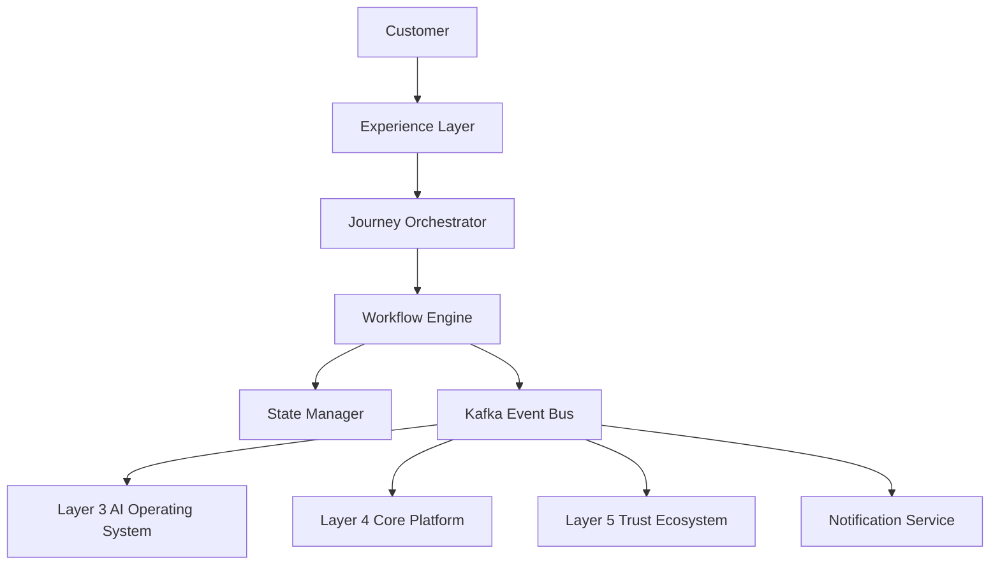
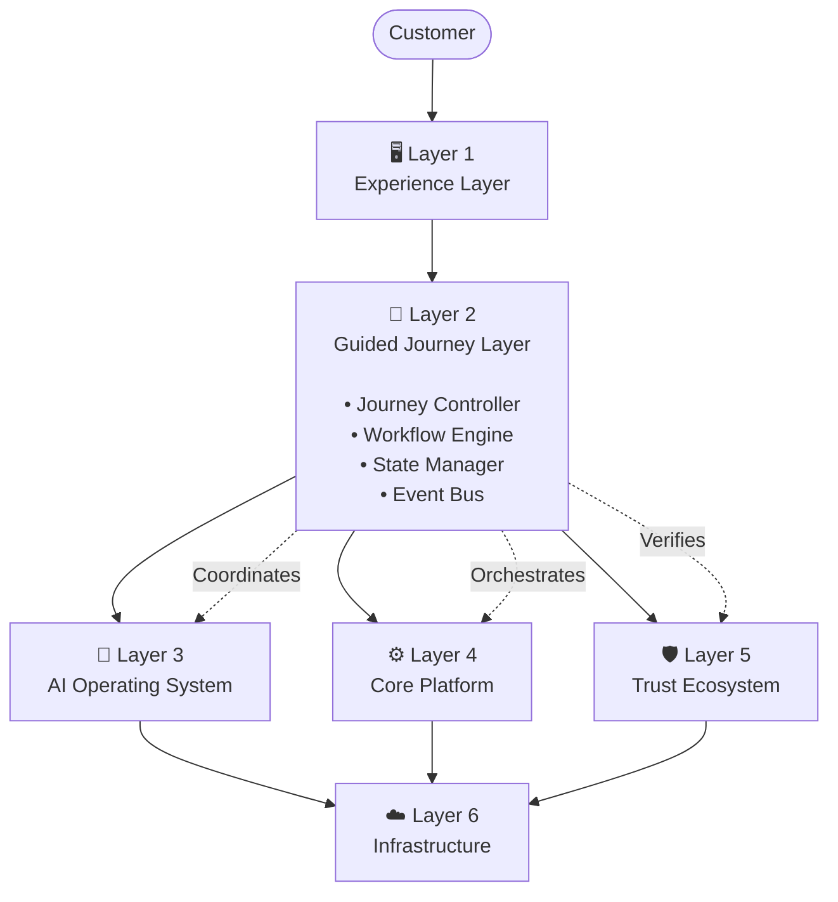
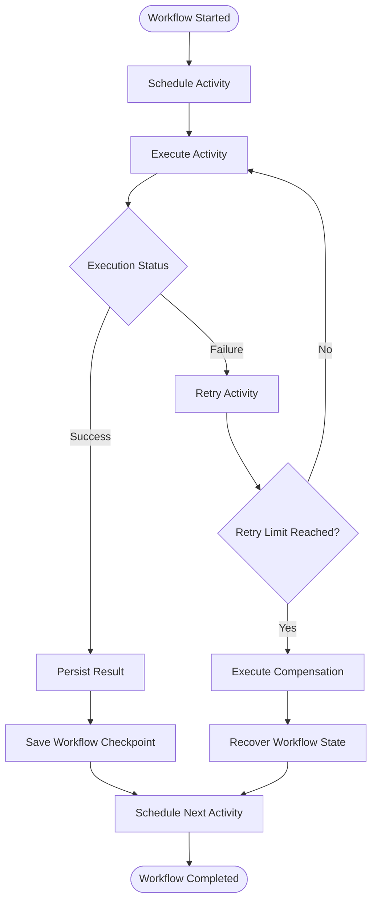
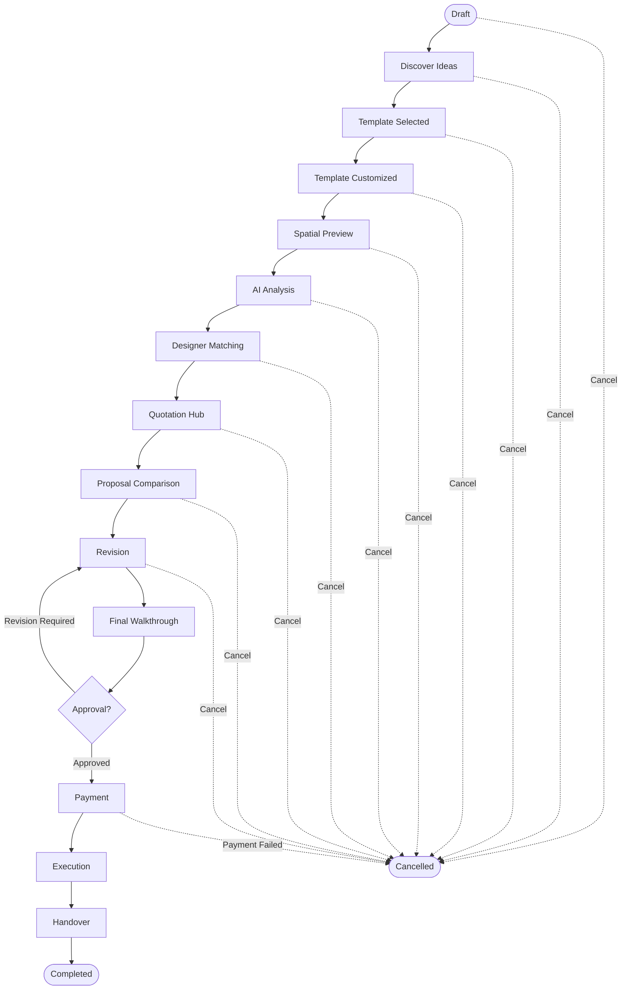
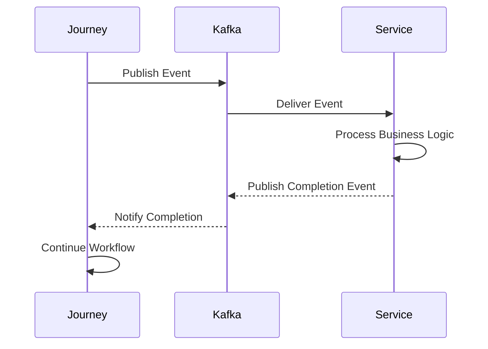
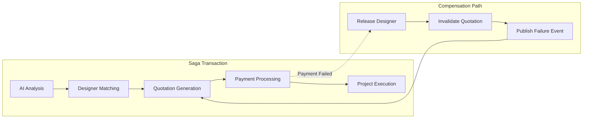
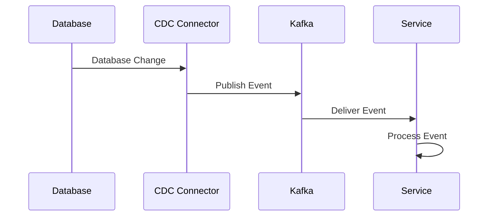
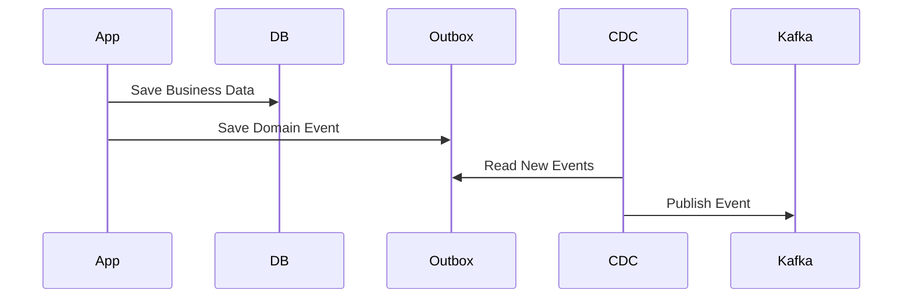

# Layer 2 Guided Journey Research
## Allure Interiors – Production Architecture Overview

---

# 1. Introduction

The **Guided Journey Layer (Layer 2)** is the orchestration backbone of the Allure Interiors platform. It manages the complete customer journey from discovering design inspirations to project handover by coordinating multiple distributed services.

This layer **does not implement business logic**. Instead, it orchestrates AI, Platform, Trust, Payment, and Execution services through APIs, workflow engines, and asynchronous events.

According to the Layer 2 architecture, the journey consists of a structured workflow:

---

Supporting every stage are:

- Request Center
- Approval Center
- Notification Center
- Timeline Center
- Document Center
- Help Center

---

# 2. Architectural Position

---

Layer 2 acts as the workflow controller between the frontend and downstream services.

---

# 3. Core Responsibilities

Layer 2 is responsible for:

- Journey orchestration
- Workflow execution
- State management
- API orchestration
- Event publishing
- Event subscription
- Session persistence
- Progress tracking
- Retry management
- Compensation triggering
- Workflow recovery
- Journey analytics
- Long-running workflow management

---

# 4. Out of Scope

Layer 2 never performs business logic.

The following remain in their dedicated layers:

| Capability | Responsible Layer |
|------------|-------------------|
| AI Analysis | Layer 3 |
| Recommendation | Layer 3 |
| Spatial Rendering | Layer 3 |
| Verification | Layer 5 |
| Trust Score | Layer 5 |
| Reputation | Layer 5 |
| Payments | Layer 4 |
| Authentication | Layer 6 |
| Notifications | Platform Services |
| Project Execution | Execution Services |

---

# 5. Design Principles

The architecture follows cloud-native distributed system principles.

## Functional Goals

- Complete journey orchestration
- Resumable workflows
- Workflow consistency
- Long-running processes
- Automatic recovery

## Non-Functional Goals

### Scalability

- Stateless APIs
- Horizontal scaling
- Queue-based execution
- Distributed workers

### Reliability

- Durable workflows
- Persistent checkpoints
- Retry mechanism
- Compensation workflow

### Maintainability

- Modular services
- Independent deployment
- API-first architecture
- Clear service boundaries

### Cost Optimization

- Event-driven execution
- Async processing
- Lazy invocation
- Auto scaling

---

# 6. Architecture Principles

The Guided Journey Layer follows:

- Single Responsibility Principle
- Loose Coupling
- Event Driven Architecture
- Stateless Processing
- Durable Workflow Execution
- Eventual Consistency
- API First Design
- Workflow Orchestration
- Hybrid Orchestration + Choreography

---

# 7. Workflow Lifecycle

Every journey follows the same lifecycle.

---

# 8. Journey State Machine

Cancellation is possible from multiple states.

---

# 9. Workflow Checkpoints

After every successful stage, Layer 2 stores:

- Journey ID
- Current State
- Previous State
- Correlation ID
- Execution ID
- Retry Count
- Timestamp
- Metadata
- Last Event

This enables:

- Resume after crash
- Retry
- Rollback
- Audit
- Recovery

---

# 10. Journey Stages Summary

## Stage 1 — Discover Ideas

Purpose

- Collect inspirations
- Load recommendations
- Create design context

Output

- Inspiration selected

---

## Stage 2 — Template Selection

Purpose

- Retrieve templates
- Validate compatibility
- Save selected template

Output

- Template metadata

---

## Stage 3 — Template Customization

Purpose

- Personalize design
- Validate workflow
- Save customization

Output

- Customized template

---

## Stage 4 — Spatial Preview

Purpose

- Generate 3D visualization
- Coordinate rendering service

Output

- Preview metadata

---

## Stage 5 — AI Analysis

Purpose

- Request AI evaluation

AI evaluates:

- Budget
- Space utilization
- Style
- Material compatibility
- Optimization

Output

- AI report

---

## Stage 6 — Designer Matching

Purpose

Match designers using:

- Skills
- Availability
- Budget
- Portfolio
- Trust Score

Output

- Ranked designer list

---

## Stage 7 — Quotation Hub

Purpose

- Send quotation requests
- Collect quotations
- Persist quotation metadata

Output

- Multiple quotations

---

## Stage 8 — Proposal Comparison

Purpose

Compare:

- Budget
- Timeline
- Trust
- Recommendation
- Proposal quality

Output

- Selected proposal

---

## Stage 9 — Revision

Purpose

Manage customer revisions until satisfaction.

Output

- Updated proposal

---

## Stage 10 — Final Walkthrough

Purpose

Present final design.

Customer reviews:

- Design
- Materials
- Timeline
- Assets

Output

- Walkthrough completion

---

## Stage 11 — Approval

Purpose

Capture customer approval.

Output

- Approved proposal

---

## Stage 12 — Payment

Purpose

Coordinate payment engine.

Output

- Payment confirmation

---

## Stage 13 — Execution

Purpose

Transfer approved project to execution.

Output

- Active project

---

## Stage 14 — Handover

Purpose

Deliver:

- Documents
- Assets
- Completion confirmation

Output

- Closed project

---

## Stage 15 — Completed

Purpose

Archive workflow

Publish completion events.

---

# 11. Communication Model

Layer 2 uses Hybrid Communication.

## Synchronous

Used for

- Validation
- Journey retrieval
- Template loading
- Status APIs

REST APIs
Client
↓
Journey API
↓
Service

---

## Asynchronous

Used for

- AI Analysis
- Rendering
- Designer Matching
- Notifications
- Quotations
- Payments

---

# 12. Workflow Patterns

## Orchestration

Workflow engine controls:

- Order
- Timeout
- Retry
- Compensation

---

## Choreography

Independent services communicate through events.

Used for

- Analytics
- Notifications
- Monitoring

---

## Saga Pattern

---

# 13. Event Driven Architecture

Core events include:

- JourneyStarted
- IdeaSelected
- TemplateSelected
- TemplateCustomized
- PreviewGenerated
- AIAnalysisCompleted
- DesignerMatched
- QuotationGenerated
- ProposalSelected
- RevisionCompleted
- WalkthroughCompleted
- ProposalApproved
- PaymentCompleted
- ExecutionStarted
- ProjectCompleted

Benefits:

- Loose coupling
- Independent scaling
- Fault tolerance
- Async execution

---

# 14. Data Management

Journey persistence stores:

- Workflow state
- Retry count
- Pending tasks
- Event history
- Metadata
- Correlation IDs

Database includes:

- Journey Table
- Journey Step Table
- Journey Event Table
- Workflow History

---

# 15. Production Patterns

Implemented architectural patterns:

## CQRS

Separate

- Command Model
- Read Model

Benefits

- Faster dashboards
- Independent scaling

---

## CDC

Database changes become events.

---

## Outbox Pattern

Avoids dual-write problems.

---

## Event Store

Stores immutable workflow events for:

- Replay
- Analytics
- Auditing
- Recovery

---

# 16. API Layer

Production APIs include:
POST /journeys

GET /journeys/{id}

POST /resume

POST /cancel

POST /retry

Design principles:

- REST
- Stateless
- JWT
- Correlation IDs
- Idempotency
- Versioning
- Rate limiting

---

# 17. Security

Layer 2 follows Zero Trust.

Authentication

- OAuth2
- JWT
- OIDC

Authorization

- RBAC
- ABAC

Internal Security

- mTLS
- SPIFFE
- API Gateway

Workflow protection

- Tenant isolation
- Ownership validation
- Permission checks

---

# 18. Observability

Production monitoring includes:

Metrics

- Active journeys
- Completion rate
- Workflow duration
- Retry count
- Queue size

Logging

- Journey ID
- Correlation ID
- Event Type
- User ID
- Status

Tracing

OpenTelemetry

Health Checks

- APIs
- Workflow Engine
- Kafka
- Database

---

# 19. Performance

Optimization strategies:

- Async workers
- Connection pooling
- Redis caching
- Lazy loading
- Batch processing
- Pagination
- CDN
- Background execution

---

# 20. Scalability

Supports:

- Horizontal scaling
- Stateless services
- Distributed workers
- Queue processing
- Load balancing
- Auto scaling
- High availability

---

# 21. Reliability

Production resilience includes:

- Durable workflows
- Automatic retries
- Dead Letter Queue
- Event replay
- Circuit breakers
- Timeout handling
- Compensation workflows
- Persistent checkpoints

---

# 22. Cost Optimization

Architecture minimizes cost through:

- Event-driven execution
- Worker auto scaling
- Archive completed journeys
- Async processing
- Storage lifecycle management
- Independent worker scaling

---

# 23. Layer Integration

Layer 2 integrates with:

## Layer 1

Experience Layer

- Public Website
- Homeowner Portal
- Designer Portal
- Admin Portal

## Layer 3

AI Operating System

- AI Analysis
- Spatial Intelligence
- Recommendation Engine

## Layer 4

Core Platform

- Design Library
- Quotation Hub
- Booking
- Payment
- Communication

## Layer 5

Trust Ecosystem

- Verification
- Reputation
- Trust Score
- Safety

## Layer 6

Infrastructure

- PostgreSQL
- Redis
- Kafka
- Workers
- S3
- CDN
- API Gateway

## Layer 7

Observability

- Logging
- Monitoring
- Tracing
- Analytics

---

# 24. Administrator Notes

Layer 2 should remain a **pure orchestration layer**.

It must never implement:

- AI logic
- Trust calculation
- Payment logic
- Business rules
- Rendering
- Recommendation algorithms

Its responsibility is to:

- Coordinate services
- Persist workflow state
- Publish events
- Manage retries
- Execute workflow transitions
- Recover from failures
- Maintain end-to-end customer journey consistency

This separation ensures scalability, maintainability, fault tolerance, and production-grade workflow orchestration across the Allure Interiors platform.

