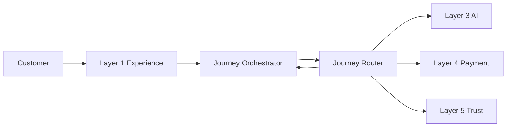
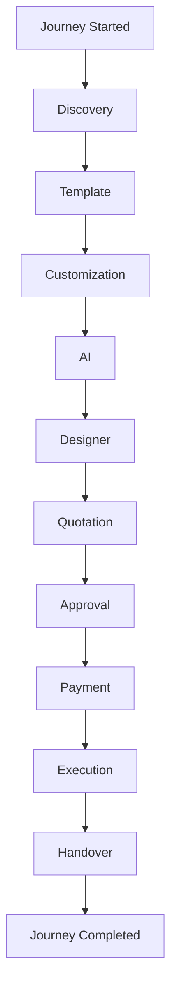
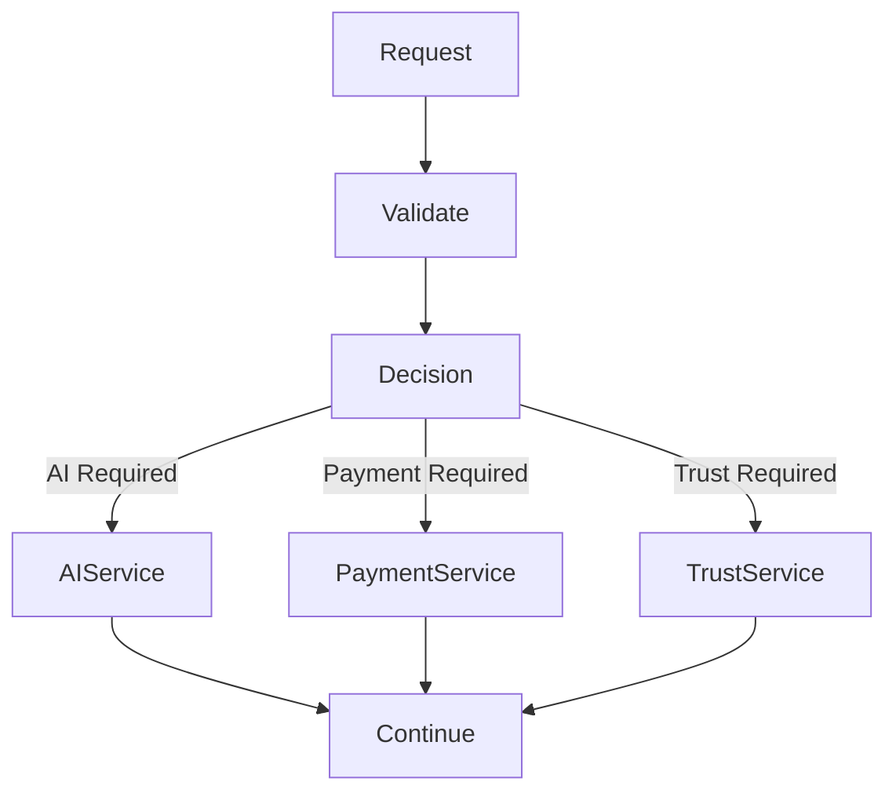
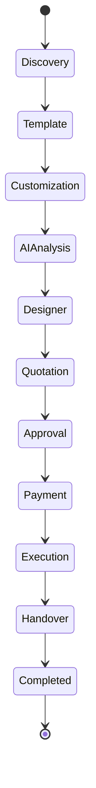
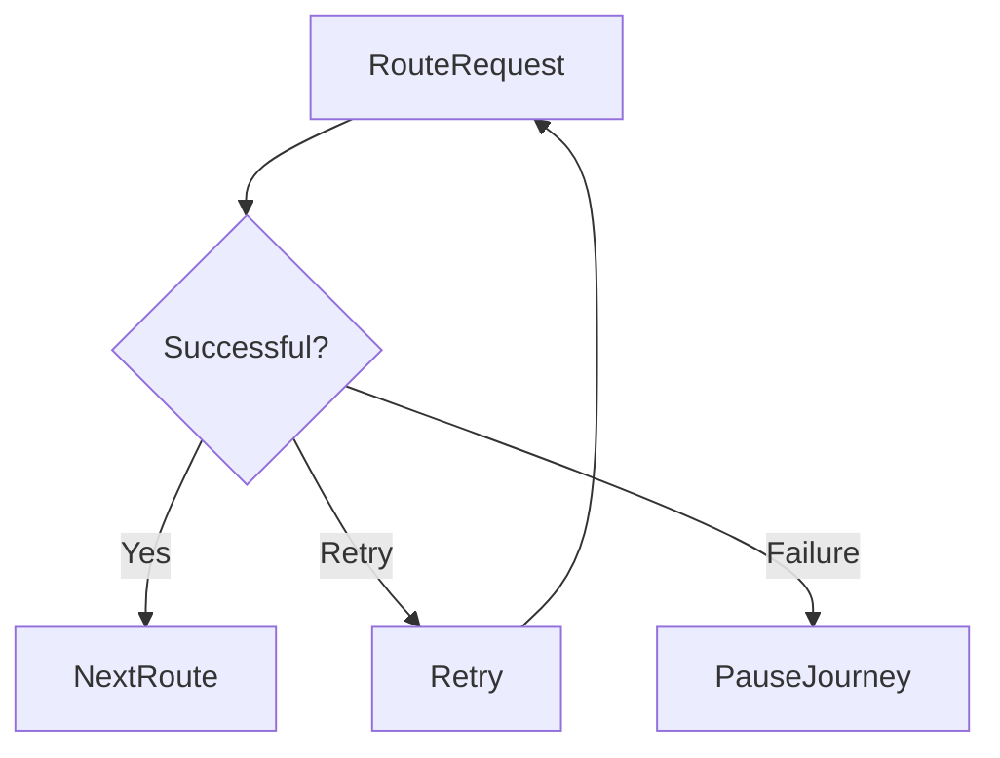

# Routing Architecture

## Document Information

| Property | Value |
|----------|-------|
| Layer | Layer 2 – Guided Journey |
| Document | Routing Architecture |
| Status | Production |
| Version | 1.0 |

---

# Purpose

This document describes how Layer 2 routes customer requests through the Guided Journey.

Routing determines the next workflow stage based on business rules, workflow state, user actions, and service responses.

---

# Objectives

- Centralize workflow routing
- Support deterministic navigation
- Handle long-running workflows
- Enable failure recovery
- Maintain journey consistency

---

# High-Level Routing Architecture

---

# Journey Routing Flow

---

# Decision Routing

---

# Routing State Machine

---

# Routing Principles

- Every request passes through the Journey Orchestrator.
- Routing decisions are deterministic.
- Business rules take precedence over AI recommendations.
- Invalid transitions are rejected.
- Long-running operations use asynchronous events.
- Failed operations support retry and recovery.

---

# Route Types

| Route | Description |
|--------|-------------|
| Discovery | Initial customer exploration |
| Template | Template selection |
| Customization | Design customization |
| AI Analysis | Recommendation generation |
| Designer Matching | Designer assignment |
| Quotation | Quote generation |
| Approval | Customer approval |
| Payment | Payment processing |
| Execution | Project execution |
| Handover | Project completion |

---

# Failure Handling

---

# Best Practices

- Keep routing stateless.
- Validate every transition.
- Avoid circular routes.
- Log routing decisions.
- Use correlation IDs.
- Publish routing events.

---

# Related Documents

- README.md
- architecture.md
- journey_architecture.md
- interaction_architecture.md
- dependency_graph.md
- state_machine.md
- observability.md
