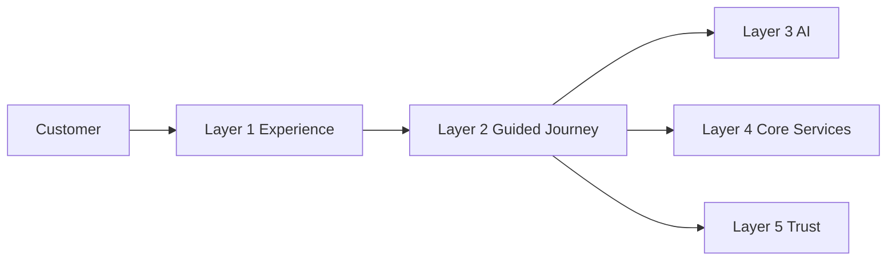
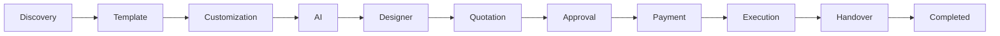
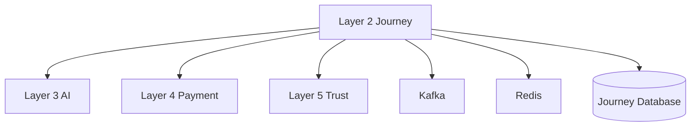

# Scope

## Document Information

| Property | Value |
|----------|-------|
| Layer | Layer 2 – Guided Journey |
| Document | Scope |
| Status | Production |
| Version | 1.0 |

---

# Purpose

This document defines the functional and architectural scope of Layer 2.

Layer 2 is responsible for orchestrating the complete customer journey while coordinating interactions with AI services, payment systems, trust services, and execution workflows.

It does not implement domain-specific business capabilities owned by other platform layers.

---

# Scope Overview

---

# Journey Scope

---

# In Scope

Layer 2 is responsible for:

- Journey orchestration
- Workflow management
- State management
- Business rule enforcement
- AI integration
- Designer matching
- Quotation workflow
- Approval workflow
- Payment orchestration
- Execution coordination
- Event publishing
- Event consumption
- Failure recovery
- Retry management
- Journey monitoring
- Progress tracking

---

# Out of Scope

Layer 2 does **not** implement:

- AI model training
- AI inference engine
- Payment gateway implementation
- Banking integrations
- Trust score calculation
- Identity verification
- Authentication provider
- Database management
- Notification delivery
- Analytics engine
- Infrastructure provisioning

These capabilities belong to their respective platform layers.

---

# External Dependencies

---

# Functional Boundaries

Layer 2 coordinates:

- Customer interactions
- Workflow progression
- Business decisions
- Service orchestration
- Event-driven communication

Layer 2 delegates:

- AI recommendations
- Payment execution
- Trust verification
- External integrations

---

# Architectural Principles

- Single workflow orchestrator
- Event-driven communication
- Stateless services
- Deterministic workflows
- Idempotent operations
- Loose coupling
- High cohesion

---

# Success Criteria

Layer 2 is considered complete when it can:

- Orchestrate the full customer journey
- Coordinate downstream services
- Recover from failures
- Resume interrupted workflows
- Maintain workflow consistency
- Produce observable events
- Scale horizontally

---

# Assumptions

- External services are independently deployable.
- AI services expose stable APIs.
- Payment services support idempotency.
- Trust services provide verification results.
- Event infrastructure is highly available.

---

# Constraints

- Business rules always override AI recommendations.
- Payment must complete before execution.
- Trust verification cannot be bypassed where required.
- Every workflow transition must be validated.
- Long-running operations must support recovery.

---

# Related Documents

- README.md
- overview.md
- architecture.md
- journey_architecture.md
- dependency_graph.md
- ADR.md
- implementation_rules.md
- AI_CONTEXT.md
- interaction_architecture.md
