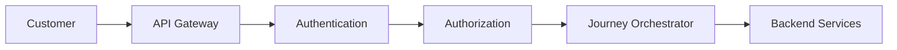
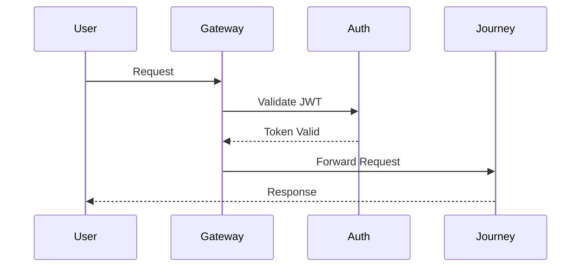
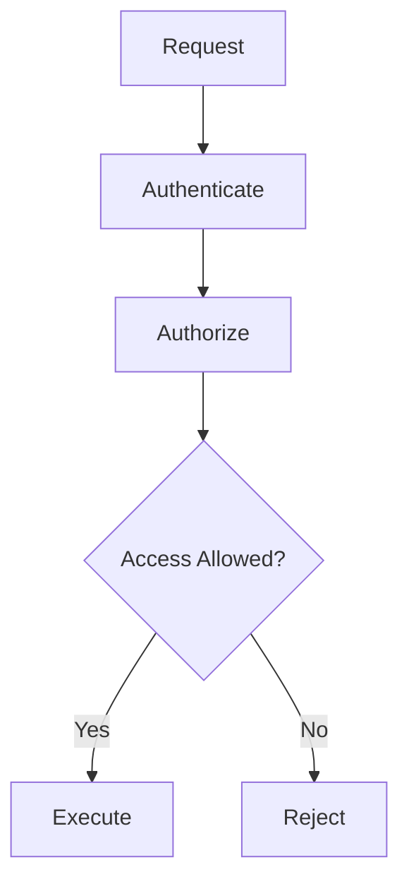
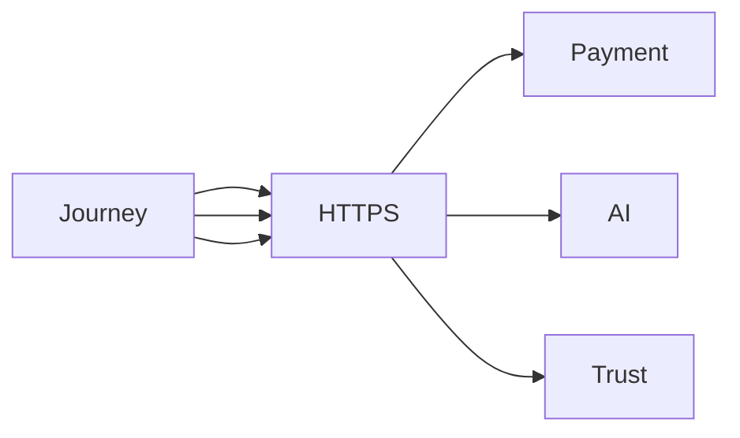
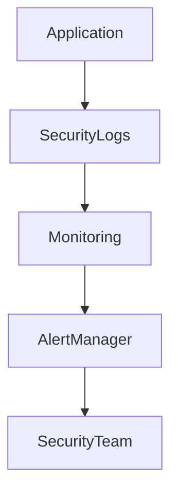

# Security

## Document Information

| Property | Value |
|----------|-------|
| Layer | Layer 2 – Guided Journey |
| Document | Security |
| Status | Production |
| Version | 1.0 |

---

# Purpose

This document defines the security architecture and implementation guidelines for Layer 2.

Layer 2 protects customer interactions, workflow execution, service communication, and business operations through authentication, authorization, encryption, validation, and auditing.

---

# Security Objectives

- Protect customer data
- Secure service communication
- Prevent unauthorized access
- Ensure data integrity
- Support secure workflow execution
- Maintain auditability

---

# Security Architecture



---

# Authentication Flow



---

# Authorization Flow



---

# Security Layers

- API Gateway
- Authentication
- Authorization
- Input Validation
- Business Rule Validation
- Audit Logging
- Encryption
- Monitoring

---

# Authentication

Every request must include:

- JWT Access Token
- Correlation ID
- HTTPS/TLS
- Content-Type

Unauthenticated requests must be rejected.

---

# Authorization

Layer 2 enforces:

- Role-Based Access Control (RBAC)
- Resource-level authorization
- Service authorization
- Principle of least privilege

---

# Input Validation

Every request should be validated for:

- Required fields
- Data types
- Value ranges
- Business constraints
- Payload size

Invalid requests must not reach business logic.

---

# Service Communication



Rules:

- HTTPS/TLS only
- Mutual authentication where required
- Signed service tokens
- Secure API communication

---

# Data Protection

Protect:

- Personal information
- Payment references
- Journey identifiers
- Authentication tokens
- Business data

Never expose:

- Passwords
- Secrets
- Private keys
- Internal credentials

---

# Audit Logging

Log:

- Authentication events
- Authorization failures
- Journey state changes
- Payment requests
- Security violations
- Administrative actions

Logs should include:

- Timestamp
- User ID
- Journey ID
- Correlation ID
- Service Name

---

# Security Monitoring



---

# Security Best Practices

- Validate every request.
- Authenticate every user.
- Authorize every operation.
- Encrypt all communications.
- Avoid logging sensitive information.
- Rotate credentials regularly.
- Keep dependencies updated.
- Follow the principle of least privilege.

---

# Security Checklist

Before deployment verify:

- JWT authentication enabled
- HTTPS enforced
- Authorization policies configured
- Input validation completed
- Audit logging enabled
- Secrets securely managed
- Security tests passed

---

# Related Documents

- README.md
- architecture.md
- observability.md
- implementation_rules.md
- api_usage_rules.md
- coding_rules.md
- performance_budget.md
- payment/security.md
```
