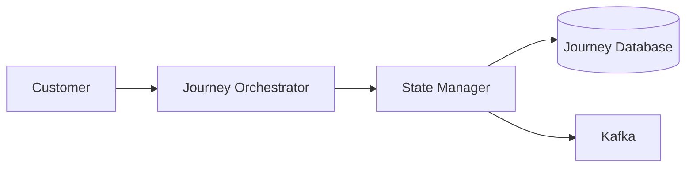
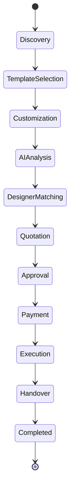
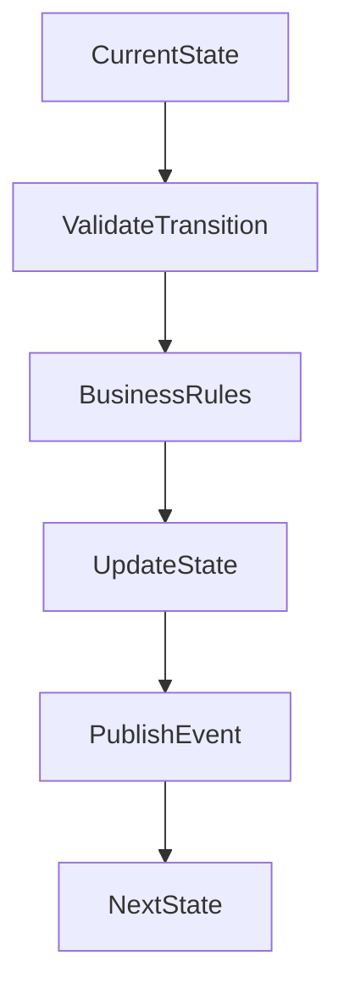
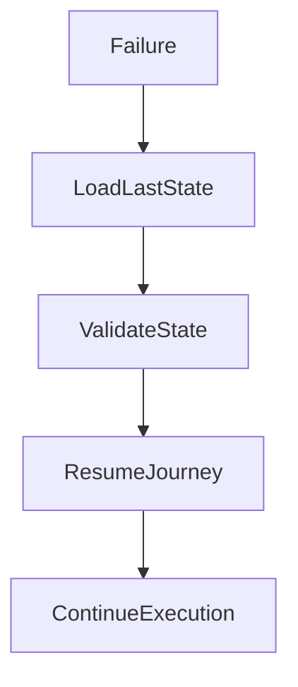

# State Architecture

## Document Information

| Property | Value |
|----------|-------|
| Layer | Layer 2 – Guided Journey |
| Document | State Architecture |
| Status | Production |
| Version | 1.0 |

---

# Purpose

This document defines how Layer 2 manages journey state throughout the customer lifecycle.

State management ensures that every workflow transition is valid, recoverable, traceable, and consistent across distributed services.

---

# Objectives

- Maintain deterministic workflows
- Validate state transitions
- Support long-running journeys
- Enable failure recovery
- Prevent invalid transitions
- Resume interrupted workflows

---

# State Management Architecture



---

# Journey State Lifecycle



---

# State Transition Flow



---

# State Persistence


---

# State Categories

| Category | Examples |
|----------|----------|
| Initial | Discovery |
| Active | Template Selection, Customization |
| Processing | AI Analysis, Payment |
| Waiting | Approval |
| Completed | Handover, Completed |
| Failed | Journey Paused |
| Cancelled | Journey Cancelled |

---

# State Rules

- Every state transition must be validated.
- Invalid transitions are rejected.
- State changes must be persisted.
- Every transition generates an audit record.
- Events are published after successful state updates.
- State changes must be idempotent.

---

# Recovery Strategy



---

# Failure Handling

Supported recovery scenarios:

- Temporary service failure
- Network interruption
- Payment retry
- AI timeout
- Manual approval delay
- System restart

The journey resumes from the last persisted state instead of restarting.

---

# State Consistency

Layer 2 ensures:

- Atomic state updates
- Deterministic transitions
- Event consistency
- Duplicate prevention
- Workflow integrity

---

# Observability

Monitor:

- State transition latency
- Invalid transition attempts
- Recovery success rate
- Journey completion rate
- State persistence failures

---

# Best Practices

- Persist every significant state.
- Keep transitions explicit.
- Avoid implicit state changes.
- Log every transition.
- Use immutable events.
- Support checkpoint recovery.

---

# Related Documents

- README.md
- architecture.md
- journey_architecture.md
- dependency_graph.md
- implementation_rules.md
- observability.md
- security.md
- payment/state_machine.md
```
