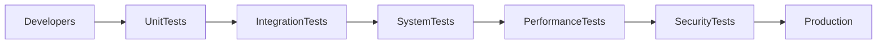
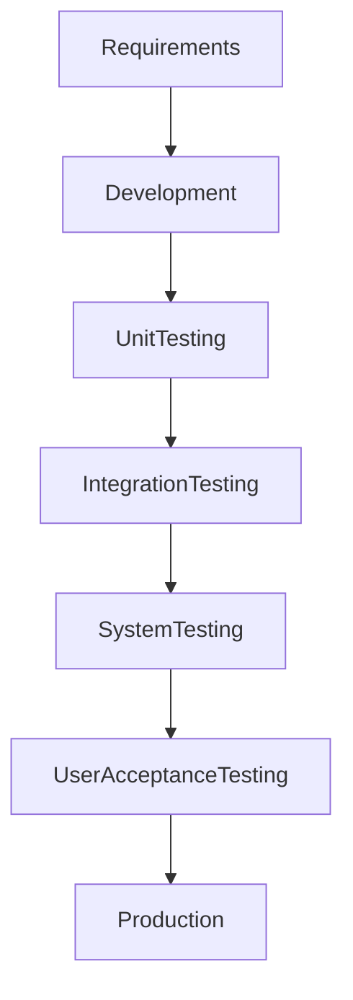
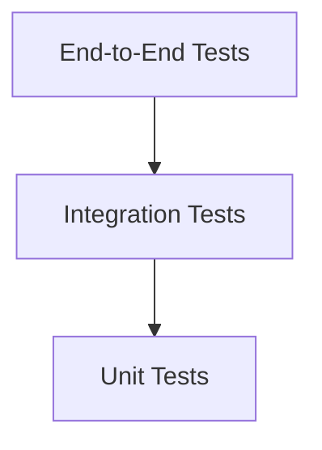
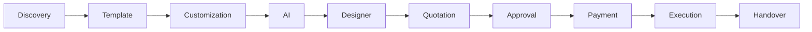
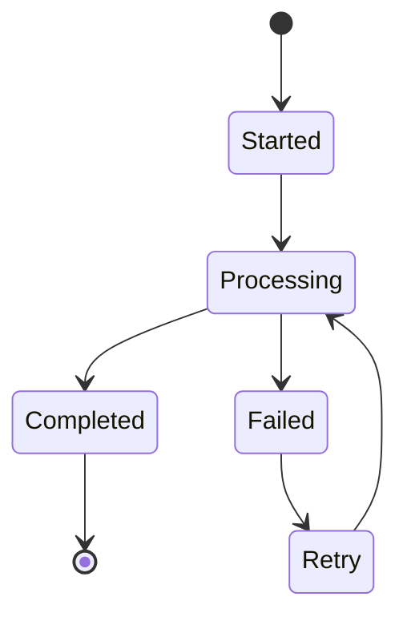

# Testing Strategy

## Document Information

| Property | Value |
|----------|-------|
| Layer | Layer 2 – Guided Journey |
| Document | Testing Strategy |
| Status | Production |
| Version | 1.0 |

---

# Purpose

This document defines the testing strategy for Layer 2.

The objective is to ensure the Guided Journey is reliable, secure, scalable, and resilient by validating every component, workflow, and integration before production deployment.

---

# Testing Objectives

- Verify workflow correctness
- Validate business rules
- Ensure API reliability
- Test state transitions
- Verify event processing
- Validate failure recovery
- Measure performance
- Ensure security compliance

---

# Testing Architecture



---

# Testing Lifecycle



---

# Test Pyramid



---

# Test Types

| Test Type | Purpose |
|------------|---------|
| Unit Testing | Validate individual components |
| Integration Testing | Verify service interactions |
| API Testing | Validate request and response behavior |
| Workflow Testing | Verify complete journey execution |
| Event Testing | Validate event publishing and consumption |
| State Machine Testing | Verify valid state transitions |
| Performance Testing | Measure latency and throughput |
| Security Testing | Verify authentication and authorization |
| Regression Testing | Prevent breaking existing functionality |
| User Acceptance Testing | Validate business requirements |

---

# Workflow Testing



Each workflow stage should be tested independently and as part of the complete journey.

---

# State Transition Testing



Validate:

- Valid transitions
- Invalid transitions
- Retry scenarios
- Recovery scenarios

---

# API Testing

Validate:

- Request validation
- Response validation
- Authentication
- Authorization
- Idempotency
- Error responses
- Timeout handling

---

# Event Testing

Verify:

- Event publication
- Event consumption
- Duplicate event handling
- Retry mechanisms
- Dead Letter Queue processing
- Event ordering where applicable

---

# Performance Testing

Measure:

- API latency
- Journey completion time
- Throughput
- Concurrent users
- Resource utilization
- Event processing latency

---

# Security Testing

Verify:

- JWT authentication
- RBAC authorization
- Input validation
- HTTPS enforcement
- Audit logging
- Access control

---

# Failure Testing

Test scenarios include:

- Network failures
- AI service unavailable
- Payment service timeout
- Database failure
- Cache failure
- Event broker interruption
- External API failure

---

# Success Criteria

A release is considered test-ready when:

- Unit tests pass
- Integration tests pass
- API tests pass
- Workflow tests pass
- Security tests pass
- Performance targets are met
- Regression tests pass
- Critical defects are resolved

---

# Test Automation

Automate:

- Unit tests
- API tests
- Integration tests
- Regression tests
- Performance smoke tests
- Security scans

Manual testing should focus on:

- User acceptance
- Exploratory testing
- Accessibility validation

---

# Best Practices

- Test early and continuously.
- Automate repetitive tests.
- Keep test data isolated.
- Test both success and failure scenarios.
- Validate edge cases.
- Maintain repeatable test environments.
- Review test coverage regularly.

---

# Related Documents

- README.md
- architecture.md
- implementation_rules.md
- coding_rules.md
- security.md
- observability.md
- performance_budget.md
- payment/testing.md
```
