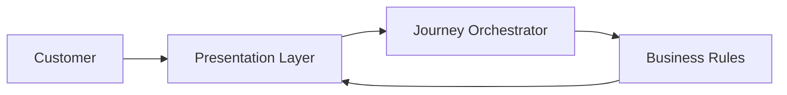
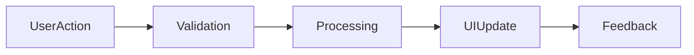
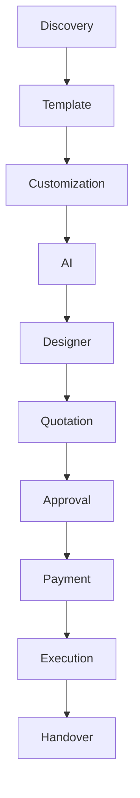
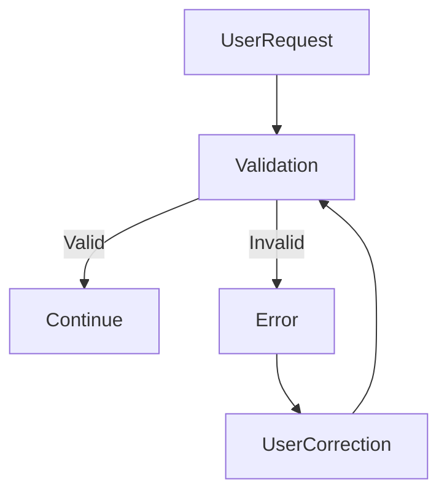

# UI Constraints

## Document Information

| Property | Value |
|----------|-------|
| Layer | Layer 2 – Guided Journey |
| Document | UI Constraints |
| Status | Production |
| Version | 1.0 |

---

# Purpose

This document defines the user interface constraints for Layer 2.

These constraints ensure a consistent, responsive, accessible, and predictable user experience throughout the Guided Journey.

---

# Objectives

- Maintain UI consistency
- Improve usability
- Ensure accessibility
- Support responsive layouts
- Prevent invalid user interactions
- Preserve workflow integrity

---

# UI Architecture



---

# User Interaction Flow



---

# Screen Flow



---

# Layout Constraints

The interface should:

- Be responsive across devices
- Maintain consistent spacing
- Use reusable components
- Support landscape and portrait modes
- Avoid unnecessary scrolling
- Maintain consistent navigation

---

# Navigation Constraints

- Users cannot skip mandatory journey steps.
- Navigation follows validated workflow transitions.
- Invalid routes must be blocked.
- Browser refresh should preserve journey progress.
- Back navigation must not corrupt workflow state.

---

# Input Constraints

All user inputs must:

- Be validated
- Display clear error messages
- Preserve entered values after validation failures
- Prevent duplicate submissions
- Follow business rules

---

# Loading Constraints

During long-running operations:

- Display progress indicators
- Disable duplicate actions
- Keep users informed
- Support asynchronous updates

---

# Error Handling



---

# Accessibility Constraints

The UI should support:

- Keyboard navigation
- Screen readers
- High contrast mode
- Responsive layouts
- Reduced-motion preferences
- Clear focus indicators

---

# Performance Constraints

Target values:

| Metric | Target |
|---------|---------|
| Initial Page Load | < 2 seconds |
| API Response Display | < 300 ms |
| Navigation Transition | < 200 ms |
| Journey Progress Update | < 500 ms |

---

# Security Constraints

- Never expose sensitive data.
- Hide unauthorized functionality.
- Validate all client input.
- Protect against duplicate actions.
- Enforce authenticated sessions.

---

# Design Principles

- Simple and predictable navigation
- Consistent visual hierarchy
- Minimal cognitive load
- Clear user feedback
- Responsive interaction
- Accessibility-first design

---

# Best Practices

- Keep screens focused on a single task.
- Display only relevant information.
- Minimize required user input.
- Preserve user progress.
- Provide immediate feedback for actions.
- Maintain consistency across all journey screens.

---

# Related Documents

- README.md
- frontend_architecture.md
- interaction_architecture.md
- accessibility.md
- rendering_architecture.md
- animation_architecture.md
- journey_architecture.md
- security.md
```
